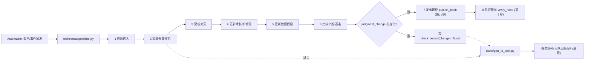
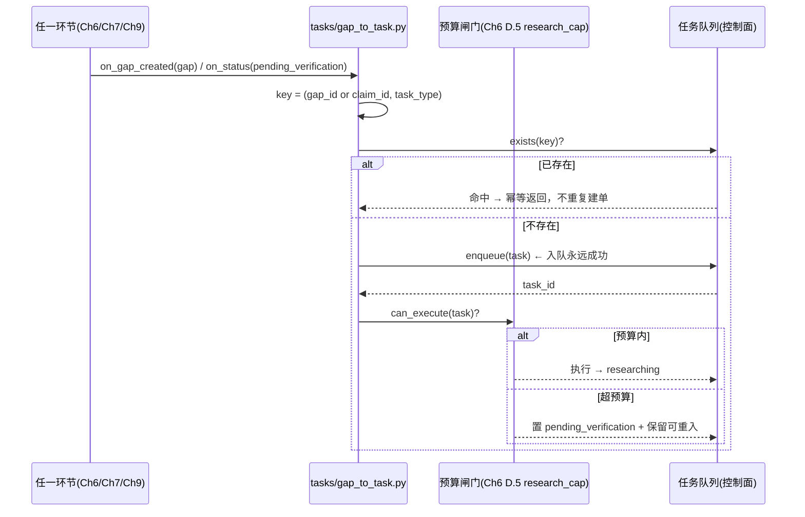

# 第一章《产品目标与核心闭环》实现方案

> **章性质**：第一章是**验收目标层**——它不新增功能模块，只定义"做成什么样算成功、闭环是否完整、结论是否可追溯、缺口是否可转任务"。
> **实现策略**：**在既有基础设施上做约束层增量**（编排器 + 校验器 + 字段/对象 + 规则版本），**不新建架构层**、不重写任何既有模块。
> **依赖**：本方案默认已存在第九章（数据与实现约束）、第六~七章、第四~五章的实现方案；此处只引用其组件，不重复其内容。
> **覆盖**：第一章 16 条需求（P0 15 / P1 1）——全部落位，其中 2 条因"第 7/8 步属第八章/第十章尚未拆解"标 ⚠️。
> **规则语言**：全文中文；凡跨文件引用一律写成 `文件 · 节 · 对象` 形式，便于回改定位。
> **版本**：v1.1（2026-09-15 回改：技术待定项 ① 关闭，见文末；**本文件回改明细见文末「附：回改记录」（唯一权威）**）

---

## A. 本章定位与验收总纲

第一章把"五个问题"中的**第五问（什么证据会改变判断）**、**反 KPI（每天维护 ≠ 每天产信号）**、**可追溯性契约（四要素 + 缺口转任务）**三条主线固化为**可自动检查的约束**。它产出的不是页面，而是三类"证据资产"：

| 资产 | 作用 | 归属章节驱动 |
|---|---|---|
| **预置反驳条件 `falsifiers`** | 让每条判断/建议可证伪、可复查、可传播 | 第一章驱动，落在 Ch4/Ch5/Ch7 的结论对象上 |
| **核查记录 `check_record`** | 表达"已维护但无变化"，使"无信号"成为正常态 | 第一章驱动，落在 Ch7 D.4 之上 |
| **缺口→任务链 `gap → research_task`** | 把"任何缺口"转成可幂等、有状态、可闭环的任务 | 第一章驱动，任务系统承第八章 |

**验收总纲（可检查三句）**：
1. 任一结论/建议都能反查到【证据 / 假设 / 计算 / 上一版本】四要素（四要素反查成功率 = 100%）。
2. 无变化日新增 `buy/sell` 信号数 = 0，且每条新建议 `change_reason` 非空（反 KPI）。
3. 任一 `gap` 都能生成**幂等**研究任务，且任务**入队不丢、执行受限、到限转待核验**。

---

## B. WorkBuddy 复用边界（A / B / C 三档）

> 沿用第九章既定边界口径：**A = 开箱即用零代码 / B = 写 Skill·配置·提示词即可 / C = 需独立代码**。

| 能力 | 档 | 落地方式 | 复用点 |
|---|---|---|---|
| 每日固定运行的闭环调度 | **A** | WorkBuddy **Automation**（每日 `rrule`）+ 一次性事件触发任务 | 即第八章"每日运行"的调度底座；本章只声明"每日维护 + 事件临时"两种触发（N1.2-02、N2.1-13） |
| 缺口→任务的推理与建单 | **B** | 一枚 Skill（`gap-to-task`）+ 提示词 + `memory/` 任务队列约定 | 复用 Ch6 D.5 `VerificationTask` 雏形 |
| 结论四要素的"自然语言反查" | **B** | Skill 提示词（在 JSONL 真源上检索 claim_id/version_id）| 复用第九章追加式 JSONL 真源 |
| 归因展示/交付 | **A** | `present_files` + 腾讯文档导出 | 复用既有展示层 |
| **8 步闭环编排器** | **C** | `scripts/orchestrate/pipeline.py`（状态机 + 断点续跑） | 新建；**注意第 7/8 步依赖第八/十章** |
| **四要素反查器** | **C** | `scripts/trace/traceback.py`（结构化反查 + 覆盖率自检） | 新建 |
| **缺口→任务幂等入队器** | **C** | `scripts/tasks/gap_to_task.py`（幂等键 + 状态机 + 预算闸门对接） | 新建 |
| **反 KPI 校验器** | **C** | `scripts/checks/no_signal_day.py`（无变化日/change_reason 校验） | 新建 |

> **为什么不把编排器做成纯 Prompt？** 8 步闭环需要**断点续跑、幂等、可回放**（承 N1.2-01 的"每步产物为对象"），纯提示词无法保证跨天失败恢复与去重，故列 C。

---

## C. 数据模型与字段增量（最小必要）

> 本章**不引入新的大对象**，只对既有对象**加字段/加一个控制面小对象**；所有字段均遵守第九章"追加式不可变 + 双时间轴"。

### C.1 `falsifiers` 族（落在结论对象上，第一章驱动）

| 字段 | 类型 | 挂载对象 | 语义 | 与既往实现的关系 |
|---|---|---|---|---|
| `falsifiers[]` | array<string> | `recommendations` / `baseline` | 可推翻本判断的证据/事件条件 | 承 **Ch7 §7.4 第 8 字段**；**本章要求"与结论同版本写入"** |
| `unmet_conditions[]` | array<string> | 同上 | 尚未兑现的条件 | 承 Ch7 第 8 字段 |
| `verification_conditions[]` | array<string> | 同上 | 可复核的验证条件（= 提前判断三要素之一，见 Ch2 §D） | 本章与 Ch2 共用同一字段名，**保持跨文件一致** |
| `falsifier_written_at` | seq/int | 同上 | 反驳条件**写入时的 `recorded_seq`** | 新增；用于断言"不晚于结论版本生效" |
| `expiry_review` | date | 同上 | 到期复查日 | 承 Ch7 第 8 字段 |

### C.2 `check_record`（核查记录，落在 Ch7 D.4 之上）

| 字段 | 类型 | 语义 |
|---|---|---|
| `check_id` | string | 主键 |
| `run_date` | date | 本次每日维护日期 |
| `scope` | enum | `collect / verify / recheck / full` |
| `changed` | bool | 当日是否有任何判断变化 |
| `judgment_change` | object | 三维变化标记（承 Ch4 H.1/H.2 `judgment_change`） |
| `signals_emitted` | int | 当日新产买卖信号数（无变化时应为 0） |
| `degraded` | bool | 当日是否降级运行（承 Ch9 §3.2） |

> `check_record` **不是**第九章 8 大对象之一，而是"控制面（任务与复盘）"的子记录；它引用 `recommendations`/`baseline` 的版本 id，不反向被业务对象依赖。

### C.3 `gap → research_task`（缺口→任务链）

> 复用 Ch6 D.5 已有 `gap` 对象与 `VerificationTask` 雏形，本章**补"自动转化链"定义，不建新对象**。

| 项 | 定义（与 PM §2.3 完全一致） |
|---|---|
| **触发条件** | ① `gap` 创建（`gap_type`/`blocking_step` 非空）② `claim.status=pending_verification`（预算到限）③ `research_depth` 未达标但被引用 ④ T12 传播依赖失效 |
| **任务类型** | `research / verify / parse / recheck / dedup_override` |
| **幂等键** | `(gap_id 或 claim_id)` + `task_type` |
| **入队 vs 执行** | **入队无限**（缺口不丢），**执行受预算 cap 约束**（Ch6 D.5 `research_cap`） |
| **到限动作** | 转 `pending_verification` + 保留可重入任务；**不伪装完成** |
| **状态机** | `queued → researching → pending_evidence → done / failed` |

---

## D. 核心流程与调用流

### D.1 8 步闭环 → 章节映射（含缺口标注）

| 步 | 流程段 | 承接 | 状态 |
|---|---|---|---|
| 1 | 公开信息进入 | Ch6 §6.1 + Ch9 N9.3 | ✅ |
| 2 | 追源去重与核验 | Ch6 §6.3 | ✅ |
| 3 | 更新公司及产业关系 | Ch7 §7.1 | ✅ |
| 4 | 修订增长与护城河判断 | Ch4 §4.1~4.3 | ✅ |
| 5 | 更新财务与估值假设 | Ch4 §4.4 + Ch5 §5.3 | ✅ |
| 6 | 比较个股与基准预期收益 | Ch5 §5.4 + Ch7 §7.3 | ✅ |
| 7 | **发布股票建议** | **第八章（未拆解）** | ❌ 缺口 |
| 8 | **持续验证与留存历史** | **第十章（未拆解）** | ❌ 缺口 |

**编排器职责**：`scripts/orchestrate/pipeline.py` 只负责"**把 1–6 步串成可断点续跑的状态机**"，并对第 7/8 步**预留接口**（`publish_hook` / `verify_hook`），第八章/第十章拆解后即插即用；**不在本章伪造第 7/8 步实现**。



### D.2 缺口→任务的幂等转化序列



### D.3 "每日维护 ≠ 每日产信号"（反 KPI）

- 每日运行**必写** `check_record`（无论有无变化）。
- `judgment_change` 全 False → **不写新版本、不发信号**（承 Ch4 H.2）。
- 仅有变化时才触发第 7 步发布。

---

## E. 关键接口与函数签名

> 语言无关伪代码；具体实现语言由工程师定，但**签名与语义须与下述一致**，以便跨文件断言。

```python
# scripts/orchestrate/pipeline.py
def run_daily(run_date: date, scope: str = "full") -> CheckRecord: ...
def resume(task_id: str) -> CheckRecord: ...           # 断点续跑
def register_publish_hook(fn) -> None: ...              # 第7步预留
def register_verify_hook(fn) -> None: ...               # 第8步预留

# scripts/trace/traceback.py
def traceback(conclusion_id: str) -> TraceabilityResult: ...

@dataclass
class TraceabilityResult:
    evidence: list[str]        # claim_id[]
    assumptions: list[str]     # baseline.driver_model / valuation_inputs(three-source)
    computation: DerivedValue  # formula + operands + method_version (承 Ch9 N9.2-02/03)
    prev_version_id: str | None

def traceback_coverage(sample: list[str]) -> float: ...  # 四要素覆盖率（应=1.0）

# scripts/tasks/gap_to_task.py
def gap_to_task(gap_or_claim) -> TaskRef: ...            # 幂等；返回既有或新建
def idempotency_key(gap_id: str | None, claim_id: str | None, task_type: str) -> str: ...

# scripts/checks/no_signal_day.py
def check_no_signal_day(run_date: date) -> list[Violation]: ...
def assert_new_signal_has_change_reason(rec) -> None: ...
```

---

## F. 校验器与守卫（可自动化 + 单测）

| 编号 | 守卫 | 校验内容 | 触发时机 | 单测断言（可跑） |
|---|---|---|---|---|
| G1-01 | **预置反驳同版本守卫** | `falsifier_written_at` 不晚于结论版本生效位；禁止事后追加到旧版本 | 写结论/建议时 | 构造"事后追加 falsifier 到旧版本" → 必须抛 `FalsifierBackfillError` |
| G1-02 | **反 KPI 守卫** | ① 无变化日 `signals_emitted==0`；② 新建议 `change_reason` 非空；③ `建议数 > 变化数` → 告警 | 每日发布前（第 7 步前置） | 造一天"无变化却产 buy" → 必须 `Violation` |
| G1-03 | **四要素全覆盖守卫** | 抽样结论 `traceback_coverage == 1.0` | 阶段验收 / 每日巡检 | 删掉某结论的 `prev_version_id` → 覆盖率 <1.0 → 拦截 |
| G1-04 | **缺口闭环守卫** | 每个 `gap` 均有任务或明确"不建单理由"；任务幂等键唯一 | 缺口产生时 / 日终 | 同 `gap_id` 建两次同型任务 → 只落 1 条 |
| G1-05 | **8 步完整性守卫** | 1–6 步产物对象齐备；7/8 步接口已注册（未实现时**显式标 gap**，不得静默跳过） | 阶段 3 验收 | 缺第 6 步产物 → 编排器置 `blocked`，不得报成功 |

> **为什么用"断言"而非"检查报告"？** 第一章条款（可追溯、不造信号、缺口闭环）是**首版硬验收**，必须是"不过则拦截"，而非"提示后可忽略"——对齐第二章 P-06 的"门/断言"哲学。

---

## G. 配置、规则版本与审计

| 项 | 位置 | 要点 |
|---|---|---|
| 闭环步骤声明 | `rules/pipeline.yaml`（只读 0444） | 8 步顺序、每步产物对象、是否阻塞；**版本化**，改序须留痕 |
| 反拖延/反造信号阈值 | `rules/review.yaml` | `no_signal` 判定口径、告警阈值；**模型不可写**（承 N9.2-01） |
| 规则→建议绑定 | `recommendations.rule_version` | 每条建议记录"当时生效的规则版本"（承 Ch2 §6.5） |
| 变更审计 | `audit/rule_changes.jsonl` | 任何影响买卖条件的改动（含展示逻辑）写一条审计记录 |

---

## H. 与其它章节/文件的接口（含回改指引）

1. **对第八章（未拆解）**：本章交付 3 个**接口契约**（`check_record` 结构、`gap→task` 状态机、`publish_hook` 签名），第八章实现任务系统/每日页时直接消费。
2. **对第十章（未拆解）**：本章交付"四要素反查 + 预置反驳条件"作为复盘输入（"什么证据会推翻判断"）。
3. **对第二章**：`verification_conditions[]` / `falsifiers[]` 字段名**与第二章 §D（A-06 修复）保持同一拼写**；本章负责"同版本写入"，第二章负责"作为买入前置必填"。
4. **回改指引**：本章的字段增量不要求改前五章；但 A-02/A-06 的修复**需要**前五章改动——**详见 `02_已确认的投资规则/02_实现方案.md` §F 回改清单（本文不再重复）。**

---

## 覆盖矩阵（第一章，16 条）

> 格式与前五章一致：`需求ID | 优先级 | 实现载体 | 验收方式 | 所属交付阶段 | 覆盖状态`。阶段 = 第十一章 5 阶段。
> 覆盖状态：✅ 已落位 / ⚠️ 已落位但依赖未拆章节或待冻结参数 / 缺口（本行为空）。

| 需求ID | 优先级 | 实现载体 | 验收方式 | 所属交付阶段 | 覆盖状态 |
|---|---|---|---|---|---|
| N1.1-01 | P0 | 统一锚点 `company_id`/`claim_id`（Ch9 对象） | 新信息可关联到结论与受影响公司 | 阶段2 | ✅ |
| N1.1-02 | P0 | 五问输出 + `falsifiers`（本章 C.1） | 每问可追溯；第五问非空 | 阶段2 | ✅ |
| N1.1-03 | P0 | `industry_nodes`/`companies`（Ch9） | 产业链浏览 + 结论落 `company_id` | 阶段1 | ✅ |
| N1.1-04 | P0 | 价值层/价格层分离（Ch4/Ch5） | 两独立更新、互不覆盖 | 阶段2 | ✅ |
| N1.1-05 | P0 | 同期限收益口径（Ch5/Ch7/Ch3 基准） | 比较用同一期限与口径 | 阶段3 | ✅ |
| N1.1-06 | P0 | `falsifiers[]` + `falsifier_written_at`（C.1） | 同版本写入，可回溯写入时点 | 阶段2 | ✅ |
| N1.2-01 | P0 | `orchestrate/pipeline.py`（D.1） | 1–6 步端到端；7/8 步接口已留 | 阶段3 | ⚠️ 依赖第八/十章 |
| N1.2-02 | P0 | `check_record` + 反 KPI 守卫 G1-02 | 无变化日信号数=0 | 阶段4 | ✅ |
| N1.2-03 | P0 | `action=maintain`（Ch7 枚举） | 维持可输出且不产新信号 | 阶段3 | ✅ |
| N1.2-04 | P0 | `research_depth` 四态（Ch3 承接） | 未完成态可见、不伪装中性 | 阶段3 | ✅ |
| N1.2-05 | P0 | `trace/traceback.py`（E） | 四要素可分别反查 | 阶段2 | ✅ |
| N1.2-06 | P0 | `tasks/gap_to_task.py`（D.2） | 缺口自动建任务、幂等、有状态 | 阶段4 | ⚠️ 任务系统承第八章 |
| N1.3-01 | P0 | NVIDIA 端到端样例编排 | 一条真实信息跑通全链 | 阶段2 | ✅ |
| N1.3-02 | P0 | 发现/传导/更新/建议四段（Ch4/5/7） | 四段完整可检查 | 阶段2 | ✅ |
| N1.3-03 | P0 | 三维验收对象定义（PM §2.7） | 三类各有判据 | 阶段2–5 | ✅ |
| N1.3-04 | P1 | 首版验收不含收益指标 | 验收清单无收益项 | 阶段5 | ✅ |

**统计**：✅ 14 / ⚠️ 2 / 缺口 0。（⚠️ 两条 = **N1.2-01、N1.2-06**，均因"第 7/8 步属第八/十章尚未拆解"，属**已知缺口而非设计缺陷**。按矩阵**逐行计数**：16 行 = ✅ 14 + ⚠️ 2。）

---

## 技术待定项（第一章）

> 标记 **需需求方澄清** 者须由需求方拍板后冻结；实现方须保持"可切换/可替换"，**不得把待定项补成新的策略门槛**（第十一章红线）。

| # | 待定项 | 影响 | 当前处理 | 状态 |
|---|---|---|---|---|
| ① | ~~规则 14 / iFinD·pandadata 是否属"付费数据订阅"~~（同 Ch3 B-19） | 决定是否可从"首版可用清单"调用 | **D-01（2026-09-15 已拍板）**：**有免费额度，暂不视为"付费数据订阅"**；标 `license_tier=free_quota` / `cost=0`；**不得写入裁决逻辑**；备注"若转付费须按 N2.1-14 重新评估" | ✅ **已澄清（2026-09-15）** |
| ② | **规则 7：官方确认 `confidence_boost` 是否可能演变为门控/阈值** | 决定其是否为纯加成 | 仅作非门控加成，不参与任何比较 | **需需求方澄清** |
| ③ | **N2.3-02：决策门是否含"置信度数值阈值"**（C123-5） | 决定 gate 是否合规 | gate 仅做结构完备性校验，无数值阈值 | **需需求方澄清** |
| ④ | **Ch3 B-17：非美证券是否进入首版推荐范围** | 影响首批可推荐标的集合 | 研究覆盖 ⊇ 推荐范围；`recommended_security_scope` 参数化（默认美股） | **需需求方澄清** |
| ⑤ | **主基准 ETF 最终冻结（是否 AGIX）+ 收益口径（信号生效价/交易成本/税前口径）** | 决定相对收益基准与口径 | 基准以对象承载、状态"未冻结"；口径版本化 | **需需求方澄清** |

> **开放待定项：4 条（② ③ ④ ⑤）**；第 ① 条已关闭（保留原判定过程 + 追加结论行，不删除）。

> 说明：上述（开放 4 条：②–⑤）为**跨三章共用的同一组待定项**，在 `01/02/03` 三份文件的"技术待定项"中**逐份集中列出，措辞一致**。

---

## 附：回改记录（v1.1 · 2026-09-15）

| R 编号 | 本节改动 | 对应需求 | 关联冲突 |
|---|---|---|---|
| D-01 | 文末技术待定项 ① 关闭：iFinD/pandadata 有免费额度、暂不视为付费数据订阅（标 `free_quota`，不进裁决逻辑）；保留原判定过程 + 追加结论行 | N2.1-14 / N6.1-13 | A-14 / B-19 |
| — | 本文件 §C.1 的 `verification_conditions[]`（A-06 三要素之一）与 Ch2 §D.1 / Ch7 §D.7 字段名一致；三要素中 `assumptions[]` / `evidence_gaps[]` 由 Ch2 §D.1 / Ch7 §D.7 落位（**本章 §C.1 不含该两字段**） | N1.1-06 / N2.1-06 | A-06 |
| R-18 | 待定项 ① / D-01 落位：allowlist `tier=free_quota` → **`license_tier=free_quota`**（`tier` 保留给来源分级） | N2.1-14 / N3.3-04 | C-3（F-11） |
