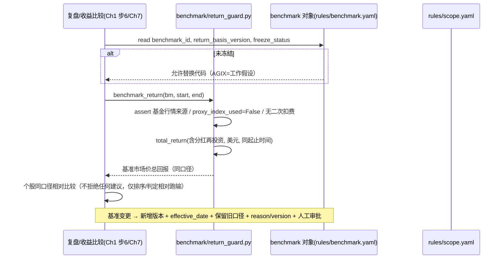

# 第三章《覆盖范围与基准》实现方案

> **章性质**：第三章是**范围与口径层**——它不定义"怎么判断"，而定义"**研究哪些对象、每个对象研究到什么程度、以什么作为比较基准、哪些东西明确不做**"。
> **实现策略**：**约束层增量**——把 N9.1-01~05 / N9.1-22~23 从"数据模型"落到"**具体取值与口径**"，在第九章方案上**补字段、补守卫**，**不新建架构层**。
> **依赖**：默认第九章、第六~七章、第四~五章实现方案已存在；此处只引用其对象，不重复其内容。
> **覆盖**：第三章 34 条需求（P0 29 / P1 5）——全部落位；含 PM 校验提出的 **7 项需补充守卫** 与 **2 项需澄清**。
> **一句话**：第二章定"规则红线"，第三章定"**研究对象边界 + 基准口径**"；两者共同约束实现方"**不得擅自扩边或缩边**"。
> **版本**：v1.1（2026-09-15 回改：技术待定项 ① 关闭；覆盖矩阵 N3.2-08/N3.3-01/N3.4-09 升级为 ✅ 并重算；**本文件回改明细见文末「附：回改记录」（唯一权威）**）

---

## A. 本章定位与实现总览（范围与口径层）

第三章把"范围/口径"固化为三类**基础设施**（供第四/五/七章共同消费）：

```
① 公司与证券分离基础设施（company_id → 0..N securities）
② 基准对象化基础设施（benchmark 对象 + 冻结状态 + 收益口径版本）
③ 覆盖/深研分层基础设施（position_listed / research_depth 四态 / scan_frequency）
        ↓
配套 4 组守卫：展示层中立 · 基准计算守卫 · 模块 denylist · 反凑数三件套
```

**关键设计判断**：
- **为什么"覆盖"与"深研"必须两个维度分开存**？否则会出现"在图即视为已研究"的**虚假覆盖**（违反 N3.2-03/05）。故用 `position_listed`（bool）+ `research_depth`（四态枚举）+ `scan_frequency`（逐节点）**三分量分别可表达**。
- **为什么基准必须"对象化"而非常量**？AGIX 只是**工作假设**，代码在确认时冻结；若无对象化，未来扩展/变更会被硬编码卡死，且无法"保留旧口径"（违反 N3.4-02/06/08）。

---

## B. WorkBuddy 复用边界（A / B / C 三档）

| 能力 | 档 | 落地方式 | 复用点 |
|---|---|---|---|
| 基准/个股行情与基金回报取数 | **A** | WorkBuddy MCP 连接器（`westock` 等） | 复用第九章数据源接入层 |
| 全景图渲染 | **A** | 展示层（`present_files`/腾讯文档） | 复用既有展示层 |
| 基准对象/推荐范围的声明 | **B** | `rules/benchmark.yaml` / `rules/scope.yaml`（只读配置） | 复用第九章规则层 |
| 附录一 44 节点迁库提示词 | **B** | Skill（节点↔公司/证券映射） | 承 N9.2-04（HTML 降为渲染层） |
| **模块 denylist 扫描** | **C** | `scripts/checks/module_denylist.py` | 新建 |
| **基准收益守卫** | **C** | `scripts/benchmark/return_guard.py` | 新建 |
| **展示层中立守卫** | **C** | `scripts/views/neutrality_check.py` | 新建（与 Ch2 P-10 共用） |
| **反凑数三件套** | **C** | `scripts/scope/anti_padding.py` | 新建 |

> **为什么"基准计算"必须独立代码（C）？** 因为要**断言**"不得用公开股票指数替代基金"和"不得二次扣费"——这类口径错误是**静默的**（算出来仍是个数），必须由可单测的守卫拦截，不能靠提示词。

---

## C. 数据模型与字段增量（最小必要）

### C.1 公司与证券分离（N3.2-07/08/09）

```
公司（company_id，稳定代理键；研究判断对象）
   └── 0..N 证券（security_id + 上市地 + 币种 + 交易时段；可交易对象）
```

| 项 | 事项 | 修复点 |
|---|---|---|
| `company → 0..N securities` | schema **显式允许 0 证券** | 未上市实体（OpenAI/Anthropic）可建研究基线，**不产出股票建议**（承 PM B-02） |
| 建议四要素校验 | 出建议前强校验 `(security_id, 上市地, 币种, 交易时段)` **已核实** | 未核实 → **不出建议**，记 gap（N3.2-09） |
| 无持仓出建议 | 建议是**股票层面判断**，无 position 依赖 | 对齐 N3.3-05 / Ch2 第 58 行 |

**附录一 44 节点"实体性质"处理**（决定"非美证券待定"影响面）：

| 类型 | 代表节点 | 处理 |
|---|---|---|
| 未上市实体 | OpenAI、Anthropic | 建公司 + 基线；**无证券、无建议** |
| 纯非美上市（无美股） | **SK hynix**（KRX） | 研究覆盖；是否入推荐范围**待定**（唯一受影响者） |
| 非美公司但有美股 ADR/ADS | ASML、TSM、ARM、NBIS | 用美股证券映射，同时保留原上市地 |
| 美股 | NVDA/AMD/AVGO/… | 直接映射 |

### C.2 覆盖 / 深研 / 频率三分量（N3.2-03/04/06）

| 维度 | 字段 | 取值 | 说明 |
|---|---|---|---|
| 覆盖 | `position_listed` | bool | 44 节点为原型覆盖起点（附录一，含 `资料日期 2026-09-08` / `核对日期 2026-09-14`） |
| 深研 | `research_depth` | `position_listed → relations_verified → baseline_done → tracking`（四态） | 承 N9.1-05；**可回退**（证据撤回时降级），**非单调递增** |
| 扫描频率 | `scan_frequency` | 逐节点不同 | 核心生态高频、边缘低频（承 N3.2-06） |

> **修复点（B-05）**：第九章方案仅**隐含**"深度可回退"，本方案要求**显式规则**：`research_depth` 允许因证据撤回/关系失效而降级，并写审计。

### C.3 基准对象化与 AGIX 口径（N3.4-01~09）

| 字段 | 类型 | 语义 |
|---|---|---|
| `benchmark_id` | string | 基准主键（**对象化**，非硬编码代码） |
| `benchmark_role` | enum | `primary`（ETF 主基准）/ `secondary`（同行辅基准，辅助分析） |
| `coverage_profile` | object | 覆盖定位（AI 硬件/基础设施/应用） |
| `includes_non_listed_assets` | bool | **含非上市资产**标记（AGIX=true） |
| `non_listed_assets` / `sensitivity` | object / object | 非上市资产**缺口 + 敏感性**（**不硬编点值**，承 05 impl E.1） |
| `freeze_status` | enum | `unfrozen / frozen`（**冻结前不得硬编码单一基准代码**） |
| `return_basis` | object | 收益口径（**同起止时间 + 美元 + 含分红再投资的市场价格总回报**） |
| `return_basis_version` | string | 口径版本（可反查、可 as-of） |
| `benchmark_semantics` | string | 语义：**"选股相对继续持有该 AI 投资选项是否创造价值"**，**≠ 全体 AI 上市公司纯行业平均** |

**基准变更治理**（N3.4-08/09）：变更**不覆盖**，新增版本 + 记录 `effective_date` + **保留旧口径结果**（as-of 可查）+ `reason` + `version` + **人工审批**。

---

## D. 关键守卫（4 组，可自动化 + 单测）

### D.1 展示层中立性守卫（N3.2-05 / N2.3-01，对齐 Ch2 P-10）

**要求**：未完成研究**禁止**渲染为"中性评级"或"无投资机会"；**待判断 ≠ 未完成研究**（前者=已研究但不足以定论，后者=尚未研究）。

```python
# scripts/views/neutrality_check.py
def check_neutral(ctx) -> list[Violation]:
    v = []
    if ctx.research_depth == "position_listed" and ctx.render_label in ("中性", "no_opportunity"):
        v.append(Violation("N3.2-05", "未研究伪装中性/无机会"))
    if ctx.rendered_as_neutral_without_research():
        v.append(Violation("N3.2-05", "无研究却输出中性结论"))
    return v
```
- 断言：渲染函数**不存在**把"未完成研究"映射到"中性/无机会"的路径（denylist 渲染扫描）。

### D.2 基准计算守卫（N3.4-05/07）

```python
# scripts/benchmark/return_guard.py
def benchmark_return(benchmark, start, end) -> float:
    # ① 禁止用公开股票指数替代整个基金（N3.4-05）
    assert benchmark.return_source == "fund_market_price", \
        "基准收益必须取基金本身行情，禁用替代指数"
    assert benchmark.proxy_index_used is False, "不得以公开指数充当基金"
    # ② 相对收益禁止二次扣费；基金费用已含在实际回报中（N3.4-07）
    r = total_return(benchmark, start, end, dividends_reinvested=True, ccy="USD")
    assert not benchmark.fee_deducted_again, "基金费用已含在实际回报，禁止二次扣费"
    return r

def nav_return_diagnostic_only(benchmark, start, end):
    # 净值收益仅作"诊断"，不得用于相对收益判定
    return {"role": "diagnostic", "value": nav_return(benchmark, start, end)}
```
- 断言：① `基准收益来源 == 基金行情`；② `fee_deducted_again is False`；③ `nav_return` 只能标 `diagnostic`。

### D.3 模块 denylist 守卫（N3.3-02 / N3.3-04 / C3-5）

```python
# scripts/checks/module_denylist.py
DENIED_MODULES = {
    "gold", "btc", "crypto", "cross_asset_allocation",
    "portfolio_weight_optimizer", "account_management", "trade_execution",
}
def check_modules(manifest) -> list[Violation]:
    return [Violation("N3.3-02/04", f"禁止新增模块: {m}")
            for m in manifest.modules if m in DENIED_MODULES]
```
- 环境项（利率/融资/AI需求/能源/政策）**只作输入**注入公司/基准研究，**不得独立成择时或跨资产配置模块**。

### D.4 反凑数三件套（N3.1-01/08/09/10 / C123-8）

```python
# scripts/scope/anti_padding.py
def check_no_target_count(config) -> list[Violation]:
    # ① 系统内不存在目标数量配置（denylist 扫描）
    banned = {"target_company_count", "expected_list_size", "companies_to_include"}
    return [Violation("N3.1-01/09", f"存在目标数量配置: {k}")
            for k in flatten_keys(config) if k in banned]

def assert_admission(obj) -> None:
    # ② 正式名单入选须三字段非空
    for f in ("raw_source", "inclusion_reason", "evidence_strength"):
        if not getattr(obj, f):
            raise AdmissionRejected(f"缺收录字段: {f}")   # 无出处/无理由 → 拒入正式名单
```
- ③ **名单规模 = 过门槛对象数**：核验后**仅 8 家即收录 8 家**，不补凑、也不为凑数降门槛（门槛变更须版本化+留痕）。
- **边界情形**："重要性高但证据弱" → **不入选正式名单**，可进"研究线索/待核验"队列（承第六章 gap 语义），**不占首批名额**。

---

## E. 基准对象化与口径计算流程



**推荐范围与覆盖解耦（C3-1 / B-17）**：`rules/scope.yaml` 存 `recommended_security_scope`（默认美股为主，非美待定），**研究覆盖集合 ⊇ 推荐范围集合**，两者分别可查；**不得因"推荐范围未定"而缩小研究覆盖**。

---

## F. 环境层与首版边界接口（含回改指引）

### F.1 环境层五类项**只作输入**（N3.3-01/02 / C3-5）

| 环境项 | 进入哪里（承载） | 承载方式 |
|---|---|---|
| 利率与折现要求 | 第五章估值 | 估值假设输入（`input_source=model_estimate/manual`） |
| 融资条件 | 第四章增长代价 | `financing_need` / 增长质量字段 |
| AI 投入与需求周期 | 第七章传导 | `demand_signal` 边 + 终端需求归因 |
| 能源与交付约束 | 第七章传导 | 电力那一跳的 `location/supply_mode/procurement_link` 门槛 |
| 重要政策变化 | 事件与影响 | `event` + `impact`（六要素） |

> **回改指引**：五类环境项的承载落在 **04/05/07** 实现方案（见 Ch2 §F 回改清单 **R-09**）；本方案只声明归属，不重复其内容。

### F.2 首版边界（N3.3-03/04/05 / C3-4）

- 交付**止于"研究 + 股票建议"**（无组合权重优化 / 无账户管理 / 无交易执行 → D.3 denylist 守卫）。
- **不以缺少持仓阻止独立个股研究**：无 position 必填项；建议 `action ∈ {buy, sell, pending, maintain}`，无 quantity/position；**不转做空**。
- 与 Ch2 P-04/P-05、Ch7 E.2 **结构性一致**（无重叠、无遗漏）。

### F.3 与其它文件的接口（回改指引）

| 事项 | 目标 | 关联回改 |
|---|---|---|
| 显式 `company → 0..N securities` + 未上市实体测试用例 | `09_..._v1.md` §2.1.3 | R-08 |
| 基准收益守卫引用 | `09_..._v1.md` + `05_...` | R-10 |
| 基准变更人工审批闸门 | `09_..._v1.md` §3.4 | R-11 |
| 反凑数 denylist + 三字段非空 | `09_..._v1.md` §2.1.3 | R-12 |
| 展示层中立守卫引用 | `06_...` + `07_...` | R-13 |
| 环境五类项承载 | `04/05/07` | R-09 |

> **完整回改清单见 `02_已确认的投资规则/02_实现方案.md` §F（R-01~R-13）**，本文不重复。

---

## 覆盖矩阵（第三章，34 条）

| 需求ID | 优先级 | 实现载体 | 验收方式 | 所属交付阶段 | 覆盖状态 |
|---|---|---|---|---|---|
| N3.1-01 | P0 | `anti_padding.check_no_target_count`（D.4） | 无目标数量配置 | 阶段1 | ✅ |
| N3.1-02 | P0 | 四类角色标签（本公司/上游/下游客户伙伴/竞争者） | 每对象带可查询角色标签 | 阶段1 | ✅ |
| N3.1-03 | P0 | 四问独立研究（Ch4/5/7） | 四项结论可单独查，不因供应商跳过 | 阶段2 | ✅ |
| N3.1-04 | P1 | NVIDIA=研究入口非默认最优 | 建议不默认 NVDA 最高优先 | 阶段3 | ⚠️ 靠评审 |
| N3.1-05 | P0 | 关系落（产品/服务、阶段、有效期） | 空维度被拒 | 阶段1 | ✅ |
| N3.1-06 | P0 | as-of "当前有效关系"（N9.1-33） | 已结束合作不参与传导 | 阶段3 | ✅ |
| N3.1-07 | P0 | 产品级关系并存（不取净号） | NVDA↔同对象多产品多边 | 阶段1 | ✅ |
| N3.1-08 | P0 | `assert_admission` 三字段（D.4） | 无出处/无理由不得入名单 | 阶段1 | ✅ |
| N3.1-09 | P1 | 名单规模=过门槛数 | 无"应收录 N 家"硬编码 | 阶段1 | ✅ |
| N3.1-10 | P0 | 同一证据门槛，重要性不豁免 | 弱证据不进正式名单 | 阶段1 | ✅ |
| N3.2-01 | P0 | 全景图增量扩节点（展示层） | 扩节点不破坏结构 | 阶段5 | ✅ |
| N3.2-02 | P0 | 附录一 44 节点迁库 + 日期标注 | 44 节点带资料/核对日期可查 | 阶段1 | ✅ |
| N3.2-03 | P0 | `position_listed` × `research_depth` 分离（C.2） | "在图但未深研"可表达 | 阶段1 | ✅ |
| N3.2-04 | P0 | `research_depth` 四态（C.2） | 四态可升可降（可回退） | 阶段3 | ✅ 修复B-05 |
| N3.2-05 | P0 | 展示层中立守卫（D.1） | 未研究不伪造中性/无机会 | 阶段5 | ✅ 修复B-06 |
| N3.2-06 | P1 | `scan_frequency` 逐节点 + 资源优先 | 优先队列含核心生态+事件 | 阶段4 | ✅ |
| N3.2-07 | P0 | 公司与证券分离（C.1） | 一公司多证券，结论落公司/建议落证券 | 阶段1 | ✅ |
| N3.2-08 | P0 | 允许公司 0 证券（C.1） | 未上市实体建基线、不出建议 | 阶段1 | ✅ 已改09 §2.1.3（R-08） |
| N3.2-09 | P0 | 建议四要素强校验（D.2/C.1） | 未核实证券不出建议 | 阶段1 | ✅ |
| N3.2-10 | P1 | `recommended_security_scope` 参数化（E） | 覆盖 ⊇ 推荐；两集合可查 | 阶段1 | ⚠️ 待冻结 |
| N3.3-01 | P0 | 环境五类项承载（F.1） | 五类有入口，可被研究引用 | 阶段3 | ✅ 已改04 §D.4/05 §D.5（R-09） |
| N3.3-02 | P0 | 模块 denylist（D.3） | 无黄金/BTC/跨资产模块 | 阶段1 | ✅ |
| N3.3-03 | P0 | 交付止于研究+建议 | 交付清单止于研究结论与建议 | 阶段5 | ✅ |
| N3.3-04 | P0 | 无组合/账户/执行（D.3） | 无相关模块；建议无 position | 阶段1 | ✅ |
| N3.3-05 | P0 | 无持仓可研究（F.2） | 无 position 必填项 | 阶段1 | ✅ |
| N3.4-01 | P0 | `benchmark_role` 主/辅分离（C.3） | 主/辅分别可查 | 阶段2 | ✅ |
| N3.4-02 | P0 | `benchmark_id` 对象化 + `freeze_status` | 无硬编码基准代码 | 阶段2 | ✅ |
| N3.4-03 | P0 | `includes_non_listed_assets` + 缺口/敏感性 | 基准底稿含覆盖定位与标记 | 阶段2 | ✅ |
| N3.4-04 | P0 | `benchmark_semantics` 语义字段 | 措辞明确、非"行业平均" | 阶段2 | ✅ |
| N3.4-05 | P0 | 基准计算守卫（D.2） | 取基金行情，无替代指数路径 | 阶段2 | ✅ 修复B-11 |
| N3.4-06 | P0 | `return_basis` 同口径总回报（C.3） | 个股与基准同口径、可版本化 | 阶段2 | ✅ |
| N3.4-07 | P0 | 费用口径守卫（D.2） | 不二次扣费；净值标诊断 | 阶段2 | ✅ 修复B-13 |
| N3.4-08 | P0 | 基准变更版本化 + 保留旧口径 | 变更不覆盖，旧口径可 as-of | 阶段5 | ✅ |
| N3.4-09 | P1 | 变更 reason+version+人工审批 | 无审批变更被拒 | 阶段5 | ✅ 已改09 §3.4.12（R-11） |

**统计**：✅ 32 / ⚠️ 2 / 缺口 0。（⚠️ 两条 = **N3.1-04**（靠评审，不可自动校验）、**N3.2-10**（非美推荐范围待冻结）；均**非结构性冲突**。v1.1 将 N3.2-08 / N3.3-01 / N3.4-09 由 ⚠️ 升级为 ✅——回改 R-08 / R-09 / R-11 已落位，按矩阵**逐行计数**：✅ 32 / ⚠️ 2 / 缺口 0。）

---

## 技术待定项（第三章）

| # | 待定项 | 影响 | 当前处理 | 状态 |
|---|---|---|---|---|
| ① | ~~规则 14：iFinD / pandadata MCP 连接器是否属"付费数据订阅"~~（B-19） | 决定首版取数口径 | **D-01（2026-09-15 已拍板）**：**有免费额度，暂不视为"付费数据订阅"**；标 `license_tier=free_quota` / `cost=0`；**不进裁决逻辑**；备注"若转付费须按 N2.1-14 重新评估" | ✅ **已澄清（2026-09-15）** |
| ② | **规则 7：官方确认 `confidence_boost` 是否可能演变为门控/阈值** | 决定其是否为纯加成 | 仅作非门控加成，不参与任何比较 | **需需求方澄清** |
| ③ | **N2.3-02：决策门是否含"置信度数值阈值"**（C123-5） | 决定 gate 是否合规 | gate 仅做结构完备性校验，无数值阈值 | **需需求方澄清** |
| ④ | **Ch3 B-17：非美证券是否进入首版推荐范围** | 影响首批可推荐标的集合 | 研究覆盖 ⊇ 推荐范围；`recommended_security_scope` 参数化（默认美股） | **需需求方澄清** |
| ⑤ | **主基准 ETF 最终冻结（是否 AGIX）+ 收益口径（信号生效价/交易成本/税前口径）** | 决定相对收益基准与口径 | 基准以对象承载、状态"未冻结"；口径版本化 | **需需求方澄清** |

> **开放待定项：4 条（② ③ ④ ⑤）**；第 ① 条已关闭（保留原判定过程 + 追加结论行，不删除）。

> 另：核心产业链"几跳内算核心"（N3.1-01）、"同样频率"对齐规则（N3.2-03）、"重要事件"阈值（N3.2-06）、基准变更触发条件（N3.4-08）—— 属**实施参数**，走第十一章冻结。

> 说明：上述（开放 4 条：②–⑤）为**跨三章共用的同一组待定项**，在 `01/02/03` 三份文件的"技术待定项"中**逐份集中列出，措辞一致**。

---

## 附：回改记录（v1.1 · 2026-09-15）

| R 编号 | 本节改动 | 对应需求 | 关联冲突 |
|---|---|---|---|
| R-08 | 覆盖矩阵 N3.2-08 由 ⚠️ → ✅（09 §2.1.3 已显式允许 `company → 0..N securities`） | N3.2-08 | Ch3 B-02 |
| R-09 | 覆盖矩阵 N3.3-01 由 ⚠️ → ✅（04 §D.4 / 05 §D.5 承载环境项） | N3.3-01 | Ch3 B-07 |
| R-11 | 覆盖矩阵 N3.4-09 由 ⚠️ → ✅（09 §3.4.12 增基准变更人工审批闸门） | N3.4-09 | Ch3 B-15 |
| D-01 | 文末技术待定项 ① 关闭：iFinD/pandadata 标 `free_quota`、非付费订阅、不进裁决逻辑 | N2.1-14 | B-19 |
| — | 覆盖矩阵重算：✅ 32 / ⚠️ 2（N3.1-04 靠评审、N3.2-10 待冻结）/ 缺口 0 | — | — |
| R-18 | 待定项 ① / D-01 落位：allowlist `tier=free_quota` → **`license_tier=free_quota`**（`tier` 保留给来源分级） | N2.1-14 / N3.3-04 | C-3（F-11） |
