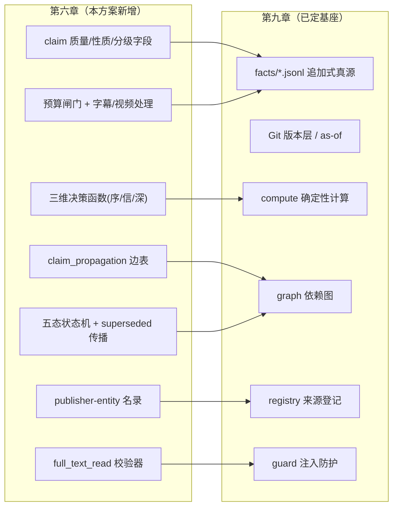
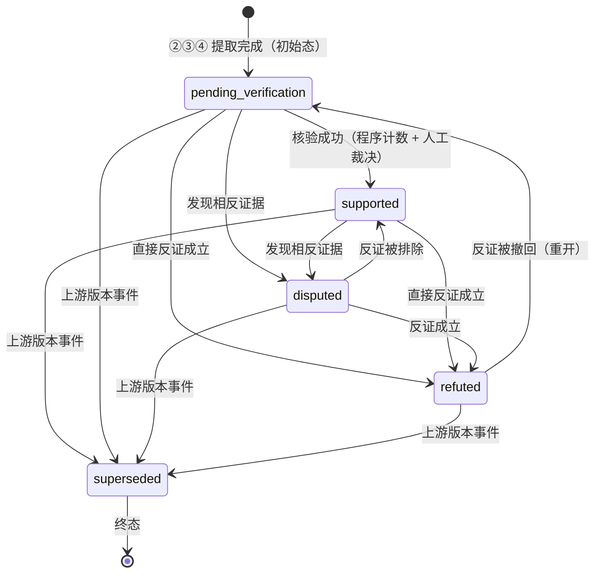

# 第六章《公开信息与证据筛选》实现方案 v1

> **对齐文档**：`02_可编辑源稿_v2.md` 第六章（第 165–207 行）+ `06_公开信息与证据筛选/01_需求拆解.md`（50 条原子需求）
> **承接方案**：`09_数据与实现约束/09_需求拆解与实现方案_v1.md`（第九章方案，本方案**不重写**）
> **本文件日期**：2026-09-15 ｜ **版本**：v1.1（2026-09-15 回改；**本文件回改明细见文末「附：回改记录」（唯一权威）**） ｜ **交付**：软件团队 SOP（产品经理拆解 → 架构师实现方案 → 主理人汇编）
> **本章需求统计**：50 条 = **P0 45 / P1 5 / P2 0**

---

## 0. 本方案定位（与第九章的关系）

> **核心原则：第六章与第九章是同一套基础设施上的两个层。**

| | 第九章（已定） | 第六章（本方案） |
|---|---|---|
| 回答 | 存什么、怎么存才可信 | 信息怎么进来、怎么变成可信主张 |
| 在架构中的位置 | ⑦存储版本层 + 全对象定义 | **②采集与登记层 + ③证据与主张层** 的方法论落地 |
| 本方案的态度 | —— | **只写"在其上加了什么"，不重复已定内容** |

**本方案的复用声明**：9 层架构、`facts/` 18 个 JSONL、三层存储（追加式 JSONL 真源 + 可重建 SQLite 索引 + Git 版本层）、五类时间双时间轴、依赖图与 T12 传播（`scripts/graph/`）、确定性计算层（`scripts/compute/`）、注入防护（`scripts/guard/`）、来源登记表、三层权限、模块 I/O 契约、运维五交付物——**全部沿用第九章，本节不重复**。

**第六章真正的新增**：一批 `claims` / `sources` 上的字段、`claim_propagation` 边表、三维正交决策函数、五态状态机、`publisher-entity` 名录、`full_text_read` 校验器、预算闸门、字幕/视频处理。**它们全部挂在既有 9 层与 `facts/` 目录上，不新建架构层。**



---

## A. 章间接口（地基）

### A.1 正向：第六章动作 → 写入第九章哪个对象/字段 → 第九章哪条需求承接

| 第六章动作 | 写入对象 / 文件 | 具体字段（新增标 ★） | 承接第九章需求 |
|---|---|---|---|
| 来源登记（5 字段） | `registry/sources.yaml` | `fetch_method` / `update_frequency` / `obtainable_content_type` / `access_restriction` / `fallback_source` | N9.3-01~07 |
| 保存出处 + locator | `facts/sources` / `facts/claims` | `★author` `published_at` `version`、`claim.locator`、`obtainable_content_type` | N9.1-10 / N9.1-11 / N9.1-12 |
| 主张拆解 | `facts/claims` | `主体/指标/期间/单位`、`★claim_nature`、`★claim_form`、`★official_claim_kind` | N9.1-13 |
| 分级判定 | `facts/claims` | `★tier`、`★tier_basis`、`★publisher_entity`、`★carrier_platform` | N9.1-13 / N6.2 |
| 去重 / 传播 | `facts/claims` / `facts/claim_propagation` | `★origin_claim_id`、`★is_restatement`、`★is_independent`、`★independent_evidence_count` | N9.1-13 / N9.1-14 |
| 证据质量六维 | `facts/claims.quality` | `★direct_knowledge` `★method_reproducible` `★caliber_match` `★independent_corroboration` `★counter_evidence` `★interest_relationship` | N9.2-02（口径）/ N9.1-13 |
| 研究增量 | `facts/claims.impact` → `facts/baselines` | `★affected_area` `★affected_node` `★magnitude` `★horizon`、`★archive_flag` | N9.1-17 / N9.1-18 |
| 核验任务 + 预算闸门 | `facts/tasks` | `stage` / `error` / `last_valid_result_ref`、`★budget_used`、`★alt_explanation` | N9.1-26 / N9.1-28 / N9.1-29 |
| 状态标注 | `facts/claims.status` | `★supported/disputed/pending_verification/refuted/superseded` | N9.1-13 |
| 版本事件 → superseded | `facts/claims` + `dependency_edges` | `★version_kind`、`supersedes` | N9.1-25 / N9.1-31 / N9.1-33 |
| 缺失处理 | `facts/relations` / `facts/prices` / `facts/expectations` | `economic_exposure=UNKNOWN`、`★delay_flag`、`★coverage_note`、`★gap` | N9.1-09 / N9.1-19 / N9.1-20 / N9.1-21 |
| 费用估算 / 记录 | `facts/tasks.cost` | `tokens` / `searches` / `storage` | N9.1-27 / N9.2-15 |

### A.2 反向：第九章哪个对象被第六章哪条需求填充

| 第九章对象 | 由第六章哪些需求填充 |
|---|---|
| `sources` | N6.1-05~09、N6.2-08/09、N6.3-01 |
| `claims`（内容） | N6.3-02、N6.2-03、N6.2-04 |
| `claims`（分级） | N6.2-01、N6.2-08~12 |
| `claims`（质量） | N6.3-05、N6.2-12 |
| `claims`（状态） | N6.3-10、N6.3-11 |
| `claims.impact` | N6.3-06、N6.3-07 |
| `claim_propagation` | N6.3-03、N6.3-04、N6.2-11 |
| `concepts` 依赖传播 | N6.3-11、N6.3-18 |
| `prices.delay_flag` | N6.4-04 |
| `expectations.coverage_note` | N6.4-02 |
| `relations.economic_exposure` | N6.4-01 |
| `tasks`（核验/预算） | N6.3-08、N6.3-09 |
| `tasks.cost` | N6.1-12 |

### A.3 第六章相对第九章的"新增清单"（一句话速览）

| 类别 | 新增项 | 落位 |
|---|---|---|
| 新文件 | `facts/claim_propagation.jsonl`、`registry/publisher-entities.yaml`、`rules/budget.yaml`、`rules/tiering.vN.yaml`、`scripts/decision/`、`scripts/validators/locator_check.py`、`scripts/ingest/transcript.py` | 挂既有目录 |
| 新字段 | `claims` 上 18 个（tier/origin/quality 六维/nature/type/status/impact/archive_flag…）、`sources` 上 4 个、`tasks` 上 3 个 | 追加 schema |
| 新服务 | 三维决策函数、去重/独立判定、五态状态机、预算闸门、locator 校验器 | `scripts/` |
| 新 Skill | `aichain-claim-extract`、`aichain-verify` | `skills/` |

---

## B. 三维正交建模的落地实现 ★（本章最关键）

### B.1 三组字段 schema（字段名 / 取值域 / 谁写入）

**① 来源分级（tier，落 `facts/claims` 与 `registry/sources`）**

| 字段 | 取值域 | 谁写入 |
|---|---|---|
| `publisher_entity` | 稳定 id（指向 `publisher-entities.yaml`） | 规则（匹配名录） |
| `publisher_type` | `company_official` / `institution` / `kol` / `media` / `unaffiliated` | 规则（名录） |
| `carrier_platform` | `sec` / `company_ir` / `x` / `youtube` / `substack` / `media_site` / … | 采集层自动 |
| `tier` | `primary` / `secondary_1_5` / `secondary_tertiary` | 规则（主体类型 + 事实最初出处） |
| `tier_basis` | 判定依据字符串 | 规则 |
| `origin_claim_id` | claim_id \| null | 规则（引用链解析） |

> **关键：分级主键 = `publisher_type` + `origin_claim_id`，`carrier_platform` 仅作辅助特征**（N6.2-09）。

**② 证据质量（`claims.quality`，六维独立结构化）**

| 字段 | 取值域 | 判定主体 |
|---|---|---|
| `direct_knowledge` | `direct` / `indirect` / `unknown` | 模型抽取 + 来源身份规则 |
| `method_reproducible` | bool + `method_locator`（方法段定位） | 程序（是否含方法段）+ 人工抽样 |
| `caliber_match` | bool + `caliber_note` | **程序**（复用 `scripts/compute/` 口径检查，N9.2-02/03） |
| `independent_corroboration` | claim_id[] | **程序**（第 3 步计数） |
| `counter_evidence` | claim_id[] | 程序化检索 + 模型抽取 |
| `interest_relationship` | `none` / `possible` / `disclosed` | 模型抽取 + 人工核验（关键主张） |

**③ 经济重要性（`claims.impact`）**

| 字段 | 取值域 | 谁写入 |
|---|---|---|
| `affected_area` | `growth_driver` / `realization_condition` / `moat` / `price_expectation` | 模型抽取 |
| `affected_node` | baseline 节点 id | 规则映射 |
| `magnitude` | `high` / `medium` / `low` / `unknown` | 模型抽取 |
| `horizon` | 期间/时滞标签 | 模型抽取 |
| `importance_class` | `high` / `medium` / `low` | 规则（由上述字段映射，见 B.2） |

### B.2 决策函数的可执行定义

> **三者组合产出两个输出：`处理优先级`（order）与`研究投入上限`（cap）。**

```python
# scripts/decision/triage.py —— 注意：以下函数签名中【不存在 weight 参数】

TIER_RANK       = {"primary": 0, "secondary_1_5": 1, "secondary_tertiary": 2}
IMPORTANCE_RANK = {"high": 2, "medium": 1, "low": 0}
BUDGET_MAP      = {"high": 40, "medium": 15, "low": 4}   # 研究投入上限（单位：模型调用数）

def priority_order(claim) -> tuple:
    """处理优先级：字典序，非加权和。输出越小越先处理。"""
    return (TIER_RANK[claim.tier],          # ① 分级决定"先看什么"
            -IMPORTANCE_RANK[claim.importance_class],  # ② 重要性决定同级的先后
            claim.first_seen_at,            # ③ 时间兜底
            claim.claim_id)

def research_cap(claim) -> int:
    """研究投入上限：仅由经济重要性决定，与 tier、quality 无关。"""
    return BUDGET_MAP[claim.importance_class]

def is_adoptable(claim) -> bool:
    """证据采纳：由质量决定（只影响采纳与置信，不影响顺序，也不突破 cap）。"""
    q = claim.quality
    direct = q.direct_knowledge == "direct"
    repro  = q.method_reproducible
    corrob = claim.independent_evidence_count >= 1
    return (q.caliber_match
            and (direct or repro or corrob)          # 可信+独立+可复核的联合判定
            and len(q.counter_evidence_strong) == 0)  # 无强反证
```

**为什么是"字典序 + 字典表"而不是"加权和"：**

1. **语义不可加**：三轴分别是**序**（order）、**信**（trust）、**深**（investment）。加权和会把"高重要性 + 低可信"这一关键态压成中间值，而它正确的处理是"**投入核验**"（既不采纳也不丢弃）。
2. **抗操纵**：加权分可被"刷量"拉高——与 N6.3-14（禁止数量/情绪投票）直接冲突；字典序无"总分"可刷。
3. **可解释**：每条决策能回答"为什么先处理它"（tier→importance→time 逐级），加权分回答不了。
4. **合规**：原文明确禁止固定分数加权（N6.2/6.3），分数化即违规。

**三轴职责边界（硬约束）**：

| 输出 | 由谁决定 | 不允许被谁影响 |
|---|---|---|
| 处理优先级 | tier 为主，importance 调序 | 不得被 quality 影响 |
| 研究投入上限 `cap` | 仅 importance | 不得被 tier / quality 影响（一手但低重要性也不深挖） |
| 采纳与置信 | 仅 quality | 不得突破 cap，不得影响顺序 |

### B.3 程序性约束：用代码保证"不得固定分数加权 / 数量或情绪投票"

| 机制 | 实现 |
|---|---|
| **函数签名无 weight** | `priority_order` / `research_cap` / `is_adoptable` 均无 `weight`、无 `score` 参数；参数只有 `claim` |
| **AST 静态检查** | `tests/test_no_weighting.py`：扫描 `scripts/decision/`、`scripts/graph/`，断言函数体内不出现标识符 `weight / weighted_sum / score / vote / popularity / follower_count / likes / view_count / sentiment_score` |
| **不变性 fuzz 测试** | 对每个决策函数注入被禁元数据（`followers: 0→1e9`、`likes`、`article_count`、`sentiment`），断言**输出完全不变** |
| **类型约束** | 决策函数只接受 `DecisionView` dataclass；该 dataclass **物理上不包含**被禁字段 → 决策代码根本无法读到热度 |
| **Schema 约束** | `claims` 的 schema 中不存在"综合可信度分数"字段；六维不得合并写回 |

### B.4 替代机制：不用分数，靠什么排序与取舍

按**字典序**（权重由低到高，不合并）：

1. **可复核的证据质量**（六维）——主要依据（`is_adoptable` 布尔判定，非打分）。
2. **独立佐证数量**（`independent_evidence_count`，是**基数**不是权重）。
3. **与一手事实的一致性**（是否与官方披露冲突，二元检查）。
4. **作者/来源历史表现**——**仅以人工核验样本为基准**（N9.3-09/11），且**只用于排序与提示**，不进入任何投票或买卖函数。

> 禁止做法（与 PM §2.3(h) 一致）：给来源设固定权重系数、用数量/情绪/粉丝量投票、用模型自评分数加权、把来源等级当硬门槛、对一手/KOL 预设固定分数。

---

## C. "独立 vs 转述"判定算法

### C.1 共同上游如何求（复用哪张表）

**结论：新建 `facts/claim_propagation.jsonl`（来源/传播边表），不混用 `dependency_edges`。**

| 表 | 语义 | 方向 |
|---|---|---|
| `dependency_edges`（第九章已建） | "结论依赖证据"（recommendation → claim） | 下游链，服务 T12 传播 |
| `claim_propagation`（本章新增） | "谁转述谁"（claim → 上游 claim） | 上游链（溯源），服务 T01 去重 |

**为什么不混用**：语义不同。若把"转述"写进 `dependency_edges`，T12 的 `forward_closure` 会把"转述者"误当"下游结论"标失效。二者**共享** `scripts/graph/` 的遍历工具，但**边表分离**。

**共同上游**：沿 `claim.origin_claim_id`（或 `claim_propagation.propagated_from_claim_id`）回溯到最早主张，用 **union-find** 求根；两根相同 = 有共同上游。

### C.2 判定算法步骤与数据结构

```python
# scripts/graph/independence.py
def classify_independence(claims) -> dict:
    # ① 按指纹分组
    groups = group_by(claims, key=lambda c: c.claim_fingerprint)
    #   claim_fingerprint = sha256(主体 ‖ 指标 ‖ 期间 ‖ 单位 ‖ 数值/方向 ‖ origin_entity ‖ time_bucket)
    for fp, g in groups.items():
        root = {c.claim_id: find_root(c) for c in g}     # ② 沿 origin_claim_id 回溯到根
        for c in g:
            shares_root = any(root[c.claim_id] == root[o.claim_id] for o in g if o.claim_id != c.claim_id)
            c.is_restatement = shares_root               # ③ 指纹同 + 共同上游 → 转述
            c.is_independent  = (not shares_root) and (c.quality.direct_knowledge == "direct")
            if c.is_restatement:
                append("facts/claim_propagation",                       # ④ 只记传播，不增计数
                       propagated_from=root[c.claim_id], via=c.source_id, observed_at=now)
            elif c.is_independent:
                bump(root[c.claim_id], "independent_evidence_count")    # ⑤ 独立佐证，计数 +1
            else:
                enqueue_review(c, kind="dedup_override")                # ⑥ 存疑 → 人工兜底
    return summary
```

**数据结构**：
```json
// facts/claim_propagation.jsonl（追加式）
{"claim_id":"CLM-x","propagated_from_claim_id":"CLM-root","via_source_id":"SRC-kx",
 "is_restatement":true,"observed_at":"2026-09-15T12:00:00Z","recorded_seq":10231}
```

### C.3 误判的纠正入口（人工 override）

- 任务类型 `dedup_override`（写 `facts/tasks.jsonl`）：操作人可强制设置 `is_independent`。
- 结果写 `facts/claim_alias.jsonl`：`{claim_id, is_independent, reason, operator, at}`（**追加，不覆盖原判定**）。
- **不改历史行**：override 作为新版本生效，旧判定仍在 Git 历史，可 as-of 复核（对齐 N9.1-33）。

### C.4 T01 的验收方式

`tests/test_acceptance_T01_T14.py::test_T01` 构造十篇转述同一匿名订单消息的主张，断言：

| 断言 | 期望 |
|---|---|
| 根主张数 | **= 1**（`SELECT count(*) WHERE is_root=true`） |
| 传播记录数 | **= 10**（`claim_propagation` 行数） |
| `independent_evidence_count`（根主张） | **= 1** |
| 任一被采纳结论的证据集 | 只含 1 条根主张，不含 10 条转述 |

---

## D. 七步主张化的模块化

### D.1 七步各自的输入/输出/幂等键/失败处理（沿用第九章契约表格式）

| 步骤 | 输入 | 输出 | 幂等键 | 失败处理 |
|---|---|---|---|---|
| ① 保存出处 | 原始抓取物 `raw/*` | `sources`（+base locator）、五时间 | (`source_id`,`content_hash`) | 无正文 → 记 `obtainable_content_type=no_transcript/headline_only`，保留入口 |
| ② 拆主张 | `source` | `claims`（主体/指标/期间/单位/`claim_nature`/`claim_form`/`official_claim_kind`） | (`source_id`,`locator`,`claim_form`) | 复合句拆不明 → 保留原句 + 待人工任务 |
| ③ 追踪去重 | `claims` | `origin_claim_id`、`claim_propagation`、`claim_fingerprint` | (`claim_fingerprint`,`origin_claim_id`) | 指纹冲突 → `dedup_override` 队列 |
| ④ 质量判断 | `claims` | `claims.quality`（六维） | (`claim_id`,`quality_version`) | 口径检查失败 → 标 `caliber_match=false` 并拦截采纳 |
| ⑤ 研究增量 | `claims` + `baselines` | `claims.impact`、`archive_flag` | (`claim_id`,`baseline_id`) | 无法映射节点 → `is_incremental=false`（归档路径） |
| ⑥ 核验（预算闸门） | 重要且不确定的 `claims` | `tasks`(verify)、`alt_explanation`、`counter_evidence` | `task_idempotency_key` | 到限 → `pending_verification` + 可重入任务（D.5） |
| ⑦ 状态标注 | `claims` | `claims.status`（五态）+ 依赖结论更新 | (`claim_id`,`status_version`) | 传播失败 → 保留原状态 + 报警，不静默 |

### D.2 七步在 WorkBuddy 里的组织：两个 Skill（而非一个）

| Skill | 覆盖步骤 | 触发方式 | 取舍理由 |
|---|---|---|---|
| `aichain-claim-extract` | ① ② ③ ④ ⑤ ⑦ | 同步（采集后立即，per source） | 这 6 步是**同一来源内的高内聚流水线**（一次解析要顺序走完），合在一个 Skill 减少上下文切换与重复加载 |
| `aichain-verify` | ⑥ 核验 + 预算闸门 | **异步（队列/事件/自动化触发）** | 第 6 步**延迟无界**（取决于核验深度）、**受预算约束**、**必须可重入**，且要支撑 T14 提问→任务——**不能塞进同步管线**，否则一次慢核验阻塞整条采集 |

> **结论**：**拆两个 Skill**。同步管线（extract）保证吞吐；异步队列（verify）保证"重要不确定"能被独立调度、到限可重入。二者共享 `scripts/graph/`（去重/传播）与 `scripts/decision/`（三维排序）。

### D.3 第 3 步（去重与传播）→ 接 C

执行 `classify_independence()`（C.2）；输出 `claim_propagation` + `independent_evidence_count`；误判走 `dedup_override`（C.3）。

### D.4 第 5 步"研究增量"判定与"归档"行为

- **半可计算**：`affected_area`（映射到驱动/兑现条件/护城河/价格预期节点）由**模型抽取**；`is_incremental` 由**规则**判定——**若主张未连接到任何 baseline 节点，或与现有证据重复（指纹已存在于已被采纳证据集）→ 无增量**。
- **归档 ≠ 删除**（硬约束，对齐 C6-4 / N9.1-33）：

| 归档行为 | 具体含义 |
|---|---|
| 设 `archive_flag=true`（**追加标记行，不改原记录**） | 退出活跃队列 |
| 不进入 | 待核验队列 / 基线更新 / 建议证据集 |
| 保留 | 记录、引用链、可被查询、可 as-of 回溯、可被重新激活 |

> 违反点自检：若把"归档"实现为 `DELETE` 或字段覆盖，即违反第八章"保留可追溯历史"与第九章"版本不可覆盖"。

### D.5 第 6 步：预算闸门（可验收的行为定义）

| 问题 | 答案 |
|---|---|
| **谁设预算** | 实现方配置 `rules/budget.yaml`（第十一章"检索/模型预算"参数冻结后填入）+ 研究优先级规则 |
| **怎么算** | 按任务类型设三类预算：**时间预算**（`deadline`）/ **计算预算**（`max_model_calls` 或 `max_tokens`）/ **检索预算**（`max_searches`）；`research_cap(claim)`（B.2）给出**上限**，三者取先到者 |
| **到限具体行为** | ① 停止深挖 → ② 主张置 `pending_verification` → ③ 生成**可重入 `VerificationTask`**（含已得部分结论、`alt_explanation` 线索、公开入口、`budget_used`）→ ④ 入队 |
| **验收** | 到限后任务状态 = 待核验 **且** 已入队 **且** 有日志 **且** 可重跑；**绝不静默丢弃、绝不把未完成结论标为已验证** |

---

## E. 主张五态状态机

### E.1 状态转移图



### E.2 转移规则表（触发器 / 前置条件 / 副作用）

| 转移 | 触发器 | 前置条件 | 副作用 |
|---|---|---|---|
| → `pending_verification` | ②③④ 完成；或发现"重要且不确定" | —— | 创建 `VerificationTask`；进入 `priority_order` 队列 |
| `pending → supported` | 核验成功 | `is_adoptable=true` 且 `independent_corroboration ≥ 1` 且无强反证 | 写入采纳证据集；推进依赖 baseline |
| `any → disputed` | 发现相反证据 | `counter_evidence` 非空 | 保留两方证据；**不自动推翻**，转核验 |
| `any → refuted` | 直接反证成立 | 反证可复核 | 移出采纳集；`forward_closure` 标记下游待复查 |
| `any → superseded` | **上游版本事件** | `version_kind` 已定 | **终态**；`forward_closure` → 下游结论入 `recheck` 队列（E.4） |

### E.3 与第九章 `version_kind` 的衔接

| `version_kind`（第九章已定） | 触发 → 主张状态 | 下游动作 |
|---|---|---|
| `forecast_revision`（预测修订） | 被修订主张 → `superseded` | 原版本仍是"当时有效判断"；更新依赖该预测的估值/建议 |
| `financial_restatement`（财务重述） | 引用旧数值的主张 → `superseded` | 旧披露以 `as_originally_reported` 保留；触发所有用旧数值的结论复查 |
| `source_retraction`（原文更正/撤回） | 该原文所有主张 → `superseded` | 全部依赖结论进入**强制复查**（T12） |

### E.4 `superseded` 触发复查：复用 T12 传播机制（不另建）

**直接调用第九章已有的 `scripts/graph/forward_closure()`**：

```python
# scripts/claim/transition.py —— 复用第九章 graph 服务，不新建传播逻辑
def on_superseded(claim_id, version_kind):
    append("facts/claims", {claim_id, status:"superseded", version_kind, supersedes: prev})
    for obj in forward_closure(claim_id, max_depth=3, detect_cycle=True):   # ← 第九章已有
        append_marker(obj, status="stale", invalidated_by=claim_id)         # 追加，不覆盖
        if obj.type in {"baseline", "recommendation"}:
            enqueue_review(target=obj.id, kind="recheck")
    bump_research_depth_downstream(forward_closure(claim_id))
```

> **为什么复用**：`forward_closure` 已实现正/反向遍历 + `max_depth` + 环检测（第九章 §3.4.3），第六章只需在"状态转移"这一事件点调用它，**不新增一套传播**——这正是"同一套库、第六章是采集与证据层"的体现。

### E.5 终态界定与 `refuted` / `superseded` 的区别

| 状态 | 是否终态 | 语义 | 旧版本是否"当时有效" |
|---|---|---|---|
| `superseded` | **终态** | 被**新版本**取代（上游改了口径/数值/原文） | **是**——旧版本在其期间内仍是当时有效判断 |
| `refuted` | **可重开** | 被**直接反证**否定（当前版本本身不可信） | 否——被反证，**不是**被新版本取代 |

> `refuted` 与 `superseded` 的关键差别：**前者是"这条不成立"，后者是"这条曾经成立，但现在已有新版本"**。因此 `superseded` 只是版本更替、旧版本可作为历史保留；`refuted` 是证据效力被否定，且可因反证撤回而 `→ pending_verification` 重开。

---

## F. 三个分级反例的可执行规则

### F.1 "发布载体 ≠ 来源身份"

**字段设计**：`publisher_entity`（谁发布）、`publisher_type`（主体类型）、`carrier_platform`（在哪发布）、`origin_claim_id`（原始出处是谁）。

| 规则 | 判定 |
|---|---|
| **分级只看主体身份**：若 `publisher_type == company_official` → `tier = primary`，**即使 `carrier_platform == "x"`** | N6.2-10 |
| **平台只作辅助特征**：`carrier_platform` 参与展示与采集，**不参与 tier 判定** | N6.2-09 |
| **仿冒识别**：`publisher_entity` 必须能在 `registry/publisher-entities.yaml` 名录中匹配；无法识别主体的来源 → `tier` 降级 + 转 `pending_verification`，**不用平台兜底** | C6-1 |

### F.2 "引用回溯源"的实现

| 主张类型 | 字段 | 规则 |
|---|---|---|
| 转述（KOL 引财报） | `origin_claim_id` → 原始一手主张 | **事实性内容取源头 tier**；转述者只记 `claim_propagation`，不计独立证据（N6.2-11） |
| 1.5 手引用 | `claim_form=citation` + `citation.origin_claim_id` | 事实部分回原财报；估计/观点留 1.5 手（N6.2-04） |
| 混合主张（夹带评论） | 拆分：事实子主张 + 评论子主张，各自 `origin_claim_id` 与 tier | N6.2-11 歧义项 |

**实现**：`claim.origin_claim_id`（单值，指向直接上游）+ `claim_propagation`（多值，完整传播树）+ Git 历史 → 支持"回到原财报"的完整引用链，且可 as-of 重建。

### F.3 独立证据认定边界

| 认定 | 条件 |
|---|---|
| **是独立佐证** | `direct_knowledge = direct` **且** 无共同上游（C.1）**且**（若为实测）`method_reproducible = true` |
| **不计独立** | 有共同上游（转述）→ 只记 `claim_propagation`，`independent_evidence_count` 不增 |
| **非机构不降质量** | `publisher_type != institution` **不**降低 `claim_quality` 标签；专业实测可入独立证据（N6.2-12 / T04） |

---

## G. 缺失处理 5 情形的系统行为

### G.1 触发条件 / 数据字段 / 展示行为 / 衔接需求

| 情形 | 触发条件 | 数据字段 | 展示行为 | 衔接第九章 |
|---|---|---|---|---|
| 无订单金额/份额 | 涉经济暴露但未披露 | `relation.economic_exposure = UNKNOWN` | 标"未披露"（≠0、≠猜测） | N9.1-09 |
| 只有研报摘要/少量预测 | `obtainable_content_type=summary` 或 `sample_n` 小 | `expectations.sample_n`、`coverage_note` | 标"公开预测样本(n=x)" | N9.1-20 |
| 视频无字幕 | 无法解析正文 | `source.obtainable_content_type=no_transcript`、`task=pending` | 标"尚未完成解析" | N9.1-10 / N9.1-11 |
| 只有延迟行情 | 行情源为延迟 | `prices.delay_flag`、`as_of_time` | 标"延迟" + 行情时间（不标实时） | N9.3-04 / N9.1-19 |
| 关键材料/估值输入缺失 | 缺失阻塞某步骤 | `gap` 记录对象 | 标"不足以完成 X" + 保留已完成 | N9.1-21 |

### G.2 "视频无字幕" vs "未完成核验"：**两级状态（不是同一状态）**

| | ① 尚未完成解析 | ② 未完成核验 |
|---|---|---|
| 层级 | **采集/解析层**（尚未进入主张化） | **主张层**（已出主张、待核验） |
| underlying 任务类型 | `parse`（无字幕/正文） | `verify`（预算闸门/待核验） |
| 数据字段 | `source.obtainable_content_type=no_transcript`、`task.type=parse` | `claim.status=pending_verification`、`task.type=verify` |
| 共享原则 | **"未完成可见"**（都显示未完成，不伪装完成） | 同左 |
| 是否合并 | **否**——任务类型不同，不可合并（裁决 C6-6） | 同左 |

---

## H. WorkBuddy 复用边界（第六章增量部分）

> 口径同第九章：**A = 开箱即用 / B = 写 Skill·配置·提示词 / C = 需独立代码**。

| 第六章新增或变化的能力项 | 归属 | 定制工作量 | 理由 |
|---|---|---|---|
| 多源采集编排 | **B** | 2–3d | WebSearch/WebFetch + 现有 MCP 连接器 + 一个编排 Skill；无自建爬虫 |
| 行情/财务/公告/新闻取数 | **A** | 0 | westock / iFinD / pandadata 已连 |
| 公开网页/IR/X/Substack 抓取 | **A** | 0 | WebFetch/WebSearch 直接拿 |
| 字幕/视频处理 | **C** | 2–3d | WorkBuddy **无内置 ASR**；用公开字幕优先，无字幕则记 `no_transcript`（不自建 ASR 也可，作降级路径） |
| 主张拆解的模型调用 | **B（编排）+ C（schema/校验）** | 2–3d | 模型只做抽取，schema 校验与结构落库自建 |
| `publisher-entity` 名录 | **B（配置）+ C（校验）** | 1–2d | 名录是可维护的 YAML 配置；主体身份匹配需小程序 |
| 三维决策函数（序/信/深） | **C** | 2–3d | 必须可单测、可断言无加权（B.3），属确定性计算层 |
| 去重/传播/独立判定 | **C** | 3–4d | 指纹 + union-find + 传播边表 |
| 五态状态机 + superseded 传播 | **B（规则）+ C（引擎）** | 2–3d | 转移规则可配置；转移引擎与 `forward_closure` 调用自建 |
| `full_text_read` 校验器 | **C** | 1–2d | 程序拦截，非模型自觉（N6.1-11） |
| 缺失处理字段与展示 | **B** | 1–2d | 字段 + 展示规则 |
| 人工核验样本库 | **B** | 1–2d | 文件 + Skill 标注流程（ground truth） |

### H.1 MCP 连接器公开口径满足度与替代（N6.1 红线：不得新增付费订阅）

| 需求内容 | 现有连接器是否满足 | 替代方案 |
|---|---|---|
| 一手财务/公告/财报数据 | ✅ westock / iFinD / pandadata 的**公开口径**字段满足 | —— |
| 行情/延迟行情 | ✅ 满足；延迟用 `delay_flag` 标注 | —— |
| 公司 IR / 监管披露正文 | ⚠️ 部分（连接器给结构化字段+公告摘要） | WebFetch 官方 IR/SEC 页面取正文 |
| 第三方研报 | ❌ **不引付费研报库**（红线） | 仅用**公开摘要**，按 N6.4-02 标"公开预测样本(n=x)" |
| 一致预期数据库 | ❌ **不引付费库**（红线） | 公开渠道（公司指引/公开券商观点）作"样本"，披露覆盖缺口 |
| X / YouTube / Substack / KOL | ❌ 连接器无 | WebSearch / WebFetch |
| 视频字幕 | ❌ 无 ASR | 公开字幕优先；无则 `no_transcript`（降级，不阻塞） |

> **结论**：现有 MCP 覆盖"一手财务/行情/公告"主干；**补充来源（X/YouTube/Substack/媒体）走 WebSearch/WebFetch**；**研报与一致预期只取公开摘要**——完全不需要新增付费订阅（守住 N6.1-13）。

### H.2 【v1.1 回改 R-13 / D-01】展示层中立 + 数据源口径（free_quota）

- **R-13 展示层中立**：第六章所有展示视图（`views/`）**引用** `scripts/views/neutrality_check.py`（与第二章 P-10、第三章 N3.2-05 共用）——排序/颜色/折叠不得形成买卖倾向；**反证与缺口**与支持证据同等可见。
- **D-01（2026-09-15 已拍板）**：iFinD / pandadata MCP 连接器**有免费额度、暂不视为"付费数据订阅"**；`rules/data-sources.allowlist.yaml` 标 `license_tier=free_quota` / `cost=0`；**不得写入裁决逻辑**（仍走本章分级与证据质量流程）；备注"若未来转为付费，须按 N2.1-14 重新评估"。

---

## I. 第六章 50 条需求覆盖矩阵

> 格式与第九章矩阵一致。覆盖状态：✅ 已覆盖（可直接验收）｜⚠️ 部分覆盖（依赖外部冻结或策略确认）｜❌ 缺口。

### I.1 N6.1 第一版信息边界（13 条）

| 需求ID | 优先级 | 实现载体（文件/脚本/Skill/字段） | 验收方式 | 阶段 | 状态 |
|---|---|---|---|---|---|
| N6.1-01 | P0 | `registry/sources.yaml:access_restriction` + `scripts/ingest/guard.py` 白名单 | 每条 claim 可回溯公开入口；无仅凭受限内容的结论 | ① | ✅ |
| N6.1-02 | P0 | `registry/sources.yaml:paid_flag` + `rules/data-sources.allowlist.yaml` | 断开付费订阅仍跑通全流程 | ① | ✅ |
| N6.1-03 | P0 | `publisher_type=company_official` → `tier=primary`；`priority_order()` | 同事件一手先入分析队列 | ① | ✅ |
| N6.1-04 | P1 | `tier` 枚举 + 补充来源标注 | 补充来源被标注且不单独支撑重大结论 | ① | ✅ |
| N6.1-05 | P0 | `source.fetch_method`（合并 N9.3-03） | 每来源可查访问方式 | ① | ✅ |
| N6.1-06 | P0 | `source.update_frequency`（合并 N9.3-05） | 承诺时效 ≤ 频率支撑范围 | ① | ✅ |
| N6.1-07 | P0 | `source.obtainable_content_type`（合并 N9.3-02） | 仅摘要来源不出"读过全文"主张 | ① | ✅ |
| N6.1-08 | P0 | `source.access_restriction`（合并 N9.3-06） | 受限来源不越权采集、按规则降级 | ① | ✅ |
| N6.1-09 | P0 | `source.failure_handling` + `tasks.failure_reason` | 失败保留上次有效结果并标注 | ④ | ✅ |
| N6.1-10 | P0 | `rules/compliance.yaml` + 采集白名单 | 无绕过付费/登录墙行为；可审计 | ① | ✅ |
| N6.1-11 | P0 | `claim.full_text_read` + `scripts/validators/locator_check.py` | 仅摘要时 `full_text_read=false`，越界被程序拦截 | ② | ✅ |
| N6.1-12 | P1 | `tasks.cost` + 第十一章参数表 | 产出费用估算与运行成本记录 | ④ | ⚠️ |
| N6.1-13 | P0 | `rules/data-sources.allowlist.yaml` + 变更审批 | 部署清单无未授权付费源 | ① | ✅ |

### I.2 N6.2 信息分级的操作定义（13 条）

| 需求ID | 优先级 | 实现载体 | 验收方式 | 阶段 | 状态 |
|---|---|---|---|---|---|
| N6.2-01 | P0 | `claim.tier` + `claim.tier_basis` | 每条来源/主张唯一分级 + 判定依据 | ① | ✅ |
| N6.2-02 | P0 | `scripts/decision/triage.py:priority_order()` | 一手在同段优先被处理 | ① | ✅ |
| N6.2-03 | P0 | `claim.official_claim_kind ∈ {occurred_fact, forward_guidance, marketing_claim}`（**仅适用 `tier=primary` 官方一手材料**） | 官方仅"验证完成"不升级量产/订单/收入 | ② | ✅ |
| N6.2-04 | P0 | `claim.claim_form ∈ {original_investigation, citation, estimate, opinion}` + `citation.origin_claim_id` | 估计/观点不冒充事实；引用指向原始出处 | ② | ✅ |
| N6.2-05 | P1 | `publisher_entity.method_note` + 身份核验 | 可查方法与身份；无法核实则降级 | ② | ⚠️ |
| N6.2-06 | P1 | `claim.narrative_value` + `unreviewed_lead` 出口 | 二三手不因热度升等级；产出线索 | ③ | ⚠️ |
| N6.2-07 | P0 | 禁止字段 denylist + `tests/test_no_weighting.py` | 权重不含粉丝/点赞/播放量 | ② | ✅ |
| N6.2-08 | P0 | `tier` 判定只引 `publisher_type`+`origin`（不引 legal_liability） | 分级逻辑不引用责任自判 | ① | ✅ |
| N6.2-09 | P0 | tier 主键=`publisher_type`+`origin_claim_id`；`carrier_platform` 仅辅助 | 同平台不同主体可得不同分级 | ① | ✅ |
| N6.2-10 | P0 | `registry/publisher-entities.yaml` + `publisher_type=company_official` | 公司官方账号 X 发布 = 一手 | ① | ✅ |
| N6.2-11 | P0 | `claim.origin_claim_id` + `claim.is_restatement` + `claim_propagation` | KOL 引财报事实指向原财报，不计独立 | ③ | ✅ |
| N6.2-12 | P0 | `claim_quality.method_reproducible`（独立于 tier） | 可复现实测计入独立佐证 | ③ | ✅ |
| N6.2-13 | P1 | `rules/tiering.vN.yaml` + as-of | 分级规则版本化，旧结论可 as-of 复核 | ⑤ | ✅ |

### I.3 N6.3 从信息到可用主张（18 条，全 P0）

| 需求ID | 优先级 | 实现载体 | 验收方式 | 阶段 | 状态 |
|---|---|---|---|---|---|
| N6.3-01 | P0 | `source.author/published_at/version` + `claim.locator` + 五时间 | 可反查页码/段落/视频时间点 | ① | ✅ |
| N6.3-02 | P0 | `claims` schema（主体/指标/期间/单位/`claim_nature`） | 一条财报拆为 N 条带期间/单位/性质主张 | ② | ⚠️ |
| N6.3-03 | P0 | `claim_fingerprint` + `claim_propagation` | 同消息多来源归并到原始主张 | ② | ✅ |
| N6.3-04 | P0 | `claim.is_independent` + `independent_evidence_count` + `claim_propagation` | T01：10 转述 = 1 证据 + 10 传播 | ③ | ✅ |
| N6.3-05 | P0 | `claims.quality`（六维独立字段） | 六维可分别查询，不合并分数 | ② | ✅ |
| N6.3-06 | P0 | `claims.impact` → baseline 节点 | 每条主张可读出改变哪个驱动/条件/护城河/预期 | ② | ⚠️ |
| N6.3-07 | P0 | `claim.archive_flag`（追加标记，非删除） | 归档不触发基线更新，仍可引用回溯 | ③ | ✅ |
| N6.3-08 | P0 | importance×uncertainty 排序 + `VerificationTask` | 重要不确定生成核验任务 + 反证线索 | ③ | ✅ |
| N6.3-09 | P0 | `rules/budget.yaml` 闸门 + 可重入任务 | 到限 = 待核验 + 入队 + 日志，不静默丢弃 | ③ | ✅ |
| N6.3-10 | P0 | `claim.status` 五态机（E） | 状态可查询且流转有规则 | ③ | ✅ |
| N6.3-11 | P0 | `scripts/graph/forward_closure()`（复用第九章） | 主张被否定/替代 → 依赖结论入复查 | ④ | ✅ |
| N6.3-12 | P0 | 三维字段独立 + `priority_order()`/`research_cap()` | 三轴可分别查询，不压成单一分数 | ② | ✅ |
| N6.3-13 | P0 | `scripts/decision/` 无来源等级系数（无 weight 参数） | 权重计算中无预设来源等级系数 | ② | ✅ |
| N6.3-14 | P0 | 决策函数无数量/情绪项 + denylist check | 决策函数不含数量/情绪投票 | ② | ✅ |
| N6.3-15 | P0 | `is_adoptable()`（可信+独立+可复核） | T04：第三方证据纳入判断并标假设 | ③ | ✅ |
| N6.3-16 | P0 | 官方确认作 `confidence_boost`（非门控） | 无官方确认不被一票否决 | ③ | ✅ |
| N6.3-17 | P0 | 三分落 `claim_quality` / `assumption_confidence` / `realization_certainty` | 事实质量、模型置信、兑现确定性可分别查询 | ② | ✅ |
| N6.3-18 | P0 | version 事件 → `superseded` → `forward_closure` → `recheck` | T12：撤回 → 依赖结论复查 + 前后版本 | ④ | ✅ |

### I.4 N6.4 公开数据的缺失处理（6 条，全 P0）

| 需求ID | 优先级 | 实现载体 | 验收方式 | 阶段 | 状态 |
|---|---|---|---|---|---|
| N6.4-01 | P0 | `relation.economic_exposure=UNKNOWN`（N9.1-09） | 未披露 ≠ 0 或猜测值 | ③ | ✅ |
| N6.4-02 | P0 | `expectations.sample_n` + `coverage_note` | T02：单份预测只更新样本，不称一致预期 | ④ | ✅ |
| N6.4-03 | P0 | `source.obtainable_content_type=no_transcript` + `task=parse:pending` | 无字幕 = 未解析 + 可重入任务 + 入口 | ③ | ⚠️ |
| N6.4-04 | P0 | `prices.delay_flag` + `as_of_time` | T13：延迟行情标注时间与延迟，不伪造实时 | ④ | ✅ |
| N6.4-05 | P0 | `gap` 对象 + 已完成研究保留 | 缺失时保留已完成并标"不足以完成 X" | ④ | ✅ |
| N6.4-06 | P0 | `pending` 态与"卖出"分离 | 待判断 ≠ 卖出；缺口可见 | ④ | ✅ |

**覆盖统计**：50 条**全部有实现载体**；**44 条 ✅ 直接可验收**；**6 条 ⚠️ 部分覆盖**（N6.1-12 / N6.2-05 / N6.2-06 / N6.3-02 / N6.3-06 / N6.4-03）；**硬缺口 0 条**。
⚠️ 的共性：**依赖外部参数冻结或策略确认**，非技术不可行。详见 §K。

---

## J. 成本与复杂度增量

### J.1 一次性开发成本增量（相对第九章 42–55 人日）

**口径同第九章**：1 人日 = 熟练工程师专注 6h。

| 第六章新增模块 | 人日 |
|---|---|
| 多源采集编排 Skill（含失败降级/备选切换） | 2–3 |
| 主张拆解（②）+ schema/校验 | 2–3 |
| 去重/传播/独立判定（③ + C） | 3–4 |
| 三维决策函数（序/信/深 + B.3 反加权测试） | 2–3 |
| 五态状态机 + superseded 传播 | 2–3 |
| `publisher-entity` 名录 + 分级规则 | 1–2 |
| `full_text_read` 校验器 | 1–2 |
| 缺失处理字段与展示 | 1–2 |
| 人工核验样本库 + 标注流程 | 1–2 |
| 字幕/视频处理（降级路径） | 1–2 |
| **第六章增量合计** | **16–24** |

> **全项目合计**（第九章 42–55 + 第六章 16–24）= **约 58–79 人日**（口径：跑通 NVIDIA 深度样例 + 一条多公司传导 + 每日连续运行；不含第十一章业务参数校准）。

### J.2 运行成本增量（给公式，单价由需求方填）

| 项 | 公式 | 说明 |
|---|---|---|
| 采集规模 | `N_sources × f_fetch`（来源数 × 每来源抓取频率） | 相对第九章新增"补充来源（X/YouTube/Substack）"的抓取量 |
| 字幕/视频处理 | `N_videos × c_asr`（视频数 × 单条处理成本） | 无公开字幕才走 ASR；可关 |
| 主张拆解抽取调用 | `N_raw_docs × T_extract`（文档数 × 单文档抽取 tokens） | 抽取用轻量模型（J4） |
| 传播/去重计算 | ≈ 0（确定性程序，无模型调用） | 不计 token |
| 核验深挖调用 | `Σ_claims research_cap(claim)` × T_verify | 受预算闸门 cap 约束 |
| **第六章月度增量** | `Σ(上述 × 单价) ` | 单价须需求方按实际采购填入 |

### J.3 复杂度增量

| 维度 | 第九章 | 第六章增量 | 综合 |
|---|---|---|---|
| 技术复杂度 | 中高 | **+1 档**（三维正交 + 五态机 + 独立判定叠加） | **高** |
| 运维复杂度 | 中 | 基本不变（复用同一 Automation/ops） | **中** |
| 数据治理复杂度 | 高 | **+1 档**（分级/质量/重要性 + 缺失五情形） | **极高** |

---

## K. 待明确事项（技术侧，仅第六章新引入）

| # | 事项 | 选项 | 建议 |
|---|---|---|---|
| K1 | 三维组合的排序器实现形式 | 字典序元组 / 决策表 | **字典序元组**（可测、可解释、无分数） |
| K2 | `claim_fingerprint` 的 `time_bucket` 粒度 | 1h / 1d / 事件窗口 | **1d 起**，按事件类型可配（与第九章 J7 同源） |
| K3 | 字幕/视频处理策略 | 自建 ASR / 公开字幕优先 / 完全降级 | **公开字幕优先，无则降级**（首版不自建 ASR） |
| K4 | 独立判定的人工兜底触发条件 | 全部存疑 / 仅高重要性存疑 | **仅高重要性 + 指纹冲突存疑**（控制人工量） |
| K5 | `publisher-entity` 名录维护方式 | 纯人工 / 半自动匹配 | **人工维护名录 + 程序匹配**（防仿冒） |
| K6 | 研究增量"半可计算"的人工介入率 | 全自动 / 关键节点人工 | **关键主张人工确认**（`is_incremental` 高重要性时） |
| K7 | 预算闸门三类预算的默认值 | 待第十一章冻结 | 占位默认 + 参数化（`rules/budget.yaml`） |
| K8 | 视频无字幕是否阻塞依赖主张 | 阻塞 / 不阻塞降级 | **不阻塞**（降级路径，与 N6.4-03 一致） |
| K9 | 缺失 `gap` 升级为研究任务的规则 | 自动 / 人工 | **高重要性自动、其余人工** |
| K10 | 人工核验样本库的覆盖频率 | 待定 | 按领域分批，与第十一章复盘参数对齐 |

---

## 附：T01–T14 中第六章直接相关反例的通过判据（摘要）

| 反例 | 第六章关键能力 | 通过判据 |
|---|---|---|
| T01 | 指纹去重 + 共同上游 + `claim_propagation` + 独立计数 | 10 转述 → 1 根证据 + 10 传播 + `independent_evidence_count=1` |
| T02 | 预测按样本存 + 无付费一致预期库 | 单份变化只更新样本，不称一致预期 |
| T03 | `official_claim_kind` 三分类 + 阶段不自动跨级 | 官方仅"验证完成"不升级量产/订单/收入 |
| T04 | 可信+独立+可复核 + 官方非门控 | 第三方证据纳入判断并标假设/验证条件 |
| T12 | 五态机 + `forward_closure` + version 事件 | 撤回 → 依赖结论入复查 + 前后版本 |
| T13 | 采集限制/失败处理 + 未解析状态 + 延迟标注 | 显示延迟与缺口，不伪造实时/全文 |

---

## 附：回改记录（v1.1 · 2026-09-15）

| R 编号 | 本节改动 | 对应需求 | 关联冲突 |
|---|---|---|---|
| R-13 | 新增 §H.2：展示层引用 `scripts/views/neutrality_check.py`（P-10 + N3.2-05） | N2.3-01 / N3.2-05 | Ch3 B-06 |
| D-01 | 新增 §H.2：iFinD / pandadata 标 `free_quota`（有免费额度、非付费订阅、不进裁决逻辑）；原 A-14/B-19 关闭 | N2.1-14 / N6.1-13 | A-14 / B-19 |
| R-18 | §H.1 / D-01 落位：allowlist `tier=free_quota` → **`license_tier=free_quota`**（`tier` 保留给来源分级） | N2.1-14 / N3.3-04 | C-3（F-11） |
| R-20 | 来源登记 / 缺失处理等引用：`source.obtainable*` → **`obtainable_content_type*`**（字段名统一），取值扩 `no_transcript` | N6.1-07 / N9.3-02 | C-5（F-11） |
| R-17 | §A.1/§D.1/§F.2/§I.2/§I.3 + 附表 T03：`claim_nature`（官方一手三分 `occurred_fact/forward_guidance/marketing_claim`）→ **`official_claim_kind`**（仅 `tier=primary`）；`claim_type`（`original_investigation/citation/estimate/opinion`）→ **`claim_form`** | N6.2-03 / N6.2-04 / N9.1-13 | C-2/C-2b（R-17） |
