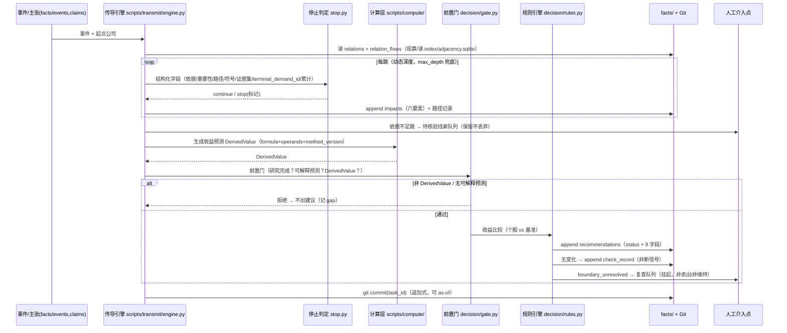

# 第七章《产业链传导与股票建议》实现方案 v1

> **对齐文档**：`02_可编辑源稿_v2.md` 第七章（第 209–252 行）+ `07_产业链传导与股票建议/01_需求拆解.md`（42 条原子需求）
> **承接方案**：第九章（`09_数据与实现约束/09_需求拆解与实现方案_v1.md`）+ 第六章（`06_公开信息与证据筛选/02_实现方案.md`）
> **本文件日期**：2026-09-15 ｜ **交付**：软件团队 SOP
> **版本**：v1.1（2026-09-15 回改；**本文件回改明细见文末「附：回改记录」（唯一权威）**）；R-25 覆盖矩阵口径归正（2026-09-15，明细见文末「附：回改记录」）
> **本章需求统计**：42 条 = **P0 39 / P1 3 / P2 0**

---

## 0. 本方案定位（增量，不重写）

第七章 = 全系统**结论生成层**。它把第六章进来、第九章存下的证据与对象，转成"某公司受何影响、影响怎么传、现在该买还是卖、一条建议长什么样"。

**沿用（不重复）**：9 层架构、`facts/*.jsonl` 真源、三层存储、双时间轴、`scripts/graph/forward_closure`（T12 传播）、`scripts/compute/`（确定性计算）、注入防护、模块 I/O 契约、运维五交付物；第六章的 `claims` 新字段、`claim_propagation`、`scripts/decision/triage.py`、五态状态机、预算闸门。

**第七章新增（全部挂既有 9 层与 `facts/`，不新建架构层）**：

| 类别 | 新增项 | 落位 |
|---|---|---|
| 新表 | `facts/businesses.jsonl`、`facts/relation_flows.jsonl` | 挂 `facts/` |
| 新字段 | `relations` 上 8 个（relation_class/type/coupling_sign/from_role/to_role/relation_progress_stage/…）；`impacts` 六要素细化；`recommendations` 上 9 个 | 追加 schema |
| 新服务 | `scripts/transmit/`（传导引擎）、`scripts/decision/rules.py` + `gate.py`（决策引擎） | `scripts/` |
| 新 Skill | `aichain-transmission`、`aichain-recommend` | `skills/` |
| 新索引 | `index/adjacency.sqlite`（可重建邻接表，非真源） | `index/` |

---

## A. 章间接口

### A.1 第七章 ← 第六章（读哪些 `claims` 字段 / 证据口径）

| 第七章用途 | 读第六章哪些字段 | 承接需求 |
|---|---|---|
| 关系/影响/建议的证据引用 | `claims.claim_id`（作为 `evidence_claim_ids`） | N7.1-08 |
| 依据门槛依赖证据**质量与状态** | `claims.quality.*`、`claims.status`（`supported`/`pending_verification`…） | N7.2-05 |
| 重复证据去重 | `claim_propagation`、`claims.independent_evidence_count` | N7.2-10 |
| 终端需求归因 | `claims.impact.affected_*`、claim 的 subject/target 结构 | N7.2-09 |
| 反证 | `claims.quality.counter_evidence[]` | N7.2-04 |
| 方法论示例隔离 | 示例不得作为 `claim` 入库 | N7.2-06 |

### A.2 第七章 ← 第九章（读写哪些对象 / JSONL）

| 方向 | 对象 / 文件 | 章节 |
|---|---|---|
| 读 | `relations`（含有效期、stage、economic_exposure、证据） | N9.1-06~09 |
| 读 | `baselines`（研究基线、价值状态）、`prices`、`expectations`、`benchmarks` | N9.1-17~23 |
| 读 | `rules/`（第二章冻结规则、模型不可写） | N9.2-01 / N9.1-25 |
| 读 | `scripts/graph.forward_closure`（T12 传播） | N9.1-33 |
| 读 | `scripts/compute`（DerivedValue） | N9.2-03 |
| 写 | `impacts`（六要素）、`relation_flows`、`businesses` | N9.1-15/16 |
| 写 | `recommendations`（8 字段）、`tasks`（复查任务、check_record） | N9.1-24~29 |
| 写 | `dependency_edges`（建议→证据/假设的新边） | N9.1-33 |

### A.3 第七章 → 第十章（哪条反例依赖第七章哪个能力）

| 反例 | 依赖第七章能力 |
|---|---|
| T03 | 合作阶段枚举 + 五者语义分层（N7.1-06/10） |
| T05 | 价值状态与价格分离 + 买入要求"价格未充分反映"（N7.4-05/N7.3-01） |
| T06 | 决策函数**无最低超额幅度门槛**（N7.3-01） |
| T07 | 相对收益比较 + 卖出=股票层面判断（N7.3-02） |
| T08 | 强制复查触发器 + 不擅改护城河（N7.3-05/N7.2-04） |
| T09 | 催化剂非硬门槛 + 无催化剂说明认识路径（N7.3-01/N7.4-09/10） |
| T10 | 待判断与卖出严格分离（N7.3-03） |
| T11 | 生效假设 + 标的时点含行情时间 + 收益口径（N7.4-01/N7.3-01） |

### A.4 第七章对第六/九章的"新增要求"（需在既有 schema 上加字段）

| 加在哪 | 新增字段 | 依据 |
|---|---|---|
| `facts/relations` | `relation_class`、`relation_type`(9 枚举)、`coupling_sign`、`from_role`/`to_role`、`relation_progress_stage` | N7.1-02/10 |
| `facts/relation_flows`（**新表**） | `flow_kind`、`product_flow.*`、`capital_flow.*`、`demand_signal.*` | N7.1-03 |
| `facts/businesses`（**新对象**） | 业务（独立于公司/产品） | N7.1-01 |
| `facts/products` | `is_service` + 服务抽象 | N7.1-05 |
| `facts/impacts` | `magnitude_type`、`conditions[]`、`counter_forces[]`、`location`/`supply_mode`/`procurement_link`、`evidence_insufficient`、`terminal_demand_id`、`cumulative_amplification`、`cycle_collapsed` | N7.2-04/05/08/09/11 |
| `facts/recommendations` | `effective_assumption`、`applicable_case`、`change_reason`、`prev_version_id`、`calc_worksheet`、`sensitivity`、`data_gaps`、`transmission_ref`/`why_now`、`falsifiers`、`catalyst_status`、**`opportunity_types[]`**、**`opportunity_basis[]`**、**`assumptions[]`/`evidence_gaps[]`/`verification_conditions[]`** | N7.4 ｜ 后三项为 v1.1 回改 R-01/R-03 |

### A.5 展示层中立守卫（v1.1 回改 R-13）

> 第七章建议/传导的所有展示视图（`views/`）**必须引用** `scripts/views/neutrality_check.py`（与第二章 P-10、第三章 N3.2-05 共用）：
> - 默认排序**不得**以"买入"置顶；不得用紧迫色/涨跌色暗示；
> - **反证与缺口**必须与支持证据同等可见（不得默认折叠）；
> - 未完成研究节点**禁止**渲染为"中性评级 / 无投资机会"。

### A.6 环境层承载（v1.1 回改 R-09）

> 环境层五类项**只作输入**，**不得独立成择时或跨资产配置模块**（对齐 `03_覆盖范围与基准/02_实现方案.md` §D.3 模块 denylist）。第七章承载其中三类：

| 环境项 | 第七章承载 | 承载方式 |
|---|---|---|
| **AI 投入与需求周期** | 传导层需求信号 | `demand_signal` 边（`relation_flows.flow_kind=demand_signal`）+ 终端需求归因（`terminal_demand_id`） |
| **能源与交付约束** | 传导层电力那一跳的门槛 | 该跳 `location` / `supply_mode` / `procurement_link` **至少一项非空**（见 §C.6 `evidence_gate`） |
| **重要政策变化** | 事件与影响 | `event` + `impact`（六要素：变量/方向/幅度/条件/反向力量/时滞） |

- 三类环境项经上述既有边/门槛/对象进入传导与建议，**不新增环境独立对象、不新增择时模块**。
- 另两类（利率与折现要求、融资条件）分别落 **Ch5 §D.5**、**Ch4 §D.4**（见回改 R-09 全表）。

---

## B. 关系模型的增量落地 ★

### B.1 `relations` 增量 schema（与第九章已有字段合并）

| 字段 | 取值域 | 新增？ | 说明 |
|---|---|---|---|
| `relation_id` | string | 已有(N9.1-06) | 主键 |
| 业务键 | (主体,客体,产品,类型,`valid_from`) | 已有 | 保留 |
| `stage` | 合作阶段枚举 | 已有(N9.1-07) | 不自动跨级 |
| `economic_exposure` | 金额/份额/方向 或 `UNKNOWN` | 已有(N9.1-09) | 未披露=UNKNOWN |
| `evidence_claim_ids` | claim_id[] | 已有 | 无证据不进传导 |
| **`relation_class`** | `flow` / `correlation` / `joint` | **新增** | 方向语义大类 |
| **`relation_type`** | 9 枚举 | **新增** | 见 B.2 |
| **`coupling_sign`** | `+1` / `-1`（仅 correlation） | **新增** | 反向耦合/同向耦合 |
| **`from_role` / `to_role`** | 角色枚举（仅 flow） | **新增** | flow 的方向两端角色 |
| **`relation_progress_stage`** | 五者语义层（见 B.4） | **新增** | 现实程度标签（**仅用于 relations**；勿与 `driver.realization_stage` 混用） |
| **`success_condition`** | 表达式（仅 joint） | **新增** | 联合成功条件 |

**合并方式**：`relation_class` + `relation_type` 两级（class 决定符号规则表，type 是 9 类细分），二者与既有字段**同表并列**，不改既有键与语义。`relation_class` 由 `relation_type` **派生**（规则映射，见 B.2），落库时冗余存储以便索引。

### B.2 九类关系类型 → 三分类 + 方向的完整映射

| 关系类型 | `relation_class` | 方向语义 | 传导符号规则（X 影响时 Y 的方向） |
|---|---|---|---|
| 供应采购 | `flow` | 有向：供应商→客户 | 需求信号逆产品流：客户需求↑→供应商营收↑（**+1**） |
| 制造封装 | `flow` | 有向：代工→委托方 | 同供应采购（**+1**） |
| 产品采用 | `flow` | 有向：提供方→采用方 | 同供应采购（**+1**） |
| 授权 | `flow` | 有向：授权方→被授权方 | 许可方收益≈被许可方销量（**+1**），权利金反向 |
| 渠道 | `flow` | 有向：厂商→渠道→终端 | 同供应链，含加成/库存（**+1**） |
| 投资关系 | `flow` | 有向：投资方→被投方 | 被投方经营↑→投资方权益↑（**+1**） |
| 竞争替代 | `correlation` | 无向 | 反向耦合（**`coupling_sign=-1`**） |
| 互补 | `correlation` | 无向 | 同向耦合（**`coupling_sign=+1`**） |
| 合作验证 | `joint` | 无向（联合结果） | `success_condition` 成立则同号，否则**不传导** |

**同一对公司同时存在正向与负向关系**（如"既供应又竞争"）：
- **不合并、不取净号**——建**两条独立边**（不同 `relation_id`，如 `NVDA↔AMD` 有 `竞争替代(-1)`，`NVDA↔某代工` 有 `供应采购(+1)`）。
- **按跳分别取符号再聚合**（裁决 C7-6）：某事件对某公司的净影响 = 该事件沿各**有效跳**传播所得符号的聚合；聚合允许**正负抵消**，**禁止把整张网标成同向**（N7.2-03）。
- 例：GPU 需求↑ → 对 NVDA / 代工 = +1；对竞争替代者 AMD = -1（替代压力）；二者不合并成"全部利好"。

### B.3 三条并行边（产品流 / 资金流 / 需求信号）

**数据结构的取舍：`relations` 主表 + `relation_flows` 子表（1 关系 → 0..3 流），而非同一张表三行。**

| 方案 | 优点 | 缺点 | 结论 |
|---|---|---|---|
| 同一 `relations` 表三行 | 单表简单 | 关系身份（证据/阶段/有效期）被复制三份，去重与版本追踪困难 | ✗ |
| **主表 + `relation_flows` 子表** | 关系身份共享；三条流各带自身字段与方向；符合"证据独立成对象"的同一设计哲学 | 多一张表 | **✓ 推荐** |

**`relation_flows` 字段**：

| 边 | `flow_kind` | 方向 | 关键字段 | 语义 |
|---|---|---|---|---|
| 产品流 | `product` | 供应商 → 客户 | `product_id`、`volume/value`、`stage` | 实物/服务交付方向 |
| 资金流 | `capital` | 付款方 → 收款方 | `amount`、`currency`、`period` | 对价支付方向（与产品流相反） |
| 需求信号 | `demand_signal` | 需求方 → 供应方 | `intensity`（定性/定量）、`basis` | 需求变化信号（与产品流相反） |

**为什么不能合并（用具体公司举例）**：以 **MSFT（云厂商）↔ NVDA** 为例：
1. **方向不一致**：产品流 `NVDA→MSFT`（交付 GPU），资金流 `MSFT→NVDA`（付款），需求信号 `MSFT→NVDA`（capex↑→下单↑）——三方向无法压成一个。
2. **存在性解耦**：可以有"MSFT capex 指引↑（需求信号↑）"但**尚无 GPU 订单**；也可有产品交付而资金未到账。合并会丢失"已知需求、未知订单"这一关键态。
3. **误把信号当收入**：需求信号↑ ≠ NVDA 收入↑（有库存/时滞/验收）。
4. **去重需要分开**：同一终端需求（AI 训练推理）可同时驱动多个供应商；只有把需求信号独立成边，才能做"根终端需求"归因与去重（N7.2-09）。
5. **证据/阶段不同**：订单阶段证据 vs 回款阶段证据不同，合并无法分别记录。

### B.4 五者语义层级（订单/承诺/capex/排产/收入）→ `relation_progress_stage` 枚举 + 程序约束

> **命名说明（v1.1 回改 R-19）**：本字段**仅用于 `relations`**（现实程度阶梯，非"合作阶段"；"合作阶段"由既有 `relations.stage` 承载，N9.1-07）。为避免同名混淆，命名为 `relation_progress_stage`（不用 `relation_stage`，以免与 `relations.stage` 再撞名）。

| 概念 | `relation_progress_stage` | 已发生 vs 计划 | 可否撤销 | 等同会导致的错误 |
|---|---|---|---|---|
| 收入 | `revenue` | 已发生 | 否 | ——（最"实"） |
| 排产 | `production_schedule` | 计划 | 可调整 | 把内部计划当已出货/已收入 |
| 资本开支 | `capex`（**需求侧**） | 计划+部分已发生 | 可延后 | 把客户预算当对某供应商的确定订单 |
| 采购承诺 | `purchase_commitment` | 计划（有约束力） | 一般不可撤 | 把承诺当已确认收入 |
| 订单 | `order` | 计划 | 可取消 | 把订单直接等同收入（跳过出货/验收/回款） |

**"实"的排序**（从最实到最虚）：`revenue > production_schedule > capex > purchase_commitment > order`。

**程序约束（代码拒绝把 A 当作 B）**：

```python
# scripts/transmit/stage_guard.py
STAGE_ORDER = {"order":0,"purchase_commitment":1,"capex":2,
               "production_schedule":3,"revenue":4}

def assert_not_equivalent(from_stage, to_stage, *, evidence):
    """禁止跳级等同；capex 属需求侧，不得作为供应商的供给 evidence。"""
    if from_stage == "capex" and to_stage in {"order","revenue"}:
        raise StageEquivalenceError("capex(需求侧) ≠ 供应商订单/收入")
    if STAGE_ORDER[to_stage] - STAGE_ORDER[from_stage] > 1 and not skip_evidence(evidence):
        raise StageEquivalenceError(f"{from_stage} 不能直接等同 {to_stage}（缺中间阶段证据）")
```

- 提取器若遇到"订单=收入"这类表述 → **必须拆成两条不同 stage 的 claim**；否则 `assert_not_equivalent` 在落库前拦截（对齐 T03、N7.1-10）。

---

## C. 传导引擎（本章最重）★

### C.1 引擎契约（沿用模块契约表格式）

| 项 | 内容 |
|---|---|
| **输入** | ① 事件或主张（`events`/`claims`）② 起点公司（`company_id`）③ `facts/relations` + `relation_flows` ④ `rules/transmission.yaml`（阈值） |
| **输出** | `facts/impacts.jsonl`（每跳六要素）+ 路径记录（`facts/impacts.path_ref`）+ 待核验线索（依据不足跳） |
| **幂等键** | `(event_id, hop_from, hop_to, relation_id, direction)` |
| **失败处理** | 关系/证据缺失 → 该跳标 `evidence_insufficient`（保留不丢弃）；计算超限 → 收敛衰减并记录；不静默丢弃 |
| **依赖** | 第六章 `claims`/`claim_propagation`；第九章 `relations`/`graph`/`compute` |

**脚本**：`scripts/transmit/engine.py`（编排）、`stop.py`（停止判定）、`cycles.py`（环检测）、`stage_guard.py`（语义层级）、`demand.py`（终端需求归因）。

### C.2 停止条件：可单测的程序判定（模型只抽字段，程序决定停不停）

```python
# scripts/transmit/stop.py
@dataclass
class StopDecision:
    action: Literal["continue","stop"]
    reason: str | None = None
    mark: str | None = None           # 如 evidence_insufficient / direction_doubtful
    effect: str | None = None         # decay / allocate / record_cycle

def should_stop(hop: Hop, path: PathState, params: TransmitParams) -> StopDecision:
    if not evidence_gate(hop, params):                       # ① 依据门槛
        return StopDecision("stop","evidence_insufficient", mark="evidence_insufficient")
    if importance(hop) < params.importance_threshold and not hop.unknown_but_important:
        return StopDecision("stop","low_importance")         # ② 经济重要性阈值
    if hop.node_key in path.visited:                         # ③ 环
        return StopDecision("stop","cycle", effect="record_cycle")
    if not forward_gt_counter(hop):                          # ④ 正向>反向力量
        return StopDecision("stop","direction_doubtful", mark="direction_doubtful")
    if evidence_subset(hop, path.upstream_evidence):         # ⑤ 纯重复证据
        return StopDecision("stop","duplicate_evidence")
    if hop.terminal_demand_id in path.counted_terminals:     # ⑥ 终端需求已计
        return StopDecision("stop","terminal_demand_dup", effect="allocate")
    if path.cumulative_amplification * gain(hop) > params.amplification_cap:  # ⑦ 累计上限
        return StopDecision("stop","amplification_capped", effect="decay")
    return StopDecision("continue")
```

> **模型 vs 程序的边界**：模型只负责**抽取字段**（`variable`/`direction`/`magnitude`/`conditions`/`evidence_claim_ids`/`location` 等）；`should_stop` 与其 7 个条件全部落在**结构化字段**上，由程序判定。**模型不决定停不停**（承 N9.2-03）。7 个条件各配单测。

### C.3 环检测与循环路径

- **算法**：对本事件的传导边集建有向图，跑 **Tarjan SCC**（`scripts/transmit/cycles.py`）；同 SCC 内的强连通分量视为环。
- **检测到后的动作**：把环**折叠为一个代表节点**，冲击按**代表值（max，非求和）**计入一次，回边记 `cycle_collapsed=true` 并丢弃。
- **规则**：同一 `(node, terminal_demand)` 在一次传导中至多贡献一次。
- **与 `max_depth` 的关系**：`max_depth`（第九章 §3.4.3，默认 3）是**硬性安全上限**（防无限遍历/成本爆炸）；SCC 环检测是**语义正确性**（防同一冲击在环内反复放大）。二者互补：`max_depth` 兜底成本，SCC 保证符号与计数正确。**深度本身不固定**（N7.2-02），由重要性动态决定，`max_depth` 仅作防御性上限。

### C.4 "同一终端需求"去重

- **规则**：为每条路径段维护 `terminal_demand_id`；不同中间环节沿依赖链回溯到**同一 `root_demand_entity`** 即判为同一终端需求 → **只计一次**；若两个下游共享同一终端需求，按**分摊比例**分配（不各自全额计入）。
- **算法**（`scripts/transmit/demand.py`）：自下游节点沿 `demand_signal` 边与 `claim.impact.affected_node` 反向回溯，用 union-find 归并同根需求。
- **反例与期望行为**：

| 场景 | 错误行为 | 期望行为 |
|---|---|---|
| 同一份"AI 训练需求"经由 ①云厂商→GPU→代工 与 ②云厂商→内存→设备 三个中间环节被分别计入终端需求 | 终端需求计 3 份 → 冲击放大 3 倍 | 回溯到同一 `root_demand_entity` → **只计 1 份**；三个环节按分摊比例分配 |

### C.5 "累计放大上限"

- **定义**：`cumulative_amplification(path) = Π gain(hop)`，其中 `gain(hop)` 为该跳的（有界）传导增益（由幅度/份额字段映射，未披露用保守值）。
- **计算**：沿路径逐跳累乘；超过 `params.amplification_cap` 时**停止深挖并衰减**（`effect="decay"`）——同一冲击不得在多层传导中被反复放大（N7.2-11）。
- **参数化位置**：`rules/transmission.yaml`（`amplification_cap`、`gain_map`、`importance_threshold`、`max_depth`）——**只读、版本化、模型不可写**（承 N9.2-01）。
- **验收**：单测构造一条 5 跳路径，断言第 k 跳命中 `amplification_capped` 且后续不再放大。

### C.6 依据门槛的形式化与程序校验（以电力公司那一跳为例）

```python
# scripts/transmit/stop.py
def evidence_gate(hop, params) -> bool:
    base = (hop.relation_id is not None
            and len(hop.evidence_claim_ids) >= 1
            and hop.variable is not None
            and hop.direction in {"+","-","0","unknown"}
            and hop.conditions)                       # 六要素中"条件"必填
    if hop.target_type == "specific_operating_entity":   # 目标=具体经营实体
        base = base and (hop.location or hop.supply_mode or hop.procurement_link)
    return base
```

- **电力公司跳的验收点**：目标为具体经营实体 → `location / supply_mode / procurement_link` **至少一项非空**，否则该跳不成立（N7.2-05）。**不能从 GPU 需求直接推所有能源公司受益**。
- **证据不足时的输出（不丢弃）**：该跳标 `impacts.evidence_insufficient=true`，进入**待核验线索队列**（承 N6.4-05 gap 语义），展示为"推断路径（依据不足）"，**不生成受益结论、不进入建议依据集**（N7.2-05）。

### C.7 云厂商 capex 4 跳链路（端到端验收样例）

| 跳 | 传导 | 所需证据类型 | 门槛字段 | 变量/方向 | 反向力量 | 时滞 |
|---|---|---|---|---|---|---|
| ① | 云厂商 capex↑ → 服务器/GPU 供应商 | 云厂商 capex 指引/公告（一手）+ 供应关系（已核验） | capex 事件有一手来源 + 关系已核验 + 投入类别明确 | 采购额/份额（未披露=UNKNOWN）,**+1** | 采购向自研/替代转移 | 1–2 季 |
| ② | 供应商 → 代工/封装 | 供应商产能/代工关系（已核验）+ stage≥订单 | 代工关系已核验 + `relation_progress_stage ≥ order` | 排产/出货,**+1** | 产能瓶颈、良率 | 1 季 |
| ③ | 代工 → 上游设备/材料 | 设备供应关系 + 代工厂 capex/扩产公告 | 关系已核验 + 扩产公告 | 设备订单,**+1** | 扩产延后、制程切换 | 2–4 季 |
| ④ | 数据中心 → 电力公司 | **数据中心地点 + 供电方式/采购关系** | `target_type=specific_operating_entity` → `location/supply_mode/procurement_link` 至少一项非空 | 购电需求,**+1** | 自备电、电网调度、区域竞争 | 数季 |
| 反例 | 无地点/供电/采购依据 | —— | **门槛不满足 → 该跳不成立** | —— | —— | 不能从 GPU 需求直接推所有能源公司受益 |

> 作为 `tests/test_transmission_capex.py` 的固定用例：断言 ①②③ 通过（均为 flow 类、正号）、④ 在缺依据时 `evidence_insufficient` 且**不产出受益结论**。

### C.8 传导图数据从哪来：现算 vs 预计算

**推荐：正确性以 `facts/relations`+`relation_flows` 现算为准；性能上用 `index/adjacency.sqlite`（可重建）缓存邻接表。**

| 方案 | 结论 |
|---|---|
| 完全现算（每次遍历 `relations`） | 44 节点规模足够快；但未来扩展后 O(边数) 扫描变慢 |
| 预计算落 `facts/` | **✗**——邻接表是 `relations` 的**派生视图**，不是真源，落 `facts/` 会违反"唯一事实源 + 可重建" |
| **现算 + `index/` 缓存** | **✓ 推荐**——邻接表落**可重建索引层** `index/adjacency.sqlite`，删了可从 `relations` 全量重建；永不作为事实源（对齐 N9.2-04 库/视图分离） |

---

## D. 建议决策引擎 ★

### D.1 五条规则的可执行判定（"若…则…"）

| 规则 | 判定条件 | 输出 | 输入对象/字段 |
|---|---|---|---|
| **R1 买入** | 若 `research_complete AND has_explainable_forecast AND 预期绝对收益>0 AND 个股收益 > 同期基准收益` | 买入（**无最低超额幅度门槛**） | `baselines`、`ExplainableForecast`、`benchmarks` |
| **R2 卖出** | 若 `有依据预计无法跑赢基准`（`confident_underperform`） | 卖出（即便正收益） | 收益比较结果（相对） |
| **R3 待判断** | 若 `暂时无法判断是否跑赢`（`not confident`） | 待判断/复查中 + 缺口（**≠卖出**） | `gap` 对象 |
| **R4 维持** | 若 `judgment_change == False`（事实/假设/结论均未变） | 维持原判断 + `check_record`（**不产新信号**） | 判断变化检测 |
| **R5 强制复查** | 若 `单纯价格明显下跌`（触发阈值） | 强制复查后重新判断（**不自动止损/抄底**） | `prices` + 触发阈值 |

### D.2 前置门（gate）的实现

**规则引擎入口**：`scripts/decision/rules.py`；**前置门**：`scripts/decision/gate.py`。

```python
def research_complete(company_id) -> bool:
    d = current_research_depth(company_id)                 # N9.1-05 研究深度
    return d >= "research_baseline_done" and baseline_is_complete(company_id)  # N9.1-17

@dataclass(frozen=True)
class ExplainableForecast:                # "可解释预测"最小形式化
    drivers: list[AssumptionRef]          # ① 驱动假设集合
    horizon: Horizon                      # ② 判断期限
    return_point_or_range: Value          # ③ 收益（点估或区间）
    worksheet: DerivedValue               # ④ 底稿：必须是 compute 层 DerivedValue
    method_version: str

def has_explainable_forecast(inp) -> bool:
    f = inp.forecast
    return (isinstance(f, ExplainableForecast) and f.drivers and f.horizon
            and isinstance(f.worksheet, DerivedValue)      # ← 强制 DerivedValue
            and bool(f.worksheet.formula and f.worksheet.operands))

def can_apply_return_comparison(inp) -> bool:
    return research_complete(inp.company_id) and has_explainable_forecast(inp)
```

- **"已完成相应研究"判定**：对应 N9.1-05 研究深度 = `research_baseline_done`（或更高态）+ N9.1-17 基线齐备。
- **"可解释预测"最小形式化**：必须同时具备 ①驱动假设集合 ②判断期限 ③收益（点或区间）④底稿引用（指向 compute 层 `DerivedValue` + 假设版本）。缺任一 → **不可应用收益比较规则**。
- **"随意填数字"的程序拦截**（N7.3-07）：决策引擎入口校验 `forecast.worksheet` 必须是 `DerivedValue` 实例；**无 DerivedValue 的收益值 → 拒绝生成建议**（人工设定值必须显式标 `assumption_source=manual` 并留在假设层，不冒充测算结果）。

**单测**（`tests/test_gate_reject_raw_number.py`）：构造 `forecast.worksheet = 1234`（裸数字）→ 断言 `can_apply_return_comparison == False` 且 `decide()` 返回 `None`（**不生成建议**）。

### D.3 `boundary_unresolved` 的落地

| 项 | 内容 |
|---|---|
| 触发 | 预期绝对收益**为负**但**仍可能跑赢基准**，且该标的**已有积极建议**（buy/hold） |
| 状态字段 | `recommendations.status = boundary_unresolved`（第九章既有 `action` 之外的新 status 值） |
| 状态机位置 | 在 R2/R8 之间的**显式未决分支**（见 D.1 流程图） |
| 处理 | 进入**复查队列**（`tasks` type=`recheck`）；**不自动转卖出、不新增买入、也不等于"维持"** |
| 展示文案 | "未决边界情形：预期绝对收益为负但仍可能跑赢基准，待完整样例校准后定义规则" |
| **为什么不变成隐含新规则** | 缺省行为 = **挂起待决**（第三态），既非"卖出"也非"维持"；它不产出任何买卖动作，只产出一条挂起记录 —— 因此**没有新增买卖条件**（N7.3-09 / 裁决 C7-4） |

### D.4 "未改变判断"的判定与记录

```python
judgment_change = (fact_set_changed OR assumption_changed OR conclusion_changed)
# 全 False → maintained
```
- 记录：生成一条 `check_record`（核查记录，**非新建议、非新信号**）；下游不产出新建议（避免每天生成无意义信号，N7.3-04 / 第八章增量计算）。

### D.5 "关系传染"的程序约束（关系只作研究路径，不作结论依据）

**在决策函数的输入结构上保证**：

```python
@dataclass(frozen=True)
class RecommendationInput:
    company_id: str
    baseline: ResearchBaseline            # 该标的**自身**研究基线（N9.1-17）
    stock_forecast: ExplainableForecast   # 该标的**自身**收益预测
    benchmark_forecast: ExplainableForecast
    own_evidence: list[str]               # 该标的**自身** claim_id[]
    # 注意：不含 relations，不含 other_company_conclusion
```

**可测断言**（`tests/test_no_relation_contagion.py`）：
1. `assert "relations" not in RecommendationInput.__dataclass_fields__`
2. `assert "related_conclusion" not in RecommendationInput.__dataclass_fields__`
3. 往环境注入关联公司结论 → `decide(RecommendationInput)` 输出**完全不变**（不变性）。
4. 供应商与 NVIDIA 有关系 → 仅触发"对供应商**独立研究**"任务，**不触发买入**（N7.4-11 / 裁决 C7-7）。

---

### D.6 【v1.1 回改 R-02】机会类型不进买入门

> 依据：第二章规则 2 / 规则 9（C123-4）。**机会类型是"标注"，不是"准入"。**

- `R1` 买入判定**不含** `opportunity_types`；两类机会（A/B）**均不得被额外门槛拒绝**。
- 门通过后由 `classify_opportunity()`（§E.3）在建议上**标注**类型与依据；未标注不影响"能否买入"。
- 单测：把同一标的分别标为 `[A]` / `[B]` / `[A,B]` / `[]` → 断言 `decide()` 的 `action` **完全不变**（机会类型不作门控）。
- 与 P-06 一致：买入门输入结构**不得**出现 `opportunity_required` 之类的字段。

### D.7 【v1.1 回改 R-03】提前判断三要素 = 买入前置必填（硬冲突 A-06）

> `falsifiers`/`unmet_conditions` 字段已存在但**未作 gate 必填**；提前判断（未兑现前买入）须**强制**含 假设 / 证据缺口 / 验证条件。

```python
# scripts/decision/gate.py（新增，插入买入门）
def assert_early_judgment_complete(rec) -> None:
    """提前判断建议：三要素任一为空 → 不出建议、记 gap。"""
    trio = {"assumptions": rec.assumptions,                    # 假设（驱动/估值）
            "evidence_gaps": rec.evidence_gaps,                # 证据缺口
            "verification_conditions": rec.verification_conditions}  # 验证条件
    for name, val in trio.items():
        if not val:
            raise EarlyJudgmentIncomplete(name, action="记 gap（不出建议）")
    assert rec.trio_written_seq <= rec.version_seq   # 与第一章 G1-01 一致：同版本写入

def is_early_judgment(rec) -> bool:
    return rec.depends_on_unrealized_assumption      # 结论是否依赖未兑现假设
```

- **仅对提前判断**强制（已兑现建议不强制）；判定依据 = 第四章 H.1 价值状态 + 第五章 `ExplainableForecast` 是否依赖未兑现假设。
- 三要素字段名**与第一章 §C.1、第二章 §D.1 完全一致**：`assumptions[]` / `evidence_gaps[]` / `verification_conditions[]`；缺失 → **不出建议、记 gap**。

---

## E. `recommendations` 8 字段 schema

| # | 8 字段 | recommendations 字段 | 新增？ |
|---|---|---|---|
| 1 | 标的与时点 | `company_id`、`security_id`、`currency`、`reference_price`(N9.1-19)、`quote_time`(N9.1-19)、`issued_at`、**`effective_assumption`** | `effective_assumption` **新增** |
| 2 | 行动 | `action ∈ {buy,sell,pending,maintain}`、**`applicable_case`**；**无 quantity/position 字段** | `applicable_case` 新增 |
| 3 | 判断期限 | `horizon`、`start_date`、`review_date`(N9.1-24) | 承 N9.1-24 |
| 4 | 变化原因 | **`change_reason`**、**`prev_version_id`** | 均新增 |
| 5 | 价值与价格 | 引用 N9.1-18 价值状态 + N9.1-21 三份判断 | 引用，不新增 |
| 6 | 收益比较 | `stock_forecast`、`benchmark_forecast`、**`calc_worksheet`**(DerivedValue)、`method`、**`sensitivity`**、**`data_gaps`** | 新增 3 |
| 7 | 传导与时点 | **`transmission_ref`/`impact_ref`**、`affected_companies[]`、`conditions`、`lag`、**`why_now`** | `transmission_ref`/`why_now` 新增 |
| 8 | 验证与反证 | `supporting_evidence[]`、`counter_evidence[]`、`unmet_conditions[]`、**`falsifiers`**、`expiry_review` | `falsifiers` 新增 |
| + | `status` | `boundary_unresolved`（D.3）、`check_record`（D.4） | 新增状态值 |

### E.1 催化剂字段的可空语义（"不存在" vs "未研究"）

| `catalyst_status` | 含义 | 必须附带 | 对第八章每日研究页影响 |
|---|---|---|---|
| `present` | 记录催化剂（`catalyst` 非空） | 催化剂内容 | 显示"催化剂" |
| `absent_confirmed` | **已研究并确认无**催化剂 | **必须**说明"价值可能被认识的路径 + 时间不确定性"（N7.4-10） | 显示认识路径 |
| `not_researched` | **未研究**（≠ 确认无） | 归入待判断/缺口（N7.3-03） | 显示为**未完成研究**，不产新信号 |

> `catalyst_status` 与 `review_date` 共同驱动"下一验证节点"展示。

### E.2 "不编造实际持仓数量"在 schema 上的体现

- `recommendations` **不存在** `quantity` / `position` / `cost_basis` 字段（结构性排除）。
- `action` 只有 4 个枚举值，**无"减仓 30%"类表达**；卖出表述为**股票层面判断**（不假设用户持仓）。
- 单测：`assert not any(f in REC_FIELDS for f in {"quantity","position","shares_held","cost_basis"})`（N7.4-02）。

### E.3 【v1.1 回改 R-01 / R-04】机会类型字段 + horizon 区间断言

**R-01 机会类型（第二章规则 2 / N2.1-02，硬冲突 A-02）**——`recommendations` 增：

| 字段 | 类型 | 语义 |
|---|---|---|
| `opportunity_types[]` | array<enum `A` \| `B`> | **数组、不互斥、可空**；A=基本面改善且价格未充分反映；B=基本面未恶化但价格有吸引力 |
| `opportunity_basis[]` | array<object `{type, value_ref, price_ref}`> | 每类一条依据：`value_ref`→第四章 `value_state_refs`；`price_ref`→第五章 `price_gap_state` |

```python
def classify_opportunity(value_state_refs, price_gap_state) -> list[str]:
    out = []
    if is_improving(value_state_refs) and price_gap_state == "not_fully_reflected":
        out.append("A")
    if not is_deteriorating(value_state_refs) and price_gap_state == "attractive":
        out.append("B")
    return out          # 可同时含 A/B、可空；空则不出买入结论
```

> 消费第四章 `value_state_refs`（回改 R-05 输出）与第五章 `price_gap_state`（回改 R-06 输出）；**不构成门控**（见 §D.6）。

**R-04 horizon 区间断言（第二章规则 1 / N2.1-01）**——schema 增：

```python
def assert_horizon(rec) -> None:
    assert rec.start_date is not None
    assert QUARTER <= rec.horizon <= YEAR     # 边界值 [1Q,1Y] 含在内；越界拒绝
```

---

## F. 更新的端到端时序（事件 → 建议）



**人工介入点**：① 依据不足跳复核；② `boundary_unresolved` 待校准；③ `not_researched` 催化剂补研究；④ 争议关系的传导确认。

---

## G. WorkBuddy 复用边界（第七章增量）

| 第七章新增/变化项 | 归属 | 工作量 | 理由 |
|---|---|---|---|
| 传导引擎编排 | **B** | 2–3d | Agent/SubAgent + Skill 编排遍历；遍历逻辑本身 C |
| 停止判定函数（7 条件） | **C** | 3–4d | 必须可单测的确定性函数（N9.2-03） |
| 环检测 SCC | **C** | 1–2d | 图算法自建（复用 `scripts/graph/` 工具） |
| 终端需求归因 / 累计上限 | **C** | 2–3d | union-find + 阈值判定 |
| 关系图存储与查询 | **B（文件/JSONL）+ C（邻接缓存）** | 1–2d | `relations`+`relation_flows` 落 `facts/`；邻接表落 `index/`（可重建） |
| 建议决策引擎（5 规则 + 前置门） | **C** | 3–4d | 确定性判定 + DerivedValue 强制追溯 |
| 建议生成与展示（8 字段视图） | **B** | 2–3d | present_files + HTML 渲染；快照承第九章 |
| 事件触发传导 | **A/B** | 0.5d | 复用 Automation（第九章已配） |
| 关系/建议的证据引用 | **A** | 0 | 复用第六章 `claims` |

> **明确分工**：**能用 WorkBuddy 原生**的是——编排（SubAgent/Skill）、触发（Automation）、取数（MCP/WebFetch）、存储（文件系统+Git）、展示（present_files）。**必须自建**的是——传导引擎（停止判定/SCC/终端需求/累计上限）、决策引擎（规则+前置门）。二者边界清晰：**"调度与存储"复用，"判定与计算"自建**。

---

## H. 第七章 42 条需求覆盖矩阵

> 状态：✅ 已覆盖 ｜ ⚠️ **已收口 · 待收尾**（机制已就绪、可直接运行，**不阻塞交付**；待收尾项仅三类：① **值可配置待冻结** ② 依赖**人工评审 / 技术侧补设计** ③ 依赖**外部动作**（如跨章回改）。**均非技术不可行、非设计缺陷**）｜ ❌ 缺口。

### H.1 N7.1 关系需要保存的内容（11 条，全 P0）

| ID | 优先级 | 实现载体 | 验收方式 | 阶段 | 状态 |
|---|---|---|---|---|---|
| N7.1-01 | P0 | `facts/businesses.jsonl`（新对象）+ companies/products | 公司/业务/产品独立可查 | ① | ⚠️ |
| N7.1-02 | P0 | `relations.relation_class` + `relation_type`(9 枚举) | 9 类可归为 3 类 | ① | ✅ |
| N7.1-03 | P0 | `facts/relation_flows.jsonl`（product/capital/demand_signal） | 三条边分别可查、方向独立 | ③ | ✅ |
| N7.1-04 | P0 | `relations.from/to` + `endpoint_type`（公司/业务/产品级） | 端点粒度可区分 | ① | ✅ |
| N7.1-05 | P0 | `products.is_service` + 服务抽象 | 服务类关系可表达 | ① | ⚠️ |
| N7.1-06 | P0 | `relations.stage`（显式枚举，不自动跨级） | T03 验证≠量产 | ① | ✅ |
| N7.1-07 | P0 | `relations.valid_from/to` + bitemporal as-of | 历史合作不参与当前传导 | ① | ✅ |
| N7.1-08 | P0 | `relations.evidence_claim_ids` | 无证据关系不进传导 | ③ | ✅ |
| N7.1-09 | P0 | `relations.economic_exposure=UNKNOWN` | 未披露≠0/猜测 | ① | ✅ |
| N7.1-10 | P0 | `relations.relation_progress_stage` + `scripts/transmit/stage_guard.py` | 不存在"订单=收入"自动赋值 | ③ | ✅ |
| N7.1-11 | P0 | `economic_exposure=UNKNOWN` + 禁点估计规则 | 结论不含未披露数值点估计 | ③ | ✅ |

### H.2 N7.2 传导的研究边界（11 条，P0 10 / P1 1）

| ID | 优先级 | 实现载体 | 验收方式 | 阶段 | 状态 |
|---|---|---|---|---|---|
| N7.2-01 | P0 | `scripts/transmit/engine.py` + `stop.evidence_gate` | 扩展跳均过依据+重要性检查 | ③ | ✅ |
| N7.2-02 | P0 | `stop.should_stop`（无固定层数）+ `max_depth` 兜底 | 深度由重要性决定，非固定为 1 | ③ | ✅ |
| N7.2-03 | P0 | `hop.symbol` + `coupling_sign`（逐跳定号） | 同事件对不同公司可正可负 | ③ | ✅ |
| N7.2-04 | P0 | `facts/impacts`（variable/direction/magnitude/conditions/counter_forces/lag） | 每跳六要素齐全，缺条件则不成立 | ② | ✅ |
| N7.2-05 | P0 | `stop.evidence_gate`(specific_entity) + `location/supply_mode/procurement_link` | 缺依据则该跳不成立并标"依据不足" | ③ | ✅ |
| N7.2-06 | P0 | `rules/methodology-examples.yaml`（示例不入 `claims`） | 示例不产生基于示例的建议 | ① | ✅ |
| N7.2-07 | P1 | `views/` 局部视图 + 路径按需展开 | 默认局部；完整路径可展开 | ⑤ | ⚠️ |
| N7.2-08 | P0 | `scripts/transmit/cycles.py`（Tarjan SCC）+ `cycle_collapsed` | 有环时冲击只计一次 | ③ | ✅ |
| N7.2-09 | P0 | `scripts/transmit/demand.py`（`terminal_demand_id` 归因） | 同一终端需求只计一次 | ③ | ✅ |
| N7.2-10 | P0 | 复用第六章 `claim_propagation`/独立计数 | 与上游同源证据不增权 | ③ | ✅ |
| N7.2-11 | P0 | `rules/transmission.yaml:amplification_cap` + `stop.effect=decay` | 同一冲击累计放大受上限 | ③ | ⚠️ |

### H.3 N7.3 建议状态与决策规则（9 条，全 P0）

| ID | 优先级 | 实现载体 | 验收方式 | 阶段 | 状态 |
|---|---|---|---|---|---|
| N7.3-01 | P0 | `scripts/decision/rules.py: R1`（无最低超额门槛） | T06 仅略高于基准不被额外门槛拒绝 | ② | ✅ |
| N7.3-02 | P0 | `R2`（相对收益确定跑不赢即卖出） | T07 正收益跑不赢→卖出并解释 | ② | ✅ |
| N7.3-03 | P0 | `R3` + `gap` 对象 | T10 待判断与卖出严格分离 | ③ | ✅ |
| N7.3-04 | P0 | `judgment_change` 检测 + `check_record` | 无变化日不产新信号，仅记核查 | ④ | ✅ |
| N7.3-05 | P0 | 强制复查触发器 + `enqueue_review` | T08 大跌触发复查，不自动止损/抄底 | ④ | ⚠️ |
| N7.3-06 | P0 | `scripts/decision/gate.py: research_complete + has_explainable_forecast` | 未完成研究者不产出收益比较/买卖 | ② | ✅ |
| N7.3-07 | P0 | `gate.py` 强制 `forecast.worksheet` 为 DerivedValue | 无 DerivedValue 拒绝生成建议 | ② | ✅ |
| N7.3-08 | P0 | `R8`（负绝对收益禁新增买入） | 负收益场景不产生新增买入 | ② | ✅ |
| N7.3-09 | P0 | `recommendations.status=boundary_unresolved` + 复查队列 | 该情形挂起，无自动卖出/维持 | ④ | ✅ |

### H.4 N7.4 建议 8 字段与补充（11 条，P0 9 / P1 2）

| ID | 优先级 | 实现载体 | 验收方式 | 阶段 | 状态 |
|---|---|---|---|---|---|
| N7.4-01 | P0 | `recommendations` 七要素 + `effective_assumption`(新) | 七要素齐全且可回溯 | ② | ✅ |
| N7.4-02 | P0 | `action` 枚举 + `applicable_case`；**无 quantity/position** | 建议中无持仓/数量字段 | ② | ✅ |
| N7.4-03 | P0 | `horizon`/`start_date`/`review_date` | 期限在季度~一年，起算点明确 | ② | ✅ |
| N7.4-04 | P0 | `change_reason`/`prev_version_id`（新） | 相对上一版本变化可追溯 | ② | ✅ |
| N7.4-05 | P0 | 引用 N9.1-18 价值状态 + N9.1-21 三份判断 | 六要素可反查 | ② | ✅ |
| N7.4-06 | P0 | `calc_worksheet`(DerivedValue)/`sensitivity`/`data_gaps`（新） | 收益预测可追到底稿，缺口可见 | ② | ✅ |
| N7.4-07 | P0 | `transmission_ref`/`impact_ref`/`why_now`（新） | 受影响公司+条件/时滞可查 | ③ | ✅ |
| N7.4-08 | P0 | `supporting_evidence[]`/`counter_evidence[]`/`unmet_conditions[]`/`falsifiers`/`expiry_review` | 支持/反对证据可查，到期复查存在 | ⑤ | ⚠️ |
| N7.4-09 | P1 | `catalyst` + `catalyst_status=present` | 有催化剂时字段非空可查 | ④ | ✅ |
| N7.4-10 | P1 | `catalyst_status=absent_confirmed` + 认识路径字段 | 无催化剂含"认识路径+时间不确定性" | ④ | ⚠️ |
| N7.4-11 | P0 | `RecommendationInput` 只接受自身 baseline+DerivedValue | 决策函数不接受关联公司结论 | ② | ✅ |

### H.5 覆盖统计

- **42 条全部有实现载体**；**✅ 已覆盖 35 条**；**⚠️ 已收口 · 待收尾 7 条**；**❌ 硬缺口 0 条**。
- 7 条 ⚠️ 及性质（均**非技术不可行**，属**已收口 · 值可配置待冻结**（机制已就绪、可直接运行，**不阻塞交付**，**非技术不可行、非设计缺陷**））：N7.1-01（业务 vs 产品线边界）、N7.1-05（服务无代际字段填法）、N7.2-07（"局部"范围定义）、N7.2-11（放大上限阈值依据）、N7.3-05（强制复查触发阈值待冻结）、N7.4-08（反证完整性规范）、N7.4-10（无催化剂表述规范）。

> 各待收尾项的**基线值**（2026-09-15 已确认）与口径归正说明见 `00_待拍板项清单.md` **D-03 / D-04**；**⚠️ 计数不因口径归正而改变**（⚠️ 表达的是"值尚未冻结"这一事实，不是"未被覆盖"）。

---

## I. 成本与复杂度增量

### I.1 一次性开发成本增量（相对第九 + 六章）

**口径同前**：1 人日 = 熟练工程师专注 6h。

| 第七章新增模块 | 人日 |
|---|---|
| `relations`/`relation_flows`/`businesses` schema + 9 类映射 | 2–3 |
| 传导引擎编排 + 停止判定（7 条件） | 3–4 |
| 环检测 SCC + 终端需求归因 + 累计上限 | 3–4 |
| 依据门槛 + stage_guard 程序约束 | 2 |
| 决策引擎（5 规则 + 前置门 + DerivedValue 强制） | 3–4 |
| `boundary_unresolved` + `check_record` + 判断变化检测 | 2 |
| `recommendations` 8 字段 + 催化剂语义 + 展示 | 2–3 |
| 传导/决策单测 + capex 4 跳用例 + 防传染断言 | 2–3 |
| **第七章增量合计** | **19–25** |

> **全项目累计**（第九章 42–55 + 第六章 16–24 + 第七章 19–25）= **约 77–104 人日**（口径：跑通 NVIDIA 深度样例 + 一条多公司传导 + 每日连续运行；不含第十一章业务参数校准）。

### I.2 新增运行成本项

| 项 | 公式 | 说明 |
|---|---|---|
| 传导计算量 | `O(E × D)`（E=有效关系边数，D=传导深度）；环检测 `O(V+E)` | 随图规模与深度增长 |
| 事件触发传导 | `e_events × O(E_avg × D)` | 每事件重算受影响子图 |
| 建议生成模型调用 | `n_updated_companies × T_recommend` | 仅对受影响+重算公司 |
| 收益预测计算 | ≈ 0（确定性程序，无模型调用） | 走 `scripts/compute/` |

### I.3 传导引擎计算复杂度风险（重点评估）

| 风险 | 描述 | 控制手段 |
|---|---|---|
| **图规模膨胀** | 44 节点 → 数百/数千节点后 `E` 与路径数组合爆炸 | 邻接表索引（`index/adjacency.sqlite`）+ 仅从**受影响子图**出发遍历 |
| **深度放大** | 无固定深度 → 深度大时路径数指数增长 | `max_depth` 硬上限 + 重要性阈值剪枝 + SCC 折叠 |
| **重复计算** | 多事件共享子图重复遍历 | 幂等键 `(event_id,hop_from,hop_to,…)` 去重 + 增量重算（只算受影响对象，承第八章） |
| **Worst-case** | 理论上 `O(b^D)`（b=平均出度，D=深度） | 实测用 44 节点规模基准；设 `b×D` 上限告警；阈值参数化于 `rules/transmission.yaml` |

> **结论**：44 节点规模可忽略（毫秒级）；扩展到数千节点时，靠"受影响子图 + 剪枝 + 索引 + 幂等去重"把复杂度控制在可接受范围，并为 `max_depth`/出度设告警。

### I.4 复杂度增量

| 维度 | 综合 | 理由 |
|---|---|---|
| 技术复杂度 | **高** | 传导引擎（图算法 + 符号 + 去重）+ 决策引擎（前置门 + 强制追溯）叠加 |
| 运维复杂度 | **中** | 复用同一 Automation/ops；新增仅索引重建 |
| 数据治理复杂度 | **极高** | 关系三分类 + 三边 + 五语义层 + 8 字段建议 + 两态分离 |

---

## J. 待明确事项（技术侧，仅第七章新引入）

| # | 事项 | 选项 | 建议 |
|---|---|---|---|
| J1 | `relation_class` 是否派生存储 | 派生冗余 / 现算 | **派生冗余存储**（索引友好，随 `relation_type` 变） |
| J2 | 三边建表方式 | 同表三行 / 主表+子表 | **主表 + `relation_flows` 子表**（B.3） |
| J3 | 传导深度上限默认值 | 3 / 5 / 无 | **硬上限 5 + 重要性动态剪枝**（`max_depth` 兜底） |
| J4 | `amplification_cap` 阈值 | 待业务定 | 参数化于 `rules/transmission.yaml`，先占位保守值 |
| J5 | `gain(hop)` 映射规则 | 幅度→增益 / 份额→增益 | 未披露用保守值；明确"未披露不点估计" |
| J6 | 终端需求分摊比例算法 | 均分 / 按经济暴露权重 | **按已知经济暴露权重；未知则均分** |
| J7 | 环折叠取值 | max / 代表值 | **max**（保守，不求和，C.3） |
| J8 | 强制复查触发阈值 | 待冻结（第十一章） | 参数化；先占位，明确非止损门槛 |
| J9 | `not_researched` 是否阻塞建议 | 阻塞 / 降级 | **降级为待判断**，不阻塞（避免变成硬门槛） |
| J10 | 邻接表缓存刷新策略 | 每次 / 增量 | **`relations` 变更后增量刷新**；可全量重建 |
| J11 | `boundary_unresolved` 的展示层级 | 建议页 / 每日页 | 两处均显示，标"未决边界" |

---

## 附：第七章相关 T 反例的通过判据（摘要）

| 反例 | 第七章关键能力 | 通过判据 |
|---|---|---|
| T03 | 合作阶段枚举 + 五者语义分层 | 官方仅"验证完成"不自动升级量产/订单/收入 |
| T05 | 价值状态与价格分离 + 买入要求"价格未充分反映" | 价值状态与投资判断分开更新，不机械买入 |
| T06 | R1 无最低超额幅度门槛 | 仅略高基准不被额外门槛拒绝 |
| T07 | R2 相对收益比较 | 正收益但跑不赢→卖出并解释相对判断 |
| T08 | R5 强制复查 + 不擅改护城河 | 大跌触发复查，不自动止损/抄底 |
| T09 | 催化剂非硬门槛 + 认识路径 | 无催化剂时说明认识路径，护城河非必要条件 |
| T10 | R3 待判断 + gap | 待判断与卖出分离，不混同"跑不赢" |
| T11 | `effective_assumption` + 行情时间 + 收益口径 | 生效价非消息前价，收益比较用正确口径 |

---

## 附：回改记录（v1.1 · 2026-09-15）

| R 编号 | 本节改动 | 对应需求 | 关联冲突 |
|---|---|---|---|
| R-01 | §A.4 recommendations 行 + 新增 §E.3：增 `opportunity_types[]`（enum A/B，数组、不互斥、可空）+ `opportunity_basis[]`（`{type,value_ref,price_ref}`） | N2.1-02 | A-02 |
| R-02 | 新增 §D.6：明确机会类型**不进买入门**；门后由 `classify_opportunity()` 标注（两类均不得被额外门槛拒绝，守规则 9） | N2.1-02 / N2.1-09 | A-02 |
| R-03 | 新增 §D.7：增 `assert_early_judgment_complete()`，`assumptions[]`/`evidence_gaps[]`/`verification_conditions[]` 任一为空 → 不出建议、记 gap | N2.1-06 | A-06 |
| R-04 | 新增 §E.3：schema 增 `horizon ∈ [1Q,1Y]` 断言（边界含）+ `start_date` 必填 | N2.1-01 | 规则 1 |
| R-09 | 新增 §A.6：环境层三类承载（AI需求→`demand_signal`+`terminal_demand_id`；能源→电力跳 `location`/`supply_mode`/`procurement_link`；政策→`event`+`impact`） | N3.3-01 | Ch3 B-07 |
| R-13 | 新增 §A.5：展示层引用 `scripts/views/neutrality_check.py`（P-10 + N3.2-05） | N2.3-01 / N3.2-05 | Ch3 B-06 |
| R-16 | §E.3 `price_gap_state` 取值**中文→英文**（`fully_reflected`/`not_fully_reflected`/`attractive`），同步 `classify_opportunity` 等值判断 | N2.1-02 | C-1（F-11） |
| R-19 | §B.1/§B.4：`relations.realization_stage` → **`relation_progress_stage`**（与 `driver.realization_stage` 消歧；driver 侧不动） | N7.1-10 | C-4（F-11） |
| R-25 | 覆盖矩阵 ⚠️ 定性归正为「已收口 · 待收尾（不阻塞交付）」；覆盖状态图例统一；**✅/⚠️/❌ 计数不变** | 跨章口径一致性 | D-04 |
