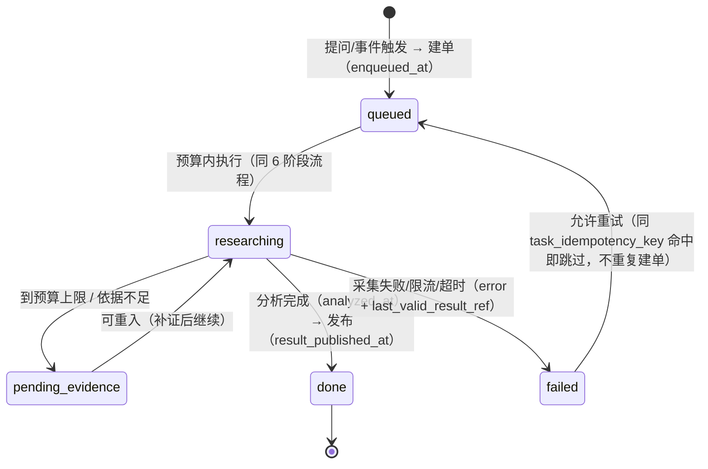
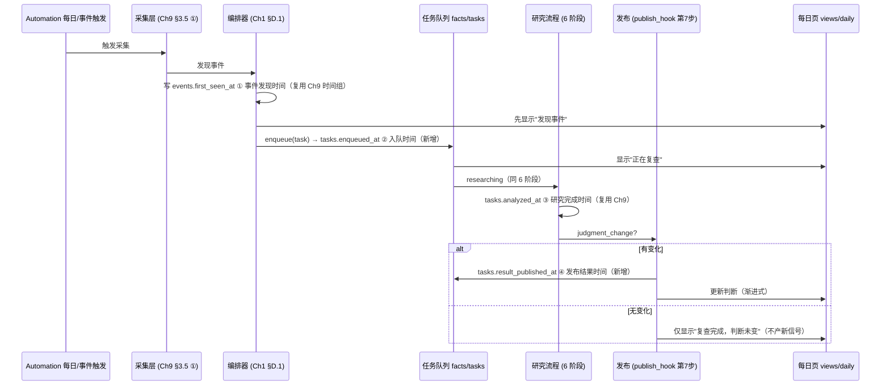

# 第八章《产品入口与每日运行》实现方案

> **对齐文档**：`02_可编辑源稿_v2.md` 第八章（第 254–286 行）+ `08_产品入口与每日运行/01_需求拆解.md`（39 条原子需求）
> **承接方案**：第九章（`09_数据与实现约束/09_需求拆解与实现方案_v1.md`）+ 第一章（`01_产品目标与核心闭环/02_实现方案.md`）+ 第二章（`02_已确认的投资规则/02_实现方案.md`）+ 第六章（`06_公开信息与证据筛选/02_实现方案.md`）+ 第七章（`07_产业链传导与股票建议/02_实现方案.md`）
> **章性质**：第八章 = **产品入口层 + 运行调度层**。它回答"**用户看到什么、每天系统自动做什么、失败时怎么办**"。
> **与第九章的分工（本方案严守）**：**第九章定义对象与字段，第八章定义入口、流程、状态展示与调度**。故本章**不新建对象、不新建流程**，只定义三类契约——**交互契约 + 调度契约 + 降级契约**；第九章已定义的 8 类对象、五类时间、版本机制**只引用、不重述**。
> **本文件日期**：2026-09-15 ｜ **交付**：软件团队 SOP
> **版本**：v1.1（2026-09-15 回改）。本文件回改明细见文末「附：回改记录」（**唯一权威**）。
> **本章需求统计**：39 条 = **P0 31 / P1 8 / P2 0**（N8.1：9 条，P0 7 / P1 2；N8.2：8 条，P0 7 / P1 1；N8.3：12 条，P0 10 / P1 2；N8.4：10 条，P0 7 / P1 3）

---

## 0. 本方案定位（增量，不重写）

**一句话结论**：第八章把"**三个阅读入口 + 每天自动跑的一套流程 + 失败时的降级行为**"接到第九章既有对象上；**本章唯一的承重设计是幂等与降级的不变量**（重跑不重复、降级不美化、未研究不冒充已验证），其余一律引用既有定义。

| | 第九章（已定） | 第八章（本方案） |
|---|---|---|
| 回答 | 存什么、怎么存才可信 | 用户看到什么、每天自动做什么、失败怎么办 |
| 在架构中的位置 | ⑦存储版本层 + 全对象定义 | **⑧展示层 的入口契约** + **⑨运行与运维层 的调度/降级契约** |
| 本方案的态度 | —— | **只写"在其上加了什么契约"，不重复已定内容** |

**本方案的复用声明**：9 层架构、`facts/*.jsonl` 真源、三层存储、双时间轴与五类时间、版本追加式不可变、8 类对象、`scripts/compute/`、`scripts/graph/forward_closure`、注入防护、模块 I/O 契约（Ch9 §3.5）、运维五交付物（Ch9 §3.6）、`neutrality_check.py`（Ch2 P-10 / Ch3 §D.1）、`priority_order`（Ch6 §B.2）、`evidence_gate`（Ch7 §C.6）、`gap→task` 幂等键（Ch1 §C.3）——**全部沿用，本节不重复**。

**第八章真正的新增（全部挂既有 9 层与 `facts/`，不新建架构层）**：

| 类别 | 新增项 | 落位 |
|---|---|---|
| 契约 | **三个阅读入口交互契约**、**提问→任务契约**、**调度契约**、**降级契约** | `views/`、`skills/`、`rules/` |
| 新字段 | `tasks` 上 `enqueued_at` / `result_published_at` / `parent_context` / `outputs` / `conclusion_changed`；`recommendations` 与事件发布上 `published_as`；各数据对象上 `stale_since` | 追加 schema（见 §A.4） |
| 新配置 | `rules/trigger.yaml`（五类事件触发）、`rules/notification.yaml`（渠道/聚合，值 `tbd`）、`rules/publish.yaml`（发布政策，值 `tbd`）、前端 `animation_policy` | `rules/` + 前端配置 |
| 新 Skill | `aichain-ask`（提问→任务）、`aichain-daily`（每日运行编排） | `skills/` |
| 新展示视图 | `views/graph/`（图谱入口）、`views/company/`（公司研究页）、`views/daily/`（每日研究页） | `views/`（渲染层，非事实源） |
| 新检查器 | `scripts/views/neutrality_check.py` **扩项**（S-02/S-03/S-06/S-08）、`rules/trigger.yaml` 配置扫描、降级写路径断言 | `scripts/views/`、`scripts/checks/` |

**本章不做什么（硬边界）**：
1. **不新建对象**（8 类对象由 Ch9 定义）、**不新建流程**（6 阶段由 Ch9 §3.5 定义）；
2. **不设新门槛、不拍板待定项**——C8-1（默认自动更新 vs 人工复核边界）、C8-2（提问是否走完整 gate）**保持可切换**，只写"两种模式下的行为差异"，**不选一个当结论**；
3. **不重述五类时间/版本机制**——只写"入口与调度如何读写它们"。

---

## A. 章间接口

### A.1 第八章 ← 各章（读哪些对象/字段）

| 第八章用途 | 读哪些对象 / 字段 | 承接需求 |
|---|---|---|
| 图谱入口展示节点三要素 | `business_positions`（`research_depth`、`updated_at`）+ 变化标记源 | N8.1-01 |
| 图谱局部关系视图 | `relations`（类型/`stage`/`valid_from`/`valid_to`，Ch7 §B.1）+ `relation_flows` | N8.1-02 |
| 事件传导路径展示 | `impacts`（六要素 + `conditions`）+ Ch7 §C.6 `evidence_gate` / `evidence_insufficient` | N8.1-03 |
| 公司页首屏六项 | `business_positions` / `growth_momentum_state` / `certainty_state` / `moat_level`+`moat_state` / `action` / 本次变化（Ch4 §H.1、Ch7 §E.3） | N8.1-04 |
| 公司页展开层五项 | `baselines`（底稿）/ `claims`（原始证据）/ 财务估值 / `counter_evidence`（反证）/ 历史版本（Ch9 追加式） | N8.1-05 |
| 每日页四项 | `check_record`（Ch1 §C.2）+ 受影响公司 + 建议变化 + `review_date`/`expiry_review`（Ch7 §E.1） | N8.1-07 |
| 三级异常态展示 | `claim.status=pending_verification`（Ch6 §E）/ `obtainable_content_type`（采集层）/ `stale`+`delay_flag`（Ch9 §3.4.8、Ch6 §G） | N8.1-08 / N8.4-05 |
| 任务五态回显 | `tasks.task_status`（Ch1 §C.3） | N8.2-04 |
| 调度与幂等 | `sources.update_frequency` / `expected_latency`（Ch9 §3.4.8）、三类幂等键（Ch9 §3.6） | N8.3 / N8.4-08 |
| 承诺时效 | `可承诺时效 = min(update_freq + latency)`（Ch9 §3.4.8） | N8.4-10 |

### A.2 第八章 → 写哪些对象

| 方向 | 对象 / 文件 | 写入内容 |
|---|---|---|
| 写 | `facts/tasks.jsonl` | `enqueued_at` / `result_published_at` / `parent_context` / `outputs` / `conclusion_changed`（§C.1） |
| 写 | `facts/recommendations.jsonl` / 事件发布 | `published_as ∈ {verified, inferred}`（§E、N8.3-11） |
| 写 | 各数据对象（标记行，追加不覆盖） | `stale_since`（`stale` 复用 Ch9 §3.4.8） |
| 写 | `check_record`（Ch1 §C.2 子记录） | `degraded=true`（当日降级运行） |
| 写 | `rules/trigger.yaml` / `rules/notification.yaml` / `rules/publish.yaml` / 前端 `animation_policy` | 调度、通知、发布、性能配置（值 `tbd` 者见 §K） |

### A.3 回写钩子挂点（对接 Ch1 §H.1 的三个接口契约）

> 第一章交付了 3 个**接口契约**（`check_record` 结构、`gap→task` 状态机、`publish_hook` 签名），第八章是**它们的落点**——Ch1 §D.1 编排器的**第 7 步（发布）/第 8 步（验证）** 在本章接上。

| Ch1 接口 | 第八章落点 | 挂载方式 |
|---|---|---|
| `register_publish_hook(fn)`（Ch1 §E） | **第 7 步发布** | 每日运行在 `judgment_change != False` 时调用；`fn` 落 `recommendations` + `published_as`；**无变化时不触发**（反 KPI） |
| `gap→task` 状态机（Ch1 §C.3） | **提问任务 / 复查任务** | 幂等键 `(gap_id 或 claim_id) + task_type`；`task_status` 五态由本章 §C.2 展示 |
| `check_record` 结构（Ch1 §C.2） | **每日页数据源** | 每日运行**必写** `check_record`（无论有无变化）；`degraded` 反映当日降级（N8.3-02） |
| `verify_hook`（Ch1 §E 第 8 步预留） | 归第十章，本章**只留接口不实现** | 与 Ch1 §D.1 一致，**不得静默跳过** |

### A.4 第八章对既有对象的"新增字段要求"

| 加在哪 | 新增字段 | 依据 |
|---|---|---|
| `facts/tasks` | `enqueued_at`、`result_published_at`、`parent_context`、`outputs`、`conclusion_changed` | N8.2-02/05/06、N8.3-06 |
| `facts/recommendations` / 事件发布对象 | `published_as ∈ {verified, inferred}` | N8.3-11 |
| 各数据对象（标记行） | `stale_since`（`stale` 复用 Ch9） | N8.4-05 |
| `check_record` | `degraded`（复用 Ch1 §C.2） | N8.4-05 |

> **命名说明（承 Ch2 §C.2 命名规范）**：`result_published_at` **刻意不叫 `published_at`**——Ch9 §3.4.1 的 `published_at` = 来源/事件**公开时间**，语义不同（**同名不同域必须消歧**）；发现时间**复用** `first_seen_at`、研究完成时间**复用** `analyzed_at`（§D.3）。新字段一律英文小写 + 下划线；"待定"值统一 `tbd`。

### A.5 展示层中立守卫（引用，不重述）

> 第八章三个入口的所有展示视图（`views/`）**必须引用** `scripts/views/neutrality_check.py`（与 Ch2 P-10、Ch3 §D.1、Ch6 §H.2、Ch7 §A.5 共用）——排序/颜色/折叠不得形成买卖倾向；**反证默认不折叠**；**未研究禁止渲染"中性 / 无投资机会 / 已验证"**（对齐 Ch3 N3.2-05）。本章在 §G 补齐 4 条**新层守卫缺口**（S-02/S-03/S-06/S-08）。

---

## B. 三个阅读入口的交互契约 ★

> 每个入口给四项：**数据来源字段 / 展示层级（首屏 vs 展开层）/ 中立性守卫 / 降级时的表现**。对应 N8.1-01~09。

### B.1 图谱入口（`views/graph/`）

| 项 | 内容 |
|---|---|
| **数据来源字段** | 节点：`business_positions.research_depth`（Ch3 四态 `position_listed`/`relations_verified`/`baseline_done`/`tracking`，**逐字引用**）+ `updated_at` + **变化标记**；边：`relations`（类型/`stage`/`valid_from`/`valid_to`）+ `relation_flows` |
| **首屏层** | "能源→应用"**位置全景**（保留 topology，不加载全图关系）；每节点显示 `research_depth` + `updated_at` + 变化标记三要素（N8.1-01） |
| **展开层** | 点击公司 → **该公司局部关系视图**（非全图，按需展开；默认跳数 `tbd`，承 N8.1-02）；点击事件 → 传导路径（`impacts`）+ 每跳 `conditions`；**无证据跳标"依据不足"**（N8.1-03） |
| **中立性守卫** | ① 变化标记**只区分"有变化/无变化"**，不作好坏色彩（承 Ch1 反 KPI）；② **"在图 ≠ 已深研"**——`research_depth=position_listed` 的节点**不得**渲染为"已研究/中性/无机会"（N3.2-05 / S-16 / S-03） |
| **降级表现** | 节点行情/材料失效 → 节点保留，挂 `stale` 角标 + `stale_since` 日期；**不置空、不标最新**（§E） |

### B.2 公司研究页（`views/company/`）

| 项 | 内容 |
|---|---|
| **数据来源字段** | 首屏六项：`business_positions`（产业位置）/ `growth_momentum_state`（增长动力）/ `certainty_state`（增长确定性）/ `moat_level`+`moat_state`（护城河）/ `action`（当前建议）/ **本次变化**（`change_reason`+`prev_version_id`，Ch7 §E.3） |
| **首屏层** | 六项**结论简洁**（可一句话读），各可点击展开（N8.1-04/06） |
| **展开层** | 五项深内容：完整底稿（`baselines`）/ 原始证据（`claims` + `locator`）/ 财务与估值 / **反证**（`counter_evidence`）/ 历史版本（as-of）；**"简洁 ≠ 空标题"**——不得因简洁删减研究内容（Ch4 §G.2，N8.1-05/06） |
| **中立性守卫** | ① **反证与支持证据同等可见**（**不折叠反证**，P-10）；② 默认排序**不得以"买入"置顶**；③ 未完成研究**禁止**渲染"中性评级"（S-03） |
| **降级表现** | 估值/行情输入缺失 → 保留上次有效结果 + `stale` 标记 + 日期；缺口标"不足以完成 X"，**不置 null**（§E、Ch6 §G） |

> **"本次变化"基准口径**：以**上次建议版本**（`prev_version_id`）为基准（非"上次运行"），避免把"每日无变化运行"渲染成"变化"（N8.1-04 歧义项，取"上次建议版本"口径；此为口径澄清，非新门槛）。

### B.3 每日研究页（`views/daily/`）

| 项 | 内容 |
|---|---|
| **数据来源字段** | 重要信息（`check_record` + `claims`）/ 受影响公司（`impacts.affected_companies`）/ 建议变化（`change_reason`）/ 下一验证节点（`review_date`/`expiry_review`，Ch7 §E.1）；**四项与 `check_record`（Ch1 §C.2）同日绑定**（N8.1-07） |
| **首屏层** | 四项齐全；"重要信息"按 **`priority_order` 字典序**（tier→importance→time，Ch6 §B.2）排（N8.1-07） |
| **展开层** | 三类异常态**分别可见**（N8.1-08）：`未完成核验` / `数据失效` / `研究任务失败`——**各有独立展示位与文案** |
| **中立性守卫** | ① "重要信息"排序**走字典序，禁 `weight`/`score` 打分**（S-02）；② 三级异常态**分别渲染**，不得合并为"加载中"（S-06）；③ 未研究事件**只**显示"发现/待研究"（S-08） |
| **降级表现** | 当日降级运行 → `check_record.degraded=true`，页面顶部标"本次为降级运行（保留上次有效结果）"+ 日期；**不隐藏、不伪装完成** |

### B.4 通知契约（N8.1-09）

| 项 | 内容 |
|---|---|
| **配置** | `rules/notification.yaml`：`notification_channels` / `notification_aggregation`，值 **`tbd`**（**已收口 · 值可配置待冻结**（A9），见 §K ③） |
| **不变量** | 通知层对 `recommendations` **只读**；"开通知 / 关通知 / 换聚合"下**结论集合与内容完全一致**（仅推送方式变）——**通知过滤不得改变投资规则**（§F 不变量测试） |
| **排序** | 通知**处理顺序**用 `priority_order` 字典序；**禁止**用 `weight`/`score` 做"通知优先级打分"（P-09，S-02） |

---

## C. 提问 → 研究任务的任务契约 ★

> 对应 N8.2-01~08。**提问必须是"真研究任务"**：不是把问题存本地就完事。

### C.1 任务对象完整 schema（`facts/tasks.jsonl` 扩展）

| 字段 | 类型 | 取值/说明 | 与既有不撞名 |
|---|---|---|---|
| `task_id` | string | 主键（Ch9 §2.1.1） | 复用 |
| `task_type` | enum | `research`/`verify`/`parse`/`recheck`/`dedup_override` | **复用** Ch1 §C.3，逐字一致 |
| `task_status` | enum | `queued`/`researching`/`pending_evidence`/`done`/`failed` | **复用** Ch1 §C.3 token（N8.2-04） |
| `enqueued_at` | datetime | 入队时间（**新**） | 不撞 `first_seen_at`/`analyzed_at` |
| `result_published_at` | datetime | 结果发布时刻（**新**） | **刻意不叫 `published_at`**（后者 = 来源公开时间）→ 消歧 |
| `parent_context` | object | `{object_id, page, baseline_version}`（**新**） | 提问继承上下文（N8.2-02） |
| `outputs` | array<ref> | 产生的更新（对象引用）（**新**） | 与 Ch1 `traceback.prev_version_id` 互补，不重复 |
| `conclusion_changed` | bool | 是否改变已有结论（**新**） | 对齐 Ch7 `judgment_change`（任务级回显） |
| `error` / `last_valid_result_ref` | —— | 失败定位 + 旧结果引用 | **复用** Ch9 §3.6 |

### C.2 五态状态机



- **五态逐字引用** Ch1 §C.3：`queued → researching → pending_evidence → done / failed`（**不得另起中文 token**，S-05）。
- **到限不伪装完成**：`pending_evidence` 保留可重入任务 + 日志（承 Ch6 §D.5 预算闸门）。

### C.3 上下文继承三要素（N8.2-02）

| 要素 | 字段 | 语义 |
|---|---|---|
| 所选对象 | `parent_context.object_id` | 公司 / 产品 / 关系 id（N8.2-01 三入口） |
| 当前页面 | `parent_context.page` | 提问发起的入口（图谱 / 公司页 / 每日页） |
| 研究基线版本 | `parent_context.baseline_version` | 提问**基于当时基线版本**（可 as-of 解释"基于哪一版研究"） |

> **缺"基线版本"就无法解释回答基于哪一版研究**——故三要素**必填**（结构性要求，非新门槛）。

### C.4 "真研究 vs 假装研究"三条硬判据的可执行实现

| 判据 | 实现（可执行） | 验收 |
|---|---|---|
| ① **服务端任务** | 提问即建 `task`（`task_id`）落 `facts/tasks.jsonl`（服务端磁盘，**非浏览器**，Ch9 N9.2-06） | 清空浏览器存储后任务与回答仍在（T14） |
| ② **同流程** | 提问走与自动监测**相同 6 阶段**（Ch9 §3.5）+ 同 `evidence_gate`（Ch7 §C.6） | 提问产出结论与自动运行**同字段/同门槛** |
| ③ **可追溯回写** | 回答含 **答案 + 证据（`claim_id[]`）+ 产生的更新（`outputs` = 对象引用）**；`outputs` 必须是**对象引用**（非纯文本） | 三件齐全，更新可回溯 |

```python
# scripts/tasks/ask_to_task.py —— 提问入口（Reject "假装研究"）
def ask(object_id, page, question, baseline_version) -> TaskRef:
    task = new_task(task_type="research", task_status="queued",
                    parent_context={"object_id": object_id, "page": page,
                                    "baseline_version": baseline_version},
                    enqueued_at=now())
    append("facts/tasks", task)                 # ① 服务端任务（非本地存储）
    run_pipeline(task, stages=CH9_6_STAGES,     # ② 同流程（同 evidence_gate）
                 gate=ch7_evidence_gate)
    assert task.outputs and task.evidence_claim_ids is not None  # ③ 可追溯回写
    return task
```

### C.5 【C8-2 可切换】提问是否走完整 gate —— 两种模式的行为差异

> **本章不选一个当结论**（C8-2 已收口（值可配置待冻结，基线值见 `00_待拍板项清单` A7））。系统以配置 `rules/ask.yaml:gate_mode` **保持可切换**，默认与自动监测一致（走完整 gate）。

| 模式 | `gate_mode` | 行为差异 | 适用 |
|---|---|---|---|
| **完整门（默认）** | `full` | 提问**走与自动监测相同的完整 gate**（Ch7 §D：`research_complete` + `has_explainable_forecast` + `assert_early_judgment_complete`）；产出的建议与自动运行**同门槛** | 涉及**建议**的提问（N8.2-03） |
| **事实短路** | `fact_shortcut` | **"是什么"类事实问题**可短路到"证据检索"分支（不产买卖建议，只回证据）；**涉及建议的提问仍必须过 gate** | 纯事实性提问 |

- **两模式共同约束**：**资源排队**统一进入同一队列、`priority_order` 排序（Ch6 §B.2）；用户提问可设"人工触发优先"，但**不得绕过门槛**（若过门槛）。
- **与 S-04 一致**：若走完整 gate，复用 Ch7 §D.7 `assert_early_judgment_complete()`；**"是否过 gate"由需求方裁定后配置化**，实现方保持两模式均可运行。

### C.6 回答中的"是否改变已有结论"与"入库清单"（N8.2-06/07）

- `conclusion_changed`：对齐 Ch7 §D.4 `judgment_change`；无变化 → 不产新信号（反 KPI）。
- 入库清单：逐条指向 `claim_id` / `relation_id` / `assumption`；**入库可审计**（承 Ch9 追加式不可变）；清单**可含"被拒绝入库"项**（P1，N8.2-07 歧义项，默认含并在展示层区分）。

---

## D. 调度契约 ★

### D.1 每日固定更新的调度设计（优先用 WorkBuddy Automation 承载）

| 项 | 口径 |
|---|---|
| **承载** | WorkBuddy **Automation**（周期任务），对齐 Ch9 §3.6 运行方案 |
| **周期** | 每日一次（`rrule` 每日）；**主更新窗口 = 美股收盘后**（N8.3-03） |
| **时刻/时区** | **可配置**（`rules/schedule.yaml`）；时区显式记录；**值 `tbd`**（属实施参数，第十一章，见 §K ⑤） |
| **非交易日** | **可配置**（`rules/schedule.yaml:trading_calendar`）；非交易日**仍写 `check_record`（无变化）**，不产信号（反 KPI，N8.3-02） |
| **幂等键** | `(run_date, scope)`；重跑命中即跳过（承 Ch9 §3.6，`state.json` 游标） |
| **每日检查三类** | 价格（`prices`）/ 公开材料（`sources`+`claims`）/ 关键变量（`drivers`，Ch4）；三类各有采集入口（N8.3-01） |
| **每日必写** | `check_record`（无论有无变化）；无变化日**不发信号**（N8.3-02） |

### D.2 五类事件触发（`rules/trigger.yaml`）★

> **触发标准 = 研究优先级规则**（`priority_order` 字典序），**不是**价格止损或最低超额收益门槛（N8.3-05 / C8-6）。

```yaml
# rules/trigger.yaml（只读、版本化、模型不可写，承 N9.2-01）
triggers:
  earnings_and_guidance:            # ① 财报与指引
    source: [earnings, forward_guidance]     # 接 Ch6
    action: enqueue_research
  major_order_and_capacity:         # ② 重要订单和产能
    min_importance_class: tbd       # 阈值待定（实施参数），非价格门槛
    action: enqueue_research
  product_and_competition:          # ③ 产品与竞争变化
    source: [product_launch, competitor_move]
    action: enqueue_research
  key_evidence_retraction:          # ④ 关键证据撤回
    source: [source_retraction]      # 接 Ch6 §E.3 version_kind
    action: force_recheck
  abnormal_price_move:              # ⑤ 异常价格变化
    rule: forced_recheck_only        # 只触发"强制复查"（Ch7 R5 / Ch5 F.5）
    threshold: tbd                   # 阈值待冻结（第十一章）
    action: force_recheck
# ⚠️ 本文件严禁出现 stop_loss / stop_price / price_stop /
#    min_excess_return / minimum_alpha / excess_threshold / confidence_threshold
```

| 硬约束 | 说明 |
|---|---|
| **五类各有触发规则**，触发即生成研究任务，五类可分别审计（N8.3-04） | `action: enqueue_research` / `force_recheck` |
| **禁止止损/最低超额门槛** | 复用 Ch2 P-01/P-03 扫描（S-01）；`trigger.yaml` 纳入配置扫描范围（§G 与建议回改项） |
| **异常价格变化 ≠ 止损** | 只产**强制复查任务**，**不自动买卖**（C8-6，N8.3-05） |

### D.3 四个时间戳的写入时序（N8.3-06）



- **四时间戳独立、互不替代**（N8.3-06）：`first_seen_at`（发现）/ `enqueued_at`（入队）/ `analyzed_at`（完成）/ `result_published_at`（发布）。
- **渐进式发布**（N8.3-07/08）：判断未更新前，页面**只能显示"发现/复查中"**；**不得显示新结论**；**不得把"尚未研究"包装成"已验证结论"**（S-08）。

---

## E. 降级契约与三级异常态 ★

### E.1 四类故障 × 系统行为矩阵

| 故障 | 检测 | 系统行为 | 展示（每日/公司页） | 数据写入 |
|---|---|---|---|---|
| **采集失败** | 主源不可达 | 切**备选来源**（Ch9 §3.4.8 `fallback_source`）；全失败 → 保留上次有效结果 | "数据失效（截至 X 日）" | 依赖对象标 `stale=true` + `stale_since`（**不覆盖**） |
| **接口限流** | MCP 返回限流 | 退避重试 / 切备选；仍失败 → 保留旧结果 | "采集受限（保留 Y 日结果）" | 同上 + `task_status=failed`（可重试） |
| **模型超时** | 编排器超时 | **保留上次有效结果**；任务置 `failed`（可重试） | "本次运行未完成（保留 Y 日结果）" | `task.error` + `last_valid_result_ref` |
| **行情过期** | `delay_flag` / `as_of_time` 过期 | 保留旧行情 + 标延迟；**不标实时** | "延迟行情（截至 X）" | `prices.stale` + `delay_flag` |

> **共同红线**：故障时**保留上次有效结果并清楚显示日期 + 失效状态**；**不覆盖为无意义空值**；**不把旧数据标为最新**（N8.4-05/06/07）。

### E.2 `stale` / `stale_since` / `last_valid_result_ref` / `degraded` 的读写

| 字段 | 落位 | 写（who/何时） | 读（who/何处） |
|---|---|---|---|
| `stale` | 各数据对象 | 降级写路径（追加标记行，**不覆盖**） | 展示层读 → 渲染失效角标 |
| `stale_since` | 各数据对象（**新**） | 降级时写首次失效日期 | 展示层读 → "截至 X 日" |
| `last_valid_result_ref` | `tasks`（**复用** Ch9 §3.6） | 失败时指向旧结果 | `ops/diagnose.py` + 展示"保留结果" |
| `degraded` | `check_record`（**复用** Ch1 §C.2） | 当日降级运行 = true | 每日页顶部标"本次为降级运行" |

### E.3 三级异常态的文案规范（PM §2.3）★

> **三级状态不可合并**——合并任意两者都会造成"虚假完成"（如把"待核验"显示为"无结论"）。承 Ch6 §G.2 的"两级状态"并**扩为三级**。

| 层 | 状态 | 判定字段 | **渲染文案（规范）** | 反例（禁止渲染） |
|---|---|---|---|---|
| **采集/解析层** | 未解析 | `obtainable_content_type ∈ {no_transcript, headline_only}` + `task_type=parse` | "**尚未完成解析**" | "无结论"/"中性" |
| **主张层** | 未核验 | `claim.status=pending_verification` + `task_type=verify` | "**待核验**" | "已确认"/"无结论" |
| **事件层** | 未研究 | 事件已发现、尚未分析（无 `analyzed_at`） | "**发现/待研究**" | "已验证结论"/"无机会" |
| **数据可用层** | 失效/延迟 | `stale=true` + `stale_since`；`delay_flag` + `as_of_time` | "**数据失效（截至 X 日）**"/"**延迟行情**" | "最新"/"实时" |

- **`待判断`（已研究未定论，Ch7 R3）≠ `未研究`（尚未分析）≠ `未核验`（已出主张待核）≠ `未解析`（采集层）**——四者措辞**必须互不混用**；四者**都不得**渲染为"中性/无机会/已验证"（N8.1-08、N8.3-08、S-06）。
- **不得合并为一句"加载中"**（S-06）。

### E.4 "不置 null" / "不标最新" 的写路径断言设计

```python
# scripts/checks/degrade_write_guard.py —— 降级写路径断言（命中即 fail）
def assert_no_null_overwrite(new_row, old_row) -> None:
    """降级时字段不得被覆盖为无意义空值（N8.4-06）。"""
    for f in old_row.data_fields:
        if new_row.get(f) in (None, 0, "", []) and old_row.get(f) not in (None, 0, "", []):
            raise NullOverwriteError(f"降级不得置空字段: {f}")   # 承 Ch9 §3.4.2 pre-commit 不覆盖

def assert_not_labeled_latest(obj) -> None:
    """旧数据不得标为最新（N8.4-07）。"""
    if obj.stale and obj.display_label in ("最新", "实时", "latest", "realtime"):
        raise StaleLabeledLatest(obj.obj_id)
    # 展示时间戳必须为真实 as_of_time，不得被改写为 now
    assert obj.as_of_time <= now() and obj.stale_since is not None
```

- **既有 `pre-commit` hook（Ch9 §3.4.2）已拒改既有行**：降级以**追加标记行**表达，与"不覆盖"一致（S-11）。

---

## F. 幂等与增量重算的不变量

### F.1 三类幂等键（全部复用/对齐 Ch9 §3.6，本章不新建机制）

| 产出 | 幂等键 | 命中行为 |
|---|---|---|
| 事件 | `event_fingerprint`（Ch9 §3.4.7，基于**根来源**非标题） | 同事件重跑 → 不新建事件（N8.4-03） |
| 建议 | `(security_id, issued_at, version)`（Ch9 §3.3.4） | 重复执行 → 命中即跳过 |
| 任务 | `task_idempotency_key = (gap_id 或 claim_id) + task_type`（Ch1 §C.3） | 同缺口重跑 → 不重复建单 |

- **事件聚合**（N8.4-03）：同一事件多篇报道 → **1 个 `event` + N 条 `claim_propagation`**；误并/漏并走 `split`/`merge`（Ch9 §3.4.7）。

### F.2 增量重算与"追加式不可变"的协调（PM §2.6）

> **裁决口径**：**重算产出"新版本"，永远不覆盖旧版本**。

| 动作 | 做法 |
|---|---|
| 受影响对象重算 | 追加**新版本行**（`prev_version_id` 指向旧版） |
| 未受影响对象 | **不产生**新版本（Ch4 §H.2：无新信息不写；N8.4-02/04） |
| 旧版本 | 保留，可 as-of 回看（Ch9 §3.4.1） |
| 依赖传播 | 走 `dependency_edges`（Ch9 §3.4.3）求受影响面 |

> L282 的"只重算"是**范围约束**（省算力），**不是覆盖授权**——二者正交，不冲突（C8-3）。

### F.3 可自动化测试的不变量

```python
# tests/test_ch8_invariants.py
def test_idempotent_rerun():
    """同日同输入重跑 N 次，events / recommendations 行数不变（N8.4-08）。"""
    n0_events = count("facts/events"); n0_recs = count("facts/recommendations")
    for _ in range(3):
        run_daily(run_date=SAME_DAY, scope="full")     # 幂等键命中即跳过
    assert count("facts/events") == n0_events
    assert count("facts/recommendations") == n0_recs

def test_notification_invariance():
    """通知开/关、聚合 A/B → 结论集合与内容完全一致（N8.1-09 / §2.5）。"""
    base = snapshot_recommendations()
    for cfg in ({"channels": "on"}, {"channels": "off"}, {"aggregation": "A"}, {"aggregation": "B"}):
        assert snapshot_recommendations(notification_cfg=cfg) == base   # 通知层只读

def test_degrade_keeps_last_valid():
    """故障时字段仍在（旧值 + stale 标记），不置 null（N8.4-05/06）。"""
    inject_failure("collect"); run_daily(run_date=SAME_DAY)
    assert exists_last_valid_result_ref() and all_rows_have_stale_marker()
    assert_no_null_overwrite(...); assert_not_labeled_latest(...)
```

---

## G. 展示层守卫（补 4 条缺口）★

> 逐条落实 PM 违规扫描表的 4 条"需补充"缺口：**S-02 / S-03 / S-06 / S-08**。全部接入 Ch2 §B.4 的 **L5 展示检查** + `scripts/views/neutrality_check.py`（扩项）；**命中即 fail，禁 warn-only**。

| 缺口 | 需求 | 可执行检查设计 | 落点 |
|---|---|---|---|
| **S-02 排序守卫** | N8.1-07 / N8.1-09 | ① 每日页"重要信息"与通知排序函数**只接受 `priority_order` 字典序**，签名**无** `weight`/`score`；② AST 扫描 `views/daily`、`tasks/notify` 命中 `weight`/`score`/`vote` 即 fail（P-09 scope 扩至"通知/每日页排序函数"，纳入 §B.3 Checker-1 的 `is_decision_scope`）；③ fuzz：注入 `followers/likes/article_count` → 排序**不变** | `scripts/views/neutrality_check.py` + Checker-1 |
| **S-03 三入口展示中立** | 全 N8.1 | 三入口视图**必须引用** `neutrality_check.py`；断言：① 默认排序**不以 buy 置顶**；② **反证 `collapsed_default == false`**；③ 未完成研究 `research_depth=position_listed` **不得**映射到 `中性`/`no_opportunity`（承 Ch3 §D.1 `check_neutral`） | `views/graph`/`company`/`daily` |
| **S-06 三级异常态分别渲染** | N8.1-08 | 断言渲染函数**不存在**把三类（未解析/未核验/数据失效）**合并为同一文案**的路径；三类各有独立 `render_block` 与文案 token（§E.3）；**禁**出现统一"加载中" | `views/daily` |
| **S-08 未研究事件渲染守卫** | N8.3-08 / N8.1-08 | 断言渲染路径**不存在**把"无 `analyzed_at` 的事件"渲染为"已验证结论"的映射；未研究事件**只**显示"发现/待研究"（denylist 渲染扫描） | `views/daily` + `neutrality_check.py` |

```python
# scripts/views/neutrality_check.py（扩项，与 Ch2 P-10 / Ch3 §D.1 共用）
def check_view(run) -> list[Violation]:
    v = []
    if run.daily.default_sort[0]["field"] in ("action", "recommendation"):   # S-02
        v.append(Violation("P-10/S-02", "每日页/通知排序按买入倾斜（须走 priority_order）"))
    if run.daily.uses_weight_or_score():                                     # S-02
        v.append(Violation("P-09/S-02", "每日页/通知排序使用了 weight/score 打分"))
    if not run.view.neutrality_imported:                                     # S-03
        v.append(Violation("S-03", "三入口视图未接入 neutrality_check"))
    if run.company.evidence_panel.collapsed_default:                         # S-03
        v.append(Violation("P-10/S-03", "反证默认折叠"))
    if run.daily.merges_three_abnormal_states():                             # S-06
        v.append(Violation("S-06", "三级异常态被合并渲染"))
    if run.daily.maps_to("未研究事件", to=("已验证结论", "已确认")):            # S-08
        v.append(Violation("S-08", "未研究事件被渲染为已验证"))
    if run.maps_to("未完成研究", to=("中性", "no_opportunity")):               # S-03
        v.append(Violation("N3.2-05/S-03", "未完成研究伪装中性/无机会"))
    return v    # 非空 → conflict_scan exit(1)
```

> **为什么必须补这 4 条**：本章"硬冲突 0"**不是"没问题"**——4 条缺口全是**新层（入口/通知/降级）的守卫缺口**，不补则 P-09/P-10/N3.2-05 会在新层被绕过。这也是 **Ch2 §B.4 需把"通知/展示/触发配置"纳入扫描范围**的原因（见 §建议回改项）。

---

## H. WorkBuddy 复用边界（第八章增量）★

> 口径同 Ch9 §3.2 / Ch6 §H / Ch7 §G：**A = 开箱即用零代码 / B = 写 Skill·配置·提示词即可 / C = 需独立代码**。
> **本节直接回答用户核心诉求**：能复用成熟 agent 产品（尤其 WorkBuddy）最好，可围绕 WorkBuddy 做定制增强。

| 第八章新增/变化项 | 归属 | 定制工作量 | 由谁承载 / 为什么 |
|---|---|---|---|
| 每日固定更新（含窗口/非交易日/重试） | **A** | 0 | **WorkBuddy Automation（周期任务）** 直接承载——一条 `rrule` 即对应"美股收盘后主更新窗口"（Ch9 §3.2） |
| 事件触发额外研究 | **B** | 0.5d | Automation（一次性）+ Agent；触发 = 研究优先级规则分支；`rules/trigger.yaml` 为配置 |
| 三个阅读入口（图谱/公司页/每日页） | **B** | 3–4d | `present_files` + 内置浏览器 + HTML 渲染层；**视图只是渲染，事实源在 `facts/`** |
| 提问→真任务 | **B** | 2d | **Agent 会话 + Skill（`aichain-ask`）+ 服务端文件库**（落 `task_id`，T14）；**服务端持久化 = 文件系统（A）** |
| 五态任务状态回显 | **B** | 1d | `tasks.jsonl` 状态字段 + 视图回显 |
| 任务队列/并行研究 | **A** | 0 | **SubAgent（可并行、可后台）** 免自研任务队列 |
| `rules/*.yaml`（trigger/notification/publish/schedule） | **B** | 1d | 纯配置；**只读 + 版本化 + 模型不可写**（承 N9.2-01） |
| 通知渠道与聚合 | **A/B** | 0.5d | WorkBuddy 原生通知/消息通道 + 配置（值 `tbd`）；**通知层只读 `recommendations`** |
| 展示快照与分享（含资料日期+版本） | **A/B** | 1d | `snapshots/` + 腾讯文档（Ch9 §2.4.6 / §3.4.10） |
| **降级写路径守卫（不置 null / 不标最新）** | **C** | 1–2d | 必须可单测的确定性断言（§E.4）——**这是本章"承重设计"的一半** |
| **幂等与增量不变量测试** | **C** | 1–2d | 必须可自动化测试的不变量（§F.3）——**本章承重设计的另一半** |
| **展示层中立守卫扩项（S-02/03/06/08）** | **C** | 1–2d | `neutrality_check.py` 扩项 + `conflict_scan` L5；**命中即 fail** |
| **三级异常态渲染（未解析/未核验/失效）** | **B（视图）+ C（守卫）** | 1d | 视图渲染为 B；"分别渲染"的断言为 C |
| 四时间戳写入（`enqueued_at`/`result_published_at`） | **B** | 0.5d | 编排器写字段；字段落 `facts/tasks`（配置化） |

> **分工结论（一段话）**：**每日调度、触发、取数、并行、持久化、展示、分享**——**A/B 档，直接由 WorkBuddy Automation / Skill / SubAgent / 文件系统 / present_files / 腾讯文档承载**（零到少量配置）；**必须自建（C 档）的只有薄薄三块**：① **幂等与增量重算的不变量**（重跑不重复）、② **降级写路径守卫**（不置 null / 不标最新）、③ **展示层中立守卫扩项 + 三级异常态分别渲染断言**（S-02/03/06/08）。这三块都是"**可单测的确定性断言**"，正是"围绕 WorkBuddy 定制增强"的落点——**调度与存储复用、不变量与守卫自建**。

---

## I. 第八章 39 条需求覆盖矩阵

> 格式与各章一致：`需求ID | 优先级 | 实现载体 | 验收方式 | 所属交付阶段 | 覆盖状态`。交付阶段承 **Ch9 §3.9 五阶段**（① 需求与来源准备 / ② NVIDIA 深度样例 / ③ 核心产业链运行 / ④ 每日持续研究 / ⑤ 覆盖扩展与评估）。
> 覆盖状态：✅ 已覆盖 ｜ ⚠️ **已收口 · 待收尾**（机制已就绪、可直接运行，**不阻塞交付**；待收尾项仅三类：① **值可配置待冻结** ② 依赖**人工评审 / 技术侧补设计** ③ 依赖**外部动作**（如跨章回改）。**均非技术不可行、非设计缺陷**）｜ ❌ 缺口。

### I.1 N8.1 三个阅读入口（9 条，P0 7 / P1 2）

| 需求ID | 优先级 | 实现载体 | 验收方式 | 阶段 | 状态 |
|---|---|---|---|---|---|
| N8.1-01 | P0 | `views/graph/` + `business_positions.research_depth`+`updated_at`+变化标记（§B.1） | 每节点可读三要素，缺一不满足 | ③ | ✅ |
| N8.1-02 | P0 | `views/graph/` 局部关系视图（按需展开，默认跳数 `tbd`） | 点击公司 → 局部关系（带类型/阶段/有效期） | ③ | ✅ |
| N8.1-03 | P0 | 事件传导路径视图 + Ch7 §C.6 `evidence_gate`（`evidence_insufficient` 标"依据不足"） | 选事件 → 路径 + 每跳 `conditions`；无证据跳不伪造 | ③ | ✅ |
| N8.1-04 | P0 | `views/company/` 首屏六项（`business_positions`/`growth_momentum_state`/`certainty_state`/`moat_level`+`moat_state`/`action`/本次变化） | 六项齐全可展开、可反查 | ② | ✅ |
| N8.1-05 | P1 | `views/company/` 展开层五项 + 反证不折叠（`collapsed_default=false`） | 五项齐全；反证与支持证据同等可见 | ② | ✅ |
| N8.1-06 | P1 | 分层呈现（结论层简洁 + 研究层深度，Ch4 §G.2） | 首屏一句话可读；展开层不因简洁删减 | ② | ✅ |
| N8.1-07 | P0 | `views/daily/` 四项 + `check_record` 同日绑定 + `priority_order` 字典序 | 四项齐全；排序无 `weight`/`score` | ④ | ✅ |
| N8.1-08 | P0 | 三级异常态分别渲染（§E.3）；`pending_verification`/`stale`/`task_status=failed` | 三态各有独立展示位与文案 | ④ | ✅ |
| N8.1-09 | P0 | `rules/notification.yaml`（值 `tbd`）+ 通知不变量测试（§F.3） | 渠道/聚合为配置；通知开关/换聚合下结论不变 | ⑤ | ✅ |

### I.2 N8.2 提问必须成为实际研究任务（8 条，P0 7 / P1 1）

| 需求ID | 优先级 | 实现载体 | 验收方式 | 阶段 | 状态 |
|---|---|---|---|---|---|
| N8.2-01 | P0 | 三入口提问（公司/产品/关系），携带 `object_id`（§C.1） | 三类对象均有提问入口 | ③ | ✅ |
| N8.2-02 | P0 | `parent_context = {object_id, page, baseline_version}`（§C.3） | 继承三要素，缺基线版本不成立 | ③ | ✅ |
| N8.2-03 | P0 | 同 6 阶段 + 同 `evidence_gate`；`rules/ask.yaml:gate_mode` 可切换（§C.5） | 提问产出与自动运行同字段/同门槛 | ③ | ⚠️ **已收口 · 值可配置待冻结**（A7 / C8-2，保持可切换） |
| N8.2-04 | P0 | `task_status ∈ {queued,researching,pending_evidence,done,failed}`（§C.2） | 五态可读、逐字引用 Ch1 §C.3 | ③ | ✅ |
| N8.2-05 | P0 | 完成任务产出 answer + `evidence`(claim_id[]) + `outputs`(对象引用) | 三件齐全，更新可追溯 | ③ | ✅ |
| N8.2-06 | P0 | `conclusion_changed`（对齐 Ch7 §D.4 `judgment_change`） | 显式声明是否改变结论；无变化不产新信号 | ③ | ✅ |
| N8.2-07 | P1 | 入库清单（指向 `claim_id`/`relation_id`/`assumption`） | 清单可审计（含被拒绝入库项） | ③ | ✅ |
| N8.2-08 | P0 | 服务端任务（`facts/tasks.jsonl`）+ 可追溯回写（§C.4） | 清空浏览器后任务与回答仍在（T14） | ③ | ✅ |

### I.3 N8.3 每日固定更新与事件触发（12 条，P0 10 / P1 2）

| 需求ID | 优先级 | 实现载体 | 验收方式 | 阶段 | 状态 |
|---|---|---|---|---|---|
| N8.3-01 | P0 | 每日运行日志三类（`prices`/`sources`+`claims`/`drivers`，§D.1） | 三类各有采集入口与日志 | ④ | ✅ |
| N8.3-02 | P0 | 每日必写 `check_record`；无变化不产信号（Ch1 反 KPI） | 无变化日 `signals_emitted=0` | ④ | ✅ |
| N8.3-03 | P1 | `rules/schedule.yaml`（窗口/时区/非交易日可配置，§D.1） | 调度含窗口声明；时刻/时区/非交易日为配置项 | ④ | ⚠️ **已收口 · 值可配置待冻结**（实施参数 #7，第十一章） |
| N8.3-04 | P0 | `rules/trigger.yaml` 五类触发（§D.2） | 五类各有规则、可分别审计 | ④ | ✅ |
| N8.3-05 | P0 | 触发标准=`priority_order` 字典序；`trigger.yaml` 配置扫描（P-01/P-03） | 配置内**不存在** `stop_loss`/`min_excess_return` | ④ | ✅ |
| N8.3-06 | P0 | 四时间戳（`first_seen_at`/`enqueued_at`/`analyzed_at`/`result_published_at`，§D.3） | 四字段独立可查、互不替代 | ④ | ✅ |
| N8.3-07 | P0 | 渐进式状态机（发现→复查中→判断更新→发布，§D.3） | 完成前只显示"发现/复查中"；判断后更新 | ④ | ✅ |
| N8.3-08 | P0 | 未研究事件渲染守卫（S-08，§G）；`views/daily` denylist 扫描 | 无路径把未研究事件渲染为已验证 | ④ | ✅ |
| N8.3-09 | P0 | 默认自动更新（无逐次人工批准）+ Git 可审查版本（Ch9 §3.4） | 默认路径产新版本；版本可 as-of | ④ | ✅ |
| N8.3-10 | P0 | 新增关系/重大变化过同 `evidence_gate`（Ch7 §C.6）+ 同 8 字段 | 与常规建议同校验器 | ④ | ✅ |
| N8.3-11 | P0 | `published_as ∈ {verified, inferred}`（§A.4） | 推断态在页面显式可见、不伪装已验证 | ④ | ✅ |
| N8.3-12 | P1 | `rules/publish.yaml`（值 `tbd`）+ `publish_hook`（Ch1 §H.1） | 默认无逐次批准；发布/复核政策为配置且值 `tbd` | ⑤ | ⚠️ **已收口 · 值可配置待冻结**（A6 / C8-1，保持可切换） |

### I.4 N8.4 增量计算与失败降级（10 条，P0 7 / P1 3）

| 需求ID | 优先级 | 实现载体 | 验收方式 | 阶段 | 状态 |
|---|---|---|---|---|---|
| N8.4-01 | P0 | 每日运行共用 Ch9 §3.5 六阶段（§A.3，接 Ch1 §D.1 编排器） | 六阶段走同一 I/O 契约 | ④ | ✅ |
| N8.4-02 | P0 | 增量重算（只算受影响对象，`dependency_edges` 求受影响面，§F.2） | 未受影响对象无新版本 | ④ | ✅ |
| N8.4-03 | P0 | `event_fingerprint`（Ch9 §3.4.7）+ `claim_propagation`（§F.1） | 同事件多篇 → 1 事件 + N 传播 | ③ | ✅ |
| N8.4-04 | P1 | 无变化公司当日不产新长报告（仅 `check_record` 记"无变化"，§F.2） | 无变化公司无新长报告 | ④ | ✅ |
| N8.4-05 | P0 | 四类故障保留旧结果 + `stale`/`stale_since`/`last_valid_result_ref`（§E.1/§E.2） | 故障时旧结果在、带日期与失效状态 | ④ | ✅ |
| N8.4-06 | P0 | `assert_no_null_overwrite`（§E.4，承 Ch9 §3.4.2 pre-commit） | 不存在"故障即置 null/0"的写路径 | ④ | ✅ |
| N8.4-07 | P0 | `assert_not_labeled_latest`（§E.4）+ 真实 `as_of_time` | 降级数据不显示"最新/实时" | ④ | ✅ |
| N8.4-08 | P0 | 三类幂等键命中即跳过；不变量测试（§F.3） | 同日同输入重跑 N 次，事件/建议行数不变 | ④ | ✅ |
| N8.4-09 | P1 | 前端 `animation_policy`（禁常驻全图动画）+ 按需加载（Ch9 §3.6） | 默认无可常驻全图动画；图谱按需渲染 | ③ | ✅ |
| N8.4-10 | P1 | 承诺时效 ≤ `min(update_freq + latency)`（Ch9 §3.4.8）；文档无"实时/毫秒级"承诺 | 承诺时效不超来源频率支撑范围 | ④ | ⚠️ **已收口 · 值可配置待冻结**（时效目标，第十一章） |

### I.5 覆盖统计

> **逐行计数**（不接受手写汇总；改完重算）。

| 小节 | 条数 | P0 | P1 | ✅ | ⚠️ | ❌ |
|---|---|---|---|---|---|---|
| N8.1 | 9 | 7 | 2 | 9 | 0 | 0 |
| N8.2 | 8 | 7 | 1 | 7 | 1 | 0 |
| N8.3 | 12 | 10 | 2 | 10 | 2 | 0 |
| N8.4 | 10 | 7 | 3 | 9 | 1 | 0 |
| **合计** | **39** | **31** | **8** | **35** | **4** | **0** |

- **39 条全部有实现载体**；**✅ 35 条**；**⚠️ 4 条**；**❌ 硬缺口 0 条**。
- 优先级对齐 PM：**P0 31 / P1 8** ✅。
- **4 条 ⚠️ 全部「已收口 · 待收尾」**（机制已就绪、可直接运行，**不阻塞交付**，**非技术不可行、非设计缺陷**）：N8.2-03 / N8.3-12（**值可配置待冻结** A7 / A6，保持可切换）、N8.3-03 / N8.4-10（**值可配置待冻结**，实施参数，第十一章）。其余 35 条可直接验收。

> 各待收尾项的**基线值**（2026-09-15 已确认）与口径归正说明见 `00_待拍板项清单.md` **D-03 / D-04**；**⚠️ 计数不因口径归正而改变**（⚠️ 表达的是"值尚未冻结"这一事实，不是"未被覆盖"）。

---

## J. 成本与复杂度增量

### J.1 一次性开发成本增量

**口径同前**：1 人日 = 熟练工程师专注 6h。

| 第八章新增模块 | 人日 |
|---|---|
| 任务契约（`tasks` 5 字段 + 五态状态机 + `parent_context`） | 1.5–2 |
| 提问入口（`aichain-ask` Skill + 同流程 + 三件输出） | 1.5–2 |
| 调度契约（Automation 编排 + `trigger.yaml` 五类 + 四时间戳时序） | 2–2.5 |
| 降级契约（`stale_since` + 写路径守卫 + 三级异常态渲染） | 2–2.5 |
| 幂等与增量不变量（三类幂等键落地 + 3 组自动化测试） | 1.5–2 |
| 三个阅读入口（图谱/公司页/每日页视图） | 3–4 |
| 展示层守卫扩项（S-02/03/06/08 + `neutrality_check.py`） | 1–2 |
| 通知/发布配置（接口先定、值 `tbd`）+ 通知不变量测试 | 1–1.5 |
| **第八章增量合计** | **13.5–18.5** |

> **全项目累计**（Ch9 42–55 + Ch6 16–24 + Ch7 19–25 + Ch4/Ch5 34–45 + Ch1/2/3 8–14 + 第八章 13.5–18.5）= **约 133–176 人日**（口径：跑通 NVIDIA 深度样例 + 一条多公司传导 + 每日连续运行；不含第十一章业务参数校准）。

### J.2 新增配置 / 脚本 / 检查器数

| 类别 | 新增数 | 清单 |
|---|---|---|
| 配置 | 4 | `rules/trigger.yaml`、`rules/notification.yaml`、`rules/publish.yaml`、`rules/schedule.yaml`（+前端 `animation_policy`） |
| Skill | 2 | `aichain-ask`、`aichain-daily` |
| 视图 | 3 | `views/graph/`、`views/company/`、`views/daily/` |
| 检查器/守卫 | 3 | `views/neutrality_check.py` 扩项、`checks/degrade_write_guard.py`、`trigger.yaml` 配置扫描接入 `conflict_scan.py` |
| 测试 | 1 套 | `tests/test_ch8_invariants.py`（幂等 / 通知不变量 / 降级） |

### J.3 运行成本增量

| 项 | 公式 | 说明 |
|---|---|---|
| 每日 Automation 调用 | `1 × 每日`（+ 事件触发 `e_events` 次） | **主窗口 1 次/日**；事件触发按需（非常驻监听） |
| 每日 LLM 预算 | `受影响对象数 × T_calc`（仅受影响，非全量） | **受 Ch1 全局 LLM 预算闸门约束**（`research_cap`，Ch6 §D.5）——增量重算只算受影响对象，避免无变化日重复调用 |
| 提问任务 | `n_asks × T_research` | 走同流程，受同一预算闸门；`gate_mode=fact_shortcut` 可短路事实问题降低消耗 |
| 存储增量 | 降级标记行 + 任务行（追加式） | 极小；版本追加（非覆盖） |

> **注意**：本章**不新增任何 LLM 调用预算口径**——每日运行与提问**共用 Ch1 的全局 LLM 预算闸门**（`rules/budget.yaml`）；增量重算把"每日固定成本"从"全量重算"降到"仅受影响对象"。

### J.4 复杂度增量

| 维度 | 综合 | 理由 |
|---|---|---|
| 技术复杂度 | **中** | 无新算法；承重是"幂等 + 降级 + 展示守卫"三类可单测断言 |
| 运维复杂度 | **中** | 复用同一 Automation/ops；新增仅额外配置与守卫；每日 1 次调用 |
| 数据治理复杂度 | **中高** | 新增"入口/通知/降级"三层的守卫缺口（4 条），需接入 Ch2 §B.4 扫描范围才能堵住 |

---

## K. 待明确事项（技术侧，仅第八章新引入）

> PM §6.3 的 5 项 + **逐字继承"跨三章既有 4 条待澄清"**。**本章不得悄悄解决**任何一条。

| # | 待明确 | 归属 | 处理（本章实现口径） |
|---|---|---|---|
| ① | **发布与人工复核政策**：默认自动更新 vs 人工批准 vs 对外授权发布的边界（C8-1） | **已收口 · 值可配置待冻结**（基线值见 `00_待拍板项清单` D-03） | 按"对象分层"口径实现，保持可切换（§D.1 / N8.3-12）：常规研究/图谱更新→默认自动；基准变更→人工审批（Ch9 §3.4.12）；对外公开→逐项授权；重大变化/争议推断→自动发布但标 `published_as=inferred` |
| ② | **提问是否走完整 gate + 资源排队规则**（C8-2） | **已收口 · 值可配置待冻结**（基线值见 `00_待拍板项清单` D-03） | 走同门槛，事实类可短路（`gate_mode`）；排队用 `priority_order`（§C.5） |
| ③ | **通知渠道与聚合方式** | **已收口 · 值可配置待冻结**（A9；基线值见 `00_待拍板项清单` D-03） | 接口先定，值 **`tbd`**（`rules/notification.yaml`，N8.1-09） |
| ④ | **可承诺时效 SLA** | 实施参数（第十一章） | 承诺时效 ≤ 来源更新频率（`min(update_freq + latency)`，N8.4-10） |
| ⑤ | **每日运行时刻 / 时区 / 非交易日** | 实施参数（第十一章） | 可配置（`rules/schedule.yaml`，N8.3-03） |

**跨三章既有 4 条待澄清（逐字继承，本章不得悄悄解决）**：

| # | 待澄清（逐字） | 本章体现方式（不改口径） |
|---|---|---|
| ② | 官方确认 `confidence_boost` 是否可能演变为门控/置信度阈值（规则 7） | 本章**不涉及**该字段；`gate_mode` 不含置信度数值阈值 |
| ③ | 决策门是否含"置信度数值阈值"（N2.3-02 / C123-5） | 本章 gate（若走完整门，§C.5）复用 Ch7 §D，**无数值阈值** |
| ④ | 非美证券是否进入首版推荐范围 | 本章仅**展示范围/基准展示**，`recommended_security_scope` 参数化，**不改口径** |
| ⑤ | 主基准 ETF 最终冻结 + 收益口径（信号生效价/交易成本/税前口径） | 本章"下一验证节点/建议变化"展示**引用既有口径**，**不改口径** |

> **纪律**：凡本章新增配置一律"**接口先定、值 `tbd`**"，**不得把待定项补成新的门槛**（第十一章红线）。

---

## 附：第八章相关 T 反例的通过判据（摘要）

| 反例 | 第八章关键能力 | 通过判据 |
|---|---|---|
| T01 | 事件聚合（`event_fingerprint`） | 同事件多篇 → 1 事件 + N `claim_propagation` |
| T02 | 聚合不把单源升级多源 + 未完成可见 | 单源事件不标"已验证"；未完成可见 |
| T03 | 渐进式发布（N8.3-07/08） | 未研究事件**不**渲染为已验证结论 |
| T04 | 提问走同流程（N8.2-03） | 提问与自动监测同门槛、同字段 |
| T05 | 三入口"价值/价格"分离展示（N8.1-04/07） | 首屏与每日页同源字段，判定在 Ch4/5 |
| T06 | 触发/排序无最低超额门槛（N8.3-05） | `trigger.yaml` 无 `min_excess_return` 等 |
| T07 | 展示相对判断与 `published_as=inferred`（N8.1-04/08） | 推断态显式可见，判定在 Ch7 |
| T08 | 异常价格变化触发强制复查（N8.3-04 / C8-6） | 只产复查任务，**非止损** |
| T09 | 反证与缺口同等可见（N8.1-05） | 反证不折叠；无硬门槛暗示 |
| T10 | 三级异常态（S-06） | "待判断/未研究/未核验"均不伪装中性/卖出 |
| T11 | 四时间戳可分辨（N8.3-06） | 发现/入队/完成/发布四时间线可重放 |
| T12 | 可审查版本 + 入库声明（N8.2-07/N8.3-09/N8.1-05） | 版本可 as-of；入库清单可查 |
| T13 | 降级保留旧结果 + 显日期 + 不置空 + 不标最新（§E） | 故障时旧结果在且带失效状态 |
| T14 | 提问=服务端任务 + 状态可见 + 三件输出 + 回写 | 清空浏览器后任务与回答仍在 |

**本章覆盖 T01–T14 全部 14 项**（T05/T07/T09 属"提供展示与入口"，判定分别在 Ch4/5/7，本章贡献是**保证判定在用户可见层不被扭曲**）。

---

## 建议回改项（已收口 · 登记于 `02/02 §F` R-26~R-30）

> 本节所列"新层守卫缺口"（S-01/S-02/S-15）**已于收口轮按"三段式审计链"回改执行**（编号见 `02/02 §F` **R-26 / R-27**，该处为**唯一权威登记**）。**本文件仅更新本节标题与说明句（R-31），不改动其它既有文件**。格式：`目标文件 | 节 | 现状 | 改成什么 | 对应需求 | 关联冲突`。

| 目标文件 | 节 | 现状 | 改成什么 | 对应需求 | 关联冲突 |
|---|---|---|---|---|---|
| `02_已确认的投资规则/02_实现方案.md` | §B.4（自动运行机制 / 被检目标） | 被检目标为 `scripts/**` · `rules/**` · `schema` · `gate` 输入 · `views/**` 渲染配置；**未显式含"事件触发配置"** | 把 **`rules/trigger.yaml`** 显式纳入 **Checker-4 配置扫描**范围（禁 `stop_loss`/`min_excess_return` 等） | N8.3-05 | S-01 |
| `02_已确认的投资规则/02_实现方案.md` | §B.2 P-09 行 + §B.3 Checker-1 `is_decision_scope` | P-09 scope = "仅决策函数内"；**未含"通知/每日页排序函数"** | 将 **"通知/每日页排序函数"** 纳入 P-09 的 `is_decision_scope`（排序统一走 `priority_order` 字典序，禁 `weight`/`score`） | N8.1-07 / N8.1-09 | S-02 |
| `02_已确认的投资规则/02_实现方案.md` | §B.4（每日运行前置门 / 夜间巡检） | 每日发布前置门跑 L4+L5；**未显式含"通知配置"与"展示配置"** | 明确把 **`rules/notification.yaml`（通知配置）+ 三入口展示配置**纳入每日发布前置门（L5）扫描对象 | N8.1-09 / N8.3-08 | S-02/S-03/S-15 |

> **说明**：以上 3 条本质是**同一件事**——把"第八章新引入的**触发/通知/展示**配置"补进 Ch2 §B.4 的**扫描范围**，否则 P-09/P-10/N3.2-05 会在**新层（入口/通知/降级）**被绕过。**已由主理人在收口轮统一登记为 R-26 / R-27 并执行完毕**（见 `02/02 §F`，**唯一权威**）；本表"现状 / 改成什么"两列**保留原始登记内容，供追溯**。

---

## 附：回改记录（v1.1 · 2026-09-15）

| R号 | 内容 | 对应需求 | 关联冲突 |
|---|---|---|---|
| R-25 | 覆盖矩阵 ⚠️ 定性归正为「已收口 · 待收尾（不阻塞交付）」；覆盖状态图例统一；**✅/⚠️/❌ 计数不变**（含图例/版本/子型对齐） | 跨章口径一致性 | D-04（含 §C.2/§K ③ 通知项定性补齐） |
| R-31 | 「建议回改项」节标题 →「（已收口 · 登记于 `02/02 §F` R-26~R-30）」；本节说明句与段末「说明」句归正为完成时（所列项已于收口轮执行，见 `02/02 §F`，唯一权威）；原表 3 行未删 | 跨章口径一致性 | S-01 / S-02 / S-15 |
| R-33 | 文件头版本行补 **R-31 / R-33 指针**（补齐三段式审计链 ③）；本表补 **R-31 行**（补齐 ②） | 留痕规范 | F-10 族（留痕） |
