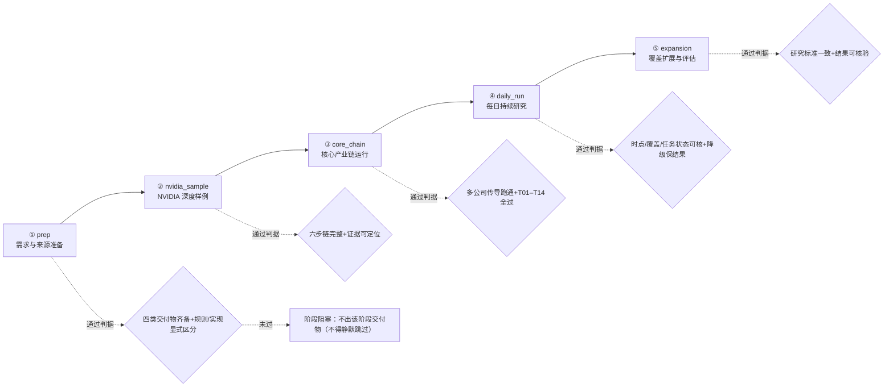

# 第十一章《交付顺序与实施参数》实现方案

> **对齐文档**：`02_可编辑源稿_v2.md` 第十一章《交付顺序与实施参数》+ `11_交付顺序与实施参数/01_需求拆解.md`（19 条原子需求）
> **承接方案**：第九章（`09_数据与实现约束/09_需求拆解与实现方案_v1.md`，尤其 §3.9 分阶段落地路线 / §3.2 WorkBuddy 复用边界 / §3.3.3 目录布局 / §3.10 技术待定项）+ 第八章（`08_产品入口与每日运行/02_实现方案.md`）+ 第十章（`10_验收与持续复盘/01_需求拆解.md`）+ 第二章（`02_已确认的投资规则/02_实现方案.md`，§B.2/§B.3 禁词与 Checker）
> **章性质（一句话）**：第十一章是**交付与参数收口章**——把整包转成两样东西：① **一条"分阶段可验收的交付路线"**（五阶段，每阶段有通过条件）；② **一张"需冻结的实施参数表"**（11 项），是**唯一同时面向需求方（拍板）与实现方（排期/评估）**的章。
> **与第十章的分工（本包严守、两章一次对齐）**：**第十章定义"怎么验收 / 怎么复盘"，第十一章冻结"用什么口径 / 参数"**。Ch10 的收益复盘判据（同区间绝对/相对收益、信号生效价、费用、观察窗口）**以 Ch11 的参数为输入**——两章**同批产出、逐项对接**。
> **本文件日期**：2026-09-15 ｜ **交付**：软件团队 SOP
> **版本**：v1.1（2026-09-15 回改）。本文件回改明细见文末「附：回改记录」（**唯一权威**）。
> **本章需求统计**：**19 条 = P0 12 / P1 7 / P2 0**（N11.1：7 条，P0 5 / P1 2；N11.2：12 条，P0 7 / P1 5）

---

## 0. 本方案定位（增量，不重写）

**一句话结论**：第十一章**不新增任何对象、不新增任何流程、不新增任何门槛**——它把前九章的成果**收口**成「**一条五阶段交付路线**（挂靠 `09 §3.9`）+ **一张 11 项参数表**（6 A 已收口 · 值可配置待冻结 / 5 C 实现方给方案）+ **两条红线**（源稿第 386 行"不补门槛"、第 368 行"付费非首版条件"）」，架构师只需把"**阶段判据 + 参数配置化 + Ch10 口径接口 + D-01 落位**"落到可执行契约。

| | 第九章（已定） | 第十一章（本方案） |
|---|---|---|
| 回答 | 存什么、怎么存才可信 | 按什么顺序交付、用什么口径与参数 |
| 在架构中的位置 | ⑦存储版本层 + 全对象定义 | **横向贯穿的"交付编排面 + 参数控制面"** |
| 本方案的态度 | —— | **只写"交付路线与参数如何被配置化承载"，不重复已定内容** |

**本方案的复用声明**：9 层架构、`facts/*.jsonl` 真源、三层存储、双时间轴与五类时间、版本追加式不可变、8 类对象、`scripts/compute/`、`scripts/graph/`、`return_guard`（Ch9 §3.4.12）、`gate`（Ch7 §D）、`neutrality_check.py`（Ch2 P-10）、`priority_order`（Ch6 §B.2）、运维五交付物（Ch9 §3.6）、`acceptance_input_set` / `eval_result`（Ch10 §4）、`check_record`（Ch1 §C.2）——**全部沿用，本节不重复**。

**第十一章真正的新增（全部挂既有 `rules/` / `registry/` / `scripts/`，不新建架构层）**：

| 类别 | 新增项 | 落位 |
|---|---|---|
| 新配置 | `registry/delivery.yaml`（五阶段路线 + 可测通过判据）、`rules/freeze.yaml`（11 项 `freeze_param`） | `registry/`、`rules/` |
| 新字段 | `delivery_stage` / `stage_pass_criteria` / `delivery_order`；`freeze_param.{param_id, source_state, param_tier, option_set, suggested_value, freeze_status, decision_owner, blocking_targets}` | 追加 schema（§A.4） |
| 新检查器 | `scripts/checks/freeze_guard.py`（参数状态断言 + 红线扫描 + 切换原子性） | `scripts/checks/` |
| 新视图 | `views/delivery/`（交付阶段看板：逐阶段"通过/未通过"判定） | `views/`（渲染层） |
| 复用（不新增） | `recommended_security_scope` / `benchmark_id` / `license_tier`+`cost` / `published_as` / `notification_channels`+`notification_aggregation`+`publish_policy` / `review_window` | 见 §A.4 |

**本章不做什么（硬边界）**：
1. **不新建对象 / 不新建流程 / 不新立门槛**——所有待冻结项一律 **`tbd` 占位 + 可切换**（守源稿第 386 行红线）；
2. **不替需求方选值**——6 项 A 档**已收口 · 值可配置待冻结**（机制就绪、不阻塞交付）：实现方准备 `option_set` + `suggested_value`（基线值见 `00_待拍板项清单` **D-03**），**不选一个当结论**；
3. **不合并两套五阶段**——**源稿五阶段 = 交付主线（权威）**，`09 §3.9` = 每阶段**实现细化挂靠**，二者**主从关系、不并列**（承 `11/01 §2.1` 裁定 C11-1）。

---

## A. 章间接口

### A.1 第十一章 ← 各章（读什么）

| 第十一章用途 | 读哪些对象 / 字段 / 节 | 承接需求 |
|---|---|---|
| 五阶段路线挂靠 | `09 §3.9`（五阶段权威对照：名称/数量/顺序逐字一致） | N11.1-01~05 |
| 阶段通过判据 | Ch1 §D（五问）、Ch4 §G（完整基线）、Ch7 §C.7（多公司传导）、Ch10 §N10.2-01（T01–T14）、Ch9 §2.2（五类时间） | N11.1-02/03/04 |
| 首批关系核验 | Ch3 §N3.1-08（名单核验产出原始出处/纳入理由）+ §N3.1-09/10（反凑数） | N11.1-01 / N11.2-02 |
| 参数现状（逐项） | Ch3 §N3.4-06（相对基准收益）、Ch3 §B-17（`recommended_security_scope`）、Ch7 §D.1（R2/R5）、Ch8 C8-1、Ch9 §3.10 J、`00_待拍板项清单` A/B/C 档 | N11.2-01~11 |
| 复盘口径接口 | Ch10 §N10.3-04/08/11（**复盘口径的唯一消费者**） | N11.2-10 |
| 数据源许可 | **D-01**（`license_tier=free_quota` / `cost=0`） | N11.1-07 / N11.2-09 |

### A.2 第十一章 → 写什么

| 方向 | 对象 / 文件 | 写入内容 |
|---|---|---|
| 写 | `registry/delivery.yaml` | `delivery_stage`（五阶段枚举）+ `stage_pass_criteria`（可测判据）+ `delivery_order`（顺序锁定） |
| 写 | `rules/freeze.yaml` | 11 条 `freeze_param`（`param_id` / `source_state` / `param_tier` / `option_set` / `suggested_value` / `freeze_status` / `decision_owner` / `blocking_targets`） |
| 写 | 首版启动条件清单（`registry/launch_criteria.yaml`） | 首版**仅公开信息**（**不含**任何付费订阅；付费项另立可后置） |
| 写 | `views/delivery/` | 逐阶段"通过/未通过"判定（读 `stage_pass_criteria` 的执行结果） |

### A.3 与 `09 §3.9` 的主从挂靠（承 `11/01 §2.1` 裁定 C11-1）

> **本方案沿用裁定，不得自行合并成一套**。

| 项 | 源稿第十一章五阶段 | `09 §3.9` 五阶段 |
|---|---|---|
| 视角 | **需求/验收视角**（"通过条件"= 交付门槛） | **实现视角**（"WorkBuddy 能力 / 新建组件"） |
| 地位 | **交付主线（权威）** | 每阶段的**实现细化挂靠** |
| 关系 | 二者**主从**，名称/数量/顺序**逐字一致**，**不构成口径不一致、无需合并** | 同左 |
| 提醒 | —— | `09 §3.9` 的"对照 P0 需求"列是**该阶段触及的需求**，**非"该阶段才实现"**（见 §附） |

### A.4 既有对象的新增字段要求

| 加在哪 | 字段 | 类型 | 依据 |
|---|---|---|---|
| `registry/delivery.yaml` | `delivery_stage` | enum `prep`/`nvidia_sample`/`core_chain`/`daily_run`/`expansion` | N11.1-01~05（**不撞** `task_type`/`run_mode`） |
| 同上 | `stage_pass_criteria` | object（可测判据） | 承 `11/01 §2.1` 右列 |
| 同上 | `delivery_order` | int（顺序锁定） | 排期 |
| `rules/freeze.yaml` | `freeze_param` | object（参数记录，11 条） | N11.2-01~11 |
| 同上 | `freeze_param.source_state` | string（源稿本版状态**原文逐字**） | 逐字留痕 |
| 同上 | **`freeze_param.param_tier`** | enum `a`/`b`/`c` | 对齐 `00` 档位（**消歧，见下**） |
| 同上 | `freeze_param.option_set` | array（≥1） | N11.2-12"提交可选择方案" |
| 同上 | `freeze_param.suggested_value` | string / object | 建议值 + 理由 |
| 同上 | `freeze_param.freeze_status` | enum `tbd`/`frozen` | **可切换标志** |
| 同上 | `freeze_param.decision_owner` | enum `requester`/`implementer`/`product_design` | A 档=requester，C 档=implementer，A9=product_design |
| 同上 | `freeze_param.blocking_targets` | **节号锚点数组**（如 `["Ch3 §N3.4-06","Ch10 §N10.3-04"]`） | 被等待处 |

> **★ 命名消歧（承 `02/02 §C.2` 命名规范：同名不同域必须消歧，一个概念一个字段名）**：`11/01 §4.2` 拟用 `freeze_param.tier`，但全包 `tier` 已**被来源分级占用**（Ch6 §B.1 `claim.tier ∈ {primary, secondary_1_5, secondary_tertiary}`；Ch9 §3.4.11 另有 `license_tier`）。故本方案将 `freeze_param.tier` **改名 `param_tier`**（取 `a`/`b`/`c`），**与来源 `tier`、许可 `license_tier` 三权分立、互不混用**。同时 `delivery_stage` 亦**回避裸词 `stage`**（全包 `relations.stage` / `relation_progress_stage` / `driver.realization_stage` 已占）。

### A.5 引用不重述

> 第十一章**不新增算法**：收益比较走 `return_guard`（Ch9 §3.4.12）、研究完成判定走 `gate`（Ch7 §D）、排序走 `priority_order`（Ch6 §B.2）、展示中立走 `neutrality_check.py`（Ch2 P-10）、禁词扫描走 Ch2 §B.2/§B.3 既有 Checker。**本章只声明"参数如何被承载"，不复制其实现**。

---

## B. 五阶段交付路线契约（逐阶段：进入条件 / 主要交付 / 通过判据 / 退出物）★

> 五阶段存 `registry/delivery.yaml`；**源稿五阶段为交付主线（权威）**，`09 §3.9` 为实现细化挂靠（§A.3）。每个阶段的"通过判据"落为**可测断言**（自动化 A / 人工 M / 留痕 E，承 `11/01 §5`）。



| 阶段 | 进入条件 | 主要交付物 | 通过判据（可测） | 退出物（冻结） | 挂靠 `09 §3.9` |
|---|---|---|---|---|---|
| **① `prep` 需求与来源准备** | 整包文档确认 | 本文 + 首批关系核验清单 + 公开数据登记 + 基准及关键口径 | 四类交付物齐备；**"已确认规则 vs 建议实现方式"有显式区分**（分层/标注，可逐条指认）；口径字段 `tbd` 占位 | `registry/sources.yaml` + 口径表（`freeze_status=tbd`） | ✅ 一致（`registry/` + 来源登记 Skill） |
| **② `nvidia_sample` NVIDIA 深度样例** | 阶段① 通过 | 完整经营/竞争/财务/估值/基准比较与建议底稿 | **六步判断链完整**（Ch1 五问 + Ch10 六结果）+ 证据可定位（Ch6 §D）+ 推导可复查；满足 **Ch4 §G** 深度 | NVIDIA 底稿（**深度标准**，承 Ch10 §N10.1-03） | ✅ 一致（`scripts/compute/`、研究 Skill、`facts/baselines`） |
| **③ `core_chain` 核心产业链运行** | 阶段② 通过 | 上/下游与竞争者独立底稿 + 真实事件联动 + 图谱与问题任务 | 多公司传导跑通（承 Ch7 §C.7）+ **T01–T14 全过**（承 Ch10 §N10.2-01）；图谱/提问任务可追溯 | 多公司样例 + `acceptance_input_set`（首批名单 + 样本事件，承 Ch10 §N10.1-06） | ✅ 一致（`scripts/graph/`、传导 Skill、问题回写） |
| **④ `daily_run` 每日持续研究** | 阶段③ 通过 | 固定更新 + 事件触发 + 增量发布 + 故障降级与建议记录 | 连续运行下**时点可核**（Ch9 §2.2 `first_seen_at` 等）+ **覆盖可核** + **任务状态可核**（Ch8 §C.2）；降级**保留上次有效结果**（Ch8 §E） | `state.json` 游标 + 运行日志 | ✅ 一致（**Automation**、Git、`scripts/ops/`） |
| **⑤ `expansion` 覆盖扩展与评估** | 阶段④ 通过 | 逐步补齐其他公司 + 校准公开信息筛选 + 持续前向复盘 | 研究标准**保持一致**（承 Ch4 §G）+ 投资结果**可核验**（承 Ch10 §N10.3-04 前向记录）；复盘 **append-only** | 三层复盘记录（Ch10 §N10.3-01） | ✅ 一致（三层权限与快照、复盘组件） |

**阶段判据的可执行化（示例：阶段④）**：

```python
# scripts/delivery/stage_gate.py
def stage_daily_run_passed(run_window) -> bool:
    """阶段④ 通过判据（承 11/01 §2.1 右列）——未过则阶段阻塞，不得静默跳过。"""
    checks = {
        "timing_replayable": all_events_have_four_timestamps(run_window),   # Ch9 §2.2/§D.3
        "coverage_verifiable": coverage_matches_acceptance_input(run_window), # Ch10 §N10.1-06
        "task_state_auditable": all_tasks_have_status(run_window),           # Ch8 §C.2
        "degrade_keeps_last_valid": no_null_overwrite_after_failure(run_window),  # Ch8 §E.4
    }
    return all(checks.values())     # 任一 False → 阶段阻塞（exit != 0）
```

---

## C. 待冻结参数对象完整 schema（`rules/freeze.yaml::freeze_param`）★

```yaml
# rules/freeze.yaml（只读 0444 + SHA256 锁 + Git 版本化；模型不可写，承 N9.2-01）
version: 1
frozen_at: tbd                 # 全部冻结的时点；未完成前恒 tbd
freeze_params:
  - param_id: p01
    param: benchmark_id                                    # 主基准 ETF
    source_state: "建议 AGIX，依据需求方已有持仓提出；待本需求文档确认"   # 源稿本版状态原文（逐字留痕）
    param_tier: a                                          # 消歧：非来源分级 tier
    option_set:
      - {value: AGIX,      basis: "需求方已有持仓；源稿建议"}
      - {value: other,     basis: "待需求方给出替代口径"}
    suggested_value: AGIX
    freeze_status: tbd                                     # 拍板前恒 tbd（守 §E 红线）
    decision_owner: requester                              # A 档=需求方
    blocking_targets: ["Ch3 §N3.4-06", "Ch10 §N10.3-04"]   # 节号锚点，禁用行号
  # …… p02 … p11（见 §D 逐项）
```

| 字段 | 类型 | 取值 / 约束 | 说明 |
|---|---|---|---|
| `param_id` | string | `p01`…`p11` | 与 §D 的 #1–#11 一一对应 |
| `param` | string | 参数名（见 §D） | **参数名须回避 Ch2 §B.2 禁词并做同名消歧**（§A.4） |
| `source_state` | string | 源稿本版状态**原文逐字** | 逐字留痕（与 `reason` 互补） |
| `param_tier` | enum | `a` / `b` / `c` | 对齐 `00_待拍板项清单` 档位（**消歧 `tier`→`param_tier`**） |
| `option_set` | array<object> | ≥1 条 `{value, basis}` | N11.2-12"提交可选择方案" |
| `suggested_value` | string / object | 建议值（**非门槛**） | 建议仅涉基准/范围/口径/披露 |
| `freeze_status` | enum | `tbd` / `frozen` | **拍板前恒 `tbd`**；可切换标志 |
| `decision_owner` | enum | `requester` / `implementer` / `product_design` | A 档=`requester`，C 档=`implementer`，A9=`product_design` |
| `blocking_targets` | array<string> | **节号锚点**（如 `Ch10 §N10.3-04`） | 与 `11/01 §2.2`"被等待处"列一致 |

---

## D. 11 项参数逐项落地方案（A 档给 option_set / C 档给建议值 + 可切换实现）★

> **分工纪律**：**A 档 6 项**（A1/A3/A6/A8/A9/A2）→ 实现方准备 `option_set` + `suggested_value`（基线值见 `00_待拍板项清单` D-03），**不替需求方选值**；**C 档 5 项**（C1–C5 + 期限）→ 实现方**给方案**、需求方**点头**，随本章冻结。
> **A/C 档归属**（承 `11/01 §2.3`，已与 `00_待拍板项清单` 逐条对齐）：**11 项 = 6 A + 5 C**（B 档 0；仅 #7 触发阈值关联 B2）。

### D.1 A 档 6 项（已收口 · 值可配置待冻结；给 `option_set` + `suggested_value`）

| # | `param_id` | 参数 | `param_tier` | `freeze_status` | `option_set`（可选方案，实现方准备） | `suggested_value`（**建议，非门槛**） | `decision_owner` | `blocking_targets` | 需求ID / 00 档 |
|---|---|---|---|---|---|---|---|---|---|
| 1 | p01 | **主基准 ETF** | a | `tbd` | ① AGIX（源稿建议）② 换别的 | AGIX（需求方已有持仓） | requester | Ch3 §N3.4-06；Ch10 §N10.3-04 | N11.2-01 / **A1** |
| 3 | p03 | **股票建议范围** | a | `tbd` | ① 仅美股（默认）② 含非美 | 仅美股（风险可控） | requester | Ch3 §B-17；Ch7 §E（`recommended_security_scope`） | N11.2-03 / **A3** |
| 6 | p06 | **负收益但相对领先** | a | `tbd` | 待样例校准（保持可切换） | **禁止新增买入（已定）**；既有积极建议的处置**待校准** | requester | Ch7 §D.1（R2） | N11.2-06 / **A8** |
| 8 | p08 | **发布与人工复核** | a | `tbd` | ① 全自动 ② 全人工 ③ **按对象分层** | 按对象分层（常规→自动；基准变更→人工审批；对外→显式授权；重大/争议→`published_as=inferred`） | requester | Ch3 §N3.4-09；Ch8 C8-1；Ch9 张力 C5 | N11.2-08 / **A6** |
| 10 | p10 | **复盘口径** | a | `tbd` | 待冻结（三件套 + 窗口） | 同时间、美元、市场价格总回报；三件套 + 窗口待冻结 | requester | **Ch10 §N10.3-04/08/11（唯一消费者）**；Ch3 §N3.4-06 | N11.2-10 / **A2** |
| 11 | p11 | **通知与分享** | a | `tbd` | 待产品设计（接口先定） | 接口先行、值待定（`notification_channels`/`notification_aggregation`/`publish_policy`） | product_design | Ch8 §K ③ | N11.2-11 / **A9** |

**p10（复盘口径）——与 Ch10 的共享接口冻结（两章逐字一致）**：

```yaml
# rules/freeze.yaml · p10（= Ch10 §N10.3-04/08/11 的口径输入）
- param_id: p10
  param: review_caliber
  source_state: "建议同时间、美元市场价格总回报；信号生效价、费用、观察窗口需冻结"
  param_tier: a
  freeze_status: tbd
  decision_owner: requester
  blocking_targets: ["Ch10 §N10.3-04", "Ch10 §N10.3-08", "Ch10 §N10.3-11"]
  caliber_terms:                      # 语义映射（map）——与 Ch10 §D.1 逐项一致
    signal_effective_price: tbd      # 信号生效价（取下一可交易时点，承 Ch9 §3.4.9）
    transaction_cost: tbd            # 交易成本
    pre_tax_caliber: tbd             # 税前口径
    review_window: tbd               # 观察窗口（1Q–1Y）
```

> **两章共享接口冻结**：Ch11 `blocking_targets` 指向 `Ch10 §N10.3-04/08/11`（节号锚点）；两侧对"复盘口径"的**语义清单逐项一致**（`signal_effective_price` / `transaction_cost` / `pre_tax_caliber` / `review_window`）。**两章须同批交付**（分开做必然口径不一致，承 C10-2 / C11-4）。

### D.2 C 档 5 项（实现方给方案 + 可切换实现）

| # | `param_id` | 参数 | `param_tier` | `freeze_status` | 方案（实现方给） | 可切换实现 | `blocking_targets` | 需求ID / 00 档 |
|---|---|---|---|---|---|---|---|---|
| 2 | p02 | **首批公司与产品关系** | c | `tbd`→随①冻结 | 证据核验后附表，v1 冻结（**"不凑数量"是硬纪律**） | `registry/` 名单版本化（v1/v2） | Ch3 §N3.1-08；Ch10 §N10.1-06 | N11.2-02 / **C4** |
| 4 | p04 | **每条建议的期限** | c | `tbd`→随⑦冻结 | 按论点在 **1Q–1Y** 内设定 + 记录 | `horizon` + `reason`；滚动受**反拖延阈值 `N`（B1，建议 2）**约束 | Ch2 §D.3；Ch7 §E | N11.2-04 / C 档·其余15项 |
| 5 | p05 | **收益预测方法** | c | `tbd`→随②冻结 | 个股与 AGIX **同期间同情景**；算法**样例确定** | 方法版本化（`method_version`） | Ch3 §N3.4-06；Ch5 §C.1；Ch9 §3.9 阶段② | N11.2-05 / **C5** |
| 7 | p07 | **运行时刻与延迟目标** | c | `tbd`→随④冻结 | 美股收盘后 + 时区显式记录；时效上限 = 公开数据更新频率 | `rules/schedule.yaml`（可配置） | Ch8（日度/事件）；Ch9 §3.10 J3 | N11.2-07 / **C1 + C2**（阈值关联 **B2**） |
| 9 | p09 | **公开数据与预算** | c | `tbd`→随①冻结 | 仅公开信息；接口/费用/预算实现方列明；**D-01 免费额度 `cost=0`** | `rules/data-sources.allowlist.yaml` | Ch6（来源）；Ch9 §3.10 J | N11.2-09 / **C3（+ D-01）** |

- **C 档"可切换实现"总则**：全部落 `rules/freeze.yaml` + 各自 `rules/*.yaml`，**读参数处一律经 `get_param(param_id)`**（**不硬编码**），故拍板后改 `freeze_status`/`value` 即可生效、无需改代码。
- **单一真源（讲死，防"参数值分散多处"误读）**：**参数值唯一真源 = `rules/freeze.yaml::freeze_param`**；`rules/schedule.yaml`（p07）、`rules/data-sources.allowlist.yaml`（p09）由**对应 `freeze_param` 记录指向**，**不另存同一参数的第二份值**（避免双写漂移）。
- **p09 对齐 D-01（已拍板）**：iFinD/pandadata 标 `license_tier=free_quota` / `cost=0`，**可进首版清单但不得写入裁决逻辑**；若转付费按 **Ch2 §N2.1-14** 重评。

---

## E. 红线守卫（第 386 行"不补门槛" + 第 368 行"付费非首版条件"）

### E.1 红线一：**不得把待定项补成新的策略门槛**（N11.2-12，源稿第 386 行）

> **要防什么**：实现方把"待定项"**悄悄补成一个未授权的阈值/门控**（如给主基准/收益口径配个阈值），从而**改变已确认投资主线**。

| 要求（逐字） | 落地做法 | 反例（禁止） |
|---|---|---|
| 参数**不改变**已确认投资主线 | 全 11 项**只做"基准/范围/口径/披露"**，**不进决策函数**；与 **Ch2 §B.2 P-01~P-10** 扫描一致 | 借"收益预测方法"名义加 `min_excess_return` 门槛 |
| 实现方提交**可选方案 + 来源能力 + 影响（+ 基线建议值）** | 每项交付 `option_set`（≥1）+ 来源能力 + 影响说明（§C `option_set`/`suggested_value`） | 只给单一方案、不说影响 |
| **不得把待定项补成新的策略门槛** | 拍板前一律 `freeze_status=tbd`、**可切换**（配置化）；**参数读取处不得出现比较运算** | 用占位保守值**当门控**（如把 B2 触发阈值当止损线） |

```python
# scripts/checks/freeze_guard.py —— 红线一 + 参数状态断言（命中即 fail，禁 warn-only）
BANNED_PARAM_TOKENS = load_banned_tokens("rules/banned_tokens.yaml")  # 复用 Ch2 §B.2（不新立禁词）

def assert_no_new_gate(freeze: dict) -> None:
    """① 参数名不得含禁词；② 参数不得进决策函数。"""
    for p in freeze["freeze_params"]:
        hit = banned_hit(p["param"]) | banned_hit(p["suggested_value"])
        if hit:
            raise NewGateError(f"{p['param_id']} 命中禁词 {hit}（借参数补门槛）")
    # ② 决策函数 AST 不得出现任何 freeze_param 读入
    assert not uses_freeze_param_in_decision_scope("scripts/decision", "scripts/graph")
```

### E.2 红线二：**付费数据可单独提出、非首版启动条件**（N11.1-07，源稿第 368 行）

```python
# scripts/checks/launch_guard.py
def assert_no_paid_in_launch(criteria: dict) -> None:
    """首版启动条件清单不含任何付费订阅（对齐 Ch6 公开信息 + D-01）。"""
    paid = [c for c in criteria["required"] if c.get("requires_paid_subscription") is True]
    assert not paid, f"首版启动条件含付费订阅: {paid}"     # 付费项只能出现在 optional（可后置）
    # D-01：免费额度连接器标 cost=0 / 不得写入裁决逻辑
    for s in criteria["available_sources"]:
        if s["id"] in {"iFinD", "pandadata"}:
            assert s["license_tier"] == "free_quota" and s["cost"] == 0
```

- 首版启动条件清单存 `registry/launch_criteria.yaml`：`required`（**仅公开信息**）/ `optional`（付费接入，**可后置、不阻塞**）。

---

## F. 不变量与幂等（`freeze_status` 单调、参数切换原子性）

### F.1 参数状态不变量

| 不变量 | 定义 | 可测断言 |
|---|---|---|
| **拍板前恒 `tbd`** | 未获需求方/实现方确认前，`freeze_status == "tbd"` | `assert all(p.freeze_status == "tbd" or p.confirmed_at is not None)` |
| **`freeze_status` 单调** | `tbd → frozen` 单向；回退须**新版本**（append-only），不得原地改 | 读 `freeze.yaml` Git 历史，`frozen` 不得变回 `tbd`（除 version+1） |
| **切换原子性** | 一次冻结 = 一次 commit（携带 `param_id` + `confirmed_by`），**全 11 项分别提交、互不连坐** | pre-commit 拒绝"半冻结"（同 commit 混入 tbd 与 frozen 的同一 param） |
| **不可覆盖** | 历史 `freeze_status` 保留，可 as-of 回看（承 Ch9 §3.4.2） | 同 `param_id` 出现新版本行，旧行不改 |

```python
# tests/test_ch11_invariants.py
def test_freeze_status_monotonic_and_atomic():
    """参数冻结单调 + 切换原子（N11.2-12 / F.1）。"""
    hist = git_history("rules/freeze.yaml")
    for pid in PARAM_IDS:                                   # p01..p11
        seq = [row.freeze_status for row in rows_of(hist, pid)]
        assert seq == sorted(seq, key={"tbd": 0, "frozen": 1}.get), "freeze_status 不得回退"
        for row in rows_of(hist, pid):
            if row.freeze_status == "frozen":
                assert row.confirmed_by and row.confirmed_at and row.version  # 原子：一次提交齐三要素

def test_no_paid_in_launch_criteria():
    """付费订阅不入首版启动条件（N11.1-07 / E.2）。"""
    assert_no_paid_in_launch(load("registry/launch_criteria.yaml"))
```

### F.2 与既有不变量的一致性

- 参数冻结与"版本追加式不可变"（Ch9 §3.4.2）**同一机制**：冻结 = 追加新 `freeze_param` 版本行，**不覆盖**旧 `tbd` 行；
- **与 `09 §3.9` 阶段无关**：参数可在任意阶段冻结，**阶段推进不以参数冻结为前置**（除阶段②需 p05 样例方法、阶段④需 p07 排期——属"该阶段触及"，非硬门）。

---

## G. 守卫与检查器（参数状态断言 + 与既有 checker 的关系）

| 编号 | 守卫 | 校验内容 | 触发时机 | 落点 |
|---|---|---|---|---|
| **G11-01** | **参数状态断言** | 全 11 项拍板前 `freeze_status=tbd`；`frozen` 项须齐 `confirmed_by`/`confirmed_at`/`version` | pre-commit / 每日巡检 | `scripts/checks/freeze_guard.py: assert_freeze_status()` |
| **G11-02** | **红线"不补门槛"扫描** | 参数名/值不含 Ch2 §B.2 禁词；决策函数 AST 不读 `freeze_param` | pre-commit / CI | `freeze_guard.assert_no_new_gate()` |
| **G11-03** | **付费非首版条件守卫** | `launch_criteria.required` 无付费订阅；D-01 连接器标 `cost=0` | 阶段① 通过前 | `scripts/checks/launch_guard.py` |
| **G11-04** | **阶段判据守卫** | 每阶段 `stage_pass_criteria` 全过方可推进；未过 → **阶段阻塞**（不得静默跳过） | 阶段切换 | `scripts/delivery/stage_gate.py` |
| **G11-05** | **`blocking_targets` 锚点守卫** | 全部为**节号锚点**（形如 `ChN §...`），**禁绝对行号** | pre-commit | `freeze_guard.assert_anchor_only()` |

**与既有 checker 的关系（不新立禁词）**：

| 关系 | 说明 |
|---|---|
| **复用 Ch2 §B.2 禁词表** | G11-02 **不新增禁词**，只**引用** `rules/banned_tokens.yaml`；`weight`/`score` 等 scope 承 Ch2 §B.3 Checker-1 |
| **接入 Ch2 §B.4 配置扫描** | 建议把 **`rules/freeze.yaml` / `registry/delivery.yaml`** 纳入 Checker-4 配置扫描范围（见 §建议回改项） |
| **参数为标记/配置，非决策输入** | 对齐 Ch2 §B.3 Checker-1 `is_decision_scope`——`freeze_param` 一律**不进入** decision/graph 作用域 |

---

## H. WorkBuddy 复用边界（第十一章增量）★

> 口径同 Ch9 §3.2 / Ch6 §H / Ch7 §G / Ch8 §H：**A = 开箱即用零代码 / B = 写 Skill·配置·提示词即可 / C = 需独立代码**。判定原则：**能 A 不 B，能 B 不 C；C 档只保留"可单测断言"的薄层**。

| 第十一章新增/变化项 | 归属 | 定制工作量 | 由谁承载 / 为什么 |
|---|---|---|---|
| 五阶段交付路线（看板/排期） | **A/B** | 0.5d | **Automation**（阶段推进提醒）+ `present_files`/腾讯文档（交付看板）；配置落 `registry/delivery.yaml`（B） |
| 阶段推进的编排与断点 | **B** | 1d | Skill（`aichain-delivery`）编排；复用 Ch1 §D.1 编排器 |
| 10 类参数登记与展示 | **B** | 1d | `rules/freeze.yaml` 为**纯配置**；`present_files` 呈现参数清单（每项带"不定会怎样"） |
| A 档参数清单交付（基线值已确认，可切换） | **A** | 0 | `present_files` + 腾讯文档**直接承载**（`00_待拍板项清单` 已成型） |
| 交付阶段的并行推进（多阶段同时） | **A** | 0 | **SubAgent**（可并行、可后台）免自研调度 |
| **参数状态断言（tbd + 可切换）** | **C** | 1–1.5d | 必须可单测的确定性断言（§F.1）——**本章承重设计之一** |
| **红线"不补门槛"扫描** | **C** | 1d | `freeze_guard.py` + 复用 Ch2 §B.2 禁词表——**本章承重设计之二** |
| **付费非首版条件守卫** | **C** | 0.5d | `launch_guard.py`（§E.2） |
| **阶段判据守卫（可测通过判据）** | **C** | 1–1.5d | `stage_gate.py`（§B 示例）——**本章承重设计之三** |
| 参数切换原子性（append + commit） | **B** | 0.5d | 复用 Ch9 §3.4.2 Git pre-commit + 版本化 |

> **分工结论（一段话）**：**交付路线看板、参数登记、A 档参数清单、阶段并行推进**——**A/B 档，直接由 WorkBuddy 的 Automation / Skill / SubAgent / 文件系统 / present_files / 腾讯文档承载**（`freeze.yaml` 与 `delivery.yaml` 只是**纯配置**）；**必须自建（C 档）的只有薄薄三块**：① **参数状态断言**（`tbd` + 可切换 + 单调原子）、② **红线"不补门槛"扫描**（复用 Ch2 禁词表，不新立）、③ **阶段判据守卫**（未过即阻塞）。三块都是"**可单测的确定性断言**"——即"**交付与登记复用、不变量与守卫自建**"，落点明确。

---

## I. 第十一章 19 条需求覆盖矩阵

> 格式与各章一致：`需求ID | 优先级 | 实现载体 | 验收方式 | 所属交付阶段 | 覆盖状态`。**逐条列出，不得只给统计**。
> 覆盖状态：✅ 已覆盖 ｜ ⚠️ **已收口 · 待收尾**（机制已就绪、可直接运行，**不阻塞交付**；待收尾项仅三类：① **值可配置待冻结** ② 依赖**人工评审 / 技术侧补设计** ③ 依赖**外部动作**（如跨章回改）。**均非技术不可行、非设计缺陷**）｜ ❌ 缺口。
> **注**：本章参数类需求的判据 = "**`tbd` 占位 + 可切换 + 不进门控 + 档位对齐**"（守 N11.2-12），**非收益/跑赢**。

### I.1 N11.1 分阶段交付与交付前提（7 条，P0 5 / P1 2）

| 需求ID | 优先级 | 实现载体 | 验收方式 | 阶段 | 状态 |
|---|---|---|---|---|---|
| N11.1-01 | P0 | `registry/delivery.yaml::prep` + 四类交付物（§B） | 四类齐备；"已确认规则 vs 建议实现方式"显式区分 | ① | ✅ |
| N11.1-02 | P0 | `registry/delivery.yaml::nvidia_sample` + 六步链（Ch1 §D / Ch10 §2.3） | 六步链完整 + 证据可定位 + 推导可复查 | ② | ✅ |
| N11.1-03 | P0 | `core_chain` + `stage_gate.py`（多公司传导 + T01–T14） | 多公司传导跑通 + T01–T14 全过 | ③ | ✅ |
| N11.1-04 | P0 | `daily_run` + `stage_daily_run_passed()`（§B） | 时点/覆盖/任务状态可核；降级保留上次有效结果 | ④ | ✅ |
| N11.1-05 | P0 | `expansion` + 三层权限与快照 + 复盘组件 | 研究标准一致 + 投资结果可核验；复盘 append-only | ⑤ | ✅ |
| N11.1-06 | P1 | 实现方评估说明（工期/人力/成本，依公开数据可得性） | 存在评估说明且与可得性挂钩；**不以付费数据为前提** | ① | ✅ |
| N11.1-07 | P1 | `registry/launch_criteria.yaml` + `launch_guard.py`（§E.2） | 启动条件不含付费订阅；付费项另立可后置；对齐 D-01 | ① | ✅ |

### I.2 N11.2 需冻结参数与红线（12 条，P0 7 / P1 5）

| 需求ID | 优先级 | 实现载体 | 验收方式 | 阶段 | 状态 |
|---|---|---|---|---|---|
| N11.2-01 | P0 | `freeze_param` p01（`benchmark_id`，AGIX 建议，`param_tier=a`） | `tbd` + 可切换；相对收益分母可算 | ① | ⚠️ **已收口 · 值可配置待冻结**（A1） |
| N11.2-02 | P1 | `freeze_param` p02（首批名单，证据核验 + 反凑数，C4） | 名单由证据核验产出；可附表 | ① | ✅ |
| N11.2-03 | P0 | `freeze_param` p03（`recommended_security_scope`，默认仅美股） | 存在、等值可切换（A3） | ① | ⚠️ **已收口 · 值可配置待冻结**（A3） |
| N11.2-04 | P1 | `freeze_param` p04（`horizon ∈ [1Q,1Y]` + `reason` + 反拖延 `N`） | 期限按论点设定 + 记录；受 B1 约束 | ① | ✅ |
| N11.2-05 | P1 | `freeze_param` p05（同期间同情景，算法样例确定，C5） | 个股与 AGIX 同期间同情景可验证 | ② | ✅ |
| N11.2-06 | P0 | `freeze_param` p06（禁新增买入已定；既有处置留 `tbd`） | "禁止新增买入"已定；既有处置**可切换**（A8） | ② | ⚠️ **已收口 · 值可配置待冻结**（A8） |
| N11.2-07 | P1 | `freeze_param` p07（`rules/schedule.yaml`，C1+C2） | 日度 + 事件触发已定；时刻/时区/阈值可评估 | ④ | ✅ |
| N11.2-08 | P0 | `freeze_param` p08（`publish_policy`，按对象分层） | 默认自动 + 版本留存；发布规则按对象分层（A6） | ④ | ⚠️ **已收口 · 值可配置待冻结**（A6） |
| N11.2-09 | P1 | `freeze_param` p09（仅公开信息；接口/费用/预算列明；D-01） | 仅公开信息可验；D-01 标 `cost=0` | ① | ✅ |
| N11.2-10 | P0 | `freeze_param` p10（`review_caliber`，`blocking_targets`→Ch10） | 口径三件套 + 窗口 `tbd`、可切换（A2）；Ch10 引用之 | ① | ⚠️ **已收口 · 值可配置待冻结**（A2） |
| N11.2-11 | P1 | `freeze_param` p11（`notification_channels`/`aggregation`/`publish_policy`） | 三字段接口已定、值 `tbd`（A9） | ① | ⚠️ **已收口 · 值可配置待冻结**（A9） |
| N11.2-12 | P0 | `freeze_guard.py`（G11-01/02）+ 复用 Ch2 §B.2 禁词表 | 全 11 项 `tbd` + 可切换；零新增门槛（Ch2 §B.2 扫描通过） | ① | ✅ |

### I.3 覆盖统计

> **逐行计数**（不接受手写汇总；改完重算）。

| 小节 | 条数 | P0 | P1 | ✅ | ⚠️ | ❌ |
|---|---|---|---|---|---|---|
| N11.1 | 7 | 5 | 2 | 7 | 0 | 0 |
| N11.2 | 12 | 7 | 5 | 6 | 6 | 0 |
| **合计** | **19** | **12** | **7** | **13** | **6** | **0** |

- **19 条全部有实现载体**；**✅ 13 条**；**⚠️ 6 条**；**❌ 硬缺口 0 条**。
- 优先级对齐 PM：**P0 12 / P1 7** ✅。
- **6 条 ⚠️ = 6 项 A 档参数**（N11.2-01/03/06/08/10/11 = A1/A3/A8/A6/A2/A9）：**已收口 · 值可配置待冻结**——机制（`tbd` 占位 + 可切换 + `option_set` + `suggested_value` + `get_param` 统一读口）已就绪，**值不定也能正确运行、不阻塞交付**；基线值已确认（见 `00_待拍板项清单` **D-03**）。**非技术缺口、非设计缺陷**。
- 其余 **13 条**（含 5 项 C 档参数 + 红线守卫）可直接验收。

> 各待收尾项的**基线值**（2026-09-15 已确认）与口径归正说明见 `00_待拍板项清单.md` **D-03 / D-04**；**⚠️ 计数不因口径归正而改变**（⚠️ 表达的是"值尚未冻结"这一事实，不是"未被覆盖"）。

---

## J. 成本与复杂度增量

### J.1 一次性开发成本增量

**口径同前**：1 人日 = 熟练工程师专注 6h。

| 第十一章新增模块 | 人日 |
|---|---|
| 交付路线配置（`delivery.yaml` 五阶段 + 可测判据） | 1–1.5 |
| 阶段判据守卫（`stage_gate.py`） | 1–1.5 |
| 参数对象 schema（`freeze.yaml` 11 条 + `param_tier` 消歧） | 1–1.5 |
| A 档 `option_set` 整理（6 项，供需求方选值） | 1–2 |
| C 档方案 + 可切换实现（5 项，`get_param()` 统一读口） | 1.5–2 |
| 红线守卫（`freeze_guard.py` + `launch_guard.py`） | 1.5–2 |
| 参数不变量测试（单调/原子/append-only） | 1–1.5 |
| 交付看板（`views/delivery/` 逐阶段判定） | 1–1.5 |
| **第十一章增量合计** | **9–13.5** |

> **全项目累计**（Ch9 42–55 + Ch6 16–24 + Ch7 19–25 + Ch4/Ch5 34–45 + Ch1/2/3 8–14 + Ch8 13.5–18.5 + Ch11 9–13.5）= **约 142–195 人日**（口径：跑通 NVIDIA 深度样例 + 一条多公司传导 + 每日连续运行；**不含** A 档拍板后的参数校准工时）。

### J.2 新增配置 / 脚本 / 检查器数

| 类别 | 新增数 | 清单 |
|---|---|---|
| 配置 | 3 | `registry/delivery.yaml`、`rules/freeze.yaml`、`registry/launch_criteria.yaml` |
| 检查器/守卫 | 3 | `scripts/checks/freeze_guard.py`、`scripts/checks/launch_guard.py`、`scripts/delivery/stage_gate.py` |
| 视图 | 1 | `views/delivery/`（交付看板） |
| 测试 | 1 套 | `tests/test_ch11_invariants.py` |

### J.3 运行成本增量

| 项 | 公式 | 说明 |
|---|---|---|
| 阶段判据巡检 | 每阶段切换时 1 次（非每日） | 复用既有自动化，**新增常驻成本 ≈ 0** |
| 参数状态断言 | 随 pre-commit / 每日巡检 | **确定性程序，无模型调用** |
| 交付看板渲染 | 复用 `present_files` | **零新增** |
| **本章运行成本** | ≈ **0**（无新增 LLM 调用；不新增预算口径） | 参数为配置、守卫为纯函数 |

> **注意**：本章**不新增任何 LLM/检索预算口径**；#9 的"检索预算实现方列明"是**列明既有预算**（承 Ch9 §3.6 费用方案），非新增。

### J.4 复杂度增量

| 维度 | 综合 | 理由 |
|---|---|---|
| 技术复杂度 | **低** | 无新算法；新增均为**配置 + 可单测断言** |
| 运维复杂度 | **低–中** | 复用同一 Automation/ops；新增仅 3 个检查器 + 3 份配置 |
| 数据治理复杂度 | **中** | 新增"参数控制面"（11 项）需与 `00_待拍板项清单` 保持逐条对齐 + 消歧 |

---

## K. 待明确事项（技术侧）

> 只列**第十一章新引入的技术侧事项**（业务参数见 `00_待拍板项清单` A/B/C 档，不在此重复）。

| # | 事项 | 选项 | 建议 |
|---|---|---|---|
| J1 | 参数读取入口 | 各模块直读 yaml / 统一 `get_param()` | **统一 `get_param(param_id)`**（可切换、可审计、便于断言） |
| J2 | `freeze_status` 存储 | 原地改 / 追加版本行 | **追加版本行**（对齐 Ch9 §3.4.2 不可覆盖） |
| J3 | 阶段看板的通过判定执行者 | 人工 / 自动 | **能自动则自动**（A 类判据），其余留痕（E 类）；未过即阻塞 |
| J4 | 冻结粒度（全 11 项一起 vs 逐项） | 整体 / 逐项 | **逐项**（互不连坐；A 档可分批拍板，承 `00` 拍板顺序） |
| J5 | `blocking_targets` 锚点校验 | 正则 / 白名单 | **正则锚点守卫**（`ChN §...`，禁行号），落 G11-05 |
| J6 | 本方案与 `00_待拍板项清单` 的同步机制 | 人工 / 脚本 | **脚本对拍**（参数集 vs `00` 档位，防漂移） |

---

## 附：五阶段 × 需求对照（引用 `09 §3.9`，注明"触及≠才实现"）

> **重要提醒（承 `11/01 §2.1` 与 `09 §3.9` 裁定）**：下表"对照 P0 需求"列是**该阶段触及的需求**，**不是"该阶段才实现"**——P0 需求**跨阶段**，**不得据阶段表反向裁剪需求**。

| 阶段 | 挂靠 `09 §3.9` | 该阶段**触及**的需求（非"才实现"） |
|---|---|---|
| ① `prep` | Registry + 来源登记 Skill | N9.3-01~11、N9.1-22~23、N9.1-31~32（+ N11.1-01/06/07、N11.2-01/02/03/09/10/11） |
| ② `nvidia_sample` | `scripts/compute/`、研究 Skill、`facts/baselines` | N9.1-01~05、N9.1-17~21、N9.2-02~03（+ N11.1-02、N11.2-05/06） |
| ③ `core_chain` | `scripts/graph/`、传导 Skill、问题回写 | N9.1-06~16、N9.1-26、N9.2-09~10（+ N11.1-03） |
| ④ `daily_run` | **Automation**、Git、`scripts/ops/` | N9.2-11~14、N9.1-27~29、N9.3-04~08（+ N11.1-04、N11.2-07/08） |
| ⑤ `expansion` | 三层权限与快照、复盘组件 | N9.1-30、N9.2-05~08、N9.3-09~11（+ N11.1-05） |

- **主从关系**（§A.3）：源稿五阶段 = 交付主线（权威）；`09 §3.9` = 实现细化挂靠；**名称/数量/顺序逐字一致，不合并**。

---

## 建议回改项（已收口 · 登记于 `02/02 §F` R-26~R-30）

> 本节所列"参数新层被绕过"缺口**已于收口轮按"三段式审计链"回改执行**（编号见 `02/02 §F` **R-26 / R-27**，该处为**唯一权威登记**）。**本文件仅更新本节标题与说明句（R-31），不改动其它既有文件**。格式：`目标文件 | 节 | 现状 | 改成什么 | 对应需求 | 关联冲突`。

| 目标文件 | 节 | 现状 | 改成什么 | 对应需求 | 关联冲突 |
|---|---|---|---|---|---|
| `02_已确认的投资规则/02_实现方案.md` | §B.4（配置扫描 / 被检目标） | 被检目标为 `scripts/**` · `rules/**` · `schema` · `gate` 输入 · `views/**` 渲染配置；**未显式含本章新增的参数配置** | 把 **`rules/freeze.yaml`** 与 **`registry/delivery.yaml`** 显式纳入 **Checker-4 配置扫描**范围（禁 `min_excess_return`/`stop_loss`/`confidence_threshold` 等；防"借参数补门槛"） | N11.2-12 | S-01（Ch11 §3.2） |
| `02_已确认的投资规则/02_实现方案.md` | §B.3 Checker-1 `is_decision_scope` | P-09/P-02 scope 为"决策函数内" | 明确 **`freeze_param` 读取不在决策函数 scope 内**（参数为配置/标记，非决策输入），并纳入 AST 守卫断言 | N11.2-12 | S-01 |

> **说明**：这两条本质是同一件事——把**第十一章新引入的参数配置**补进 Ch2 §B.4 的**扫描范围**，否则"**不得把待定项补成新门槛**"（源稿第 386 行）在新层无守卫。**已由主理人在收口轮统一登记为 R-26 / R-27 并执行完毕**（见 `02/02 §F`，**唯一权威**）；本表"现状 / 改成什么"两列**保留原始登记内容，供追溯**。

---

## 附：回改记录（v1.1 · 2026-09-15）

| R号 | 内容 | 对应需求 | 关联冲突 |
|---|---|---|---|
| R-25 | 覆盖矩阵 ⚠️ 定性归正为「已收口 · 待收尾（不阻塞交付）」；覆盖状态图例统一；**✅/⚠️/❌ 计数不变**（含统计行/标签补齐；另 L15/L336/L345/L414 术语补齐） | 跨章口径一致性 | D-04 |
| R-31 | 「建议回改项」节标题 →「（已收口 · 登记于 `02/02 §F` R-26~R-30）」；本节说明句与段末「说明」句归正为完成时（两条对应 R-26 / R-27）；原表 2 行未删 | 跨章口径一致性 | S-01 |
| R-33 | 文件头版本行补 **R-31 / R-33 指针**（补齐三段式审计链 ③）；本表补 **R-31 行**（补齐 ②） | 留痕规范 | F-10 族（留痕） |
