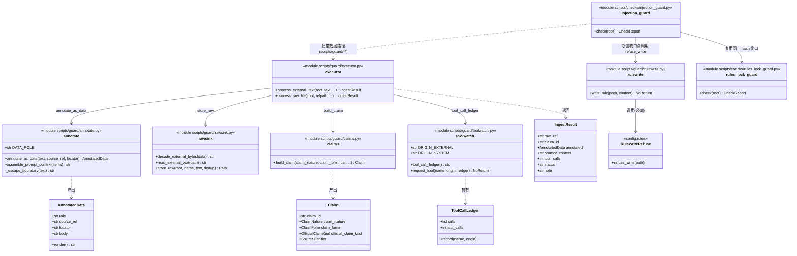
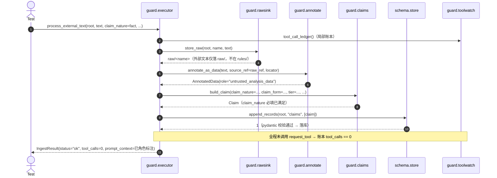
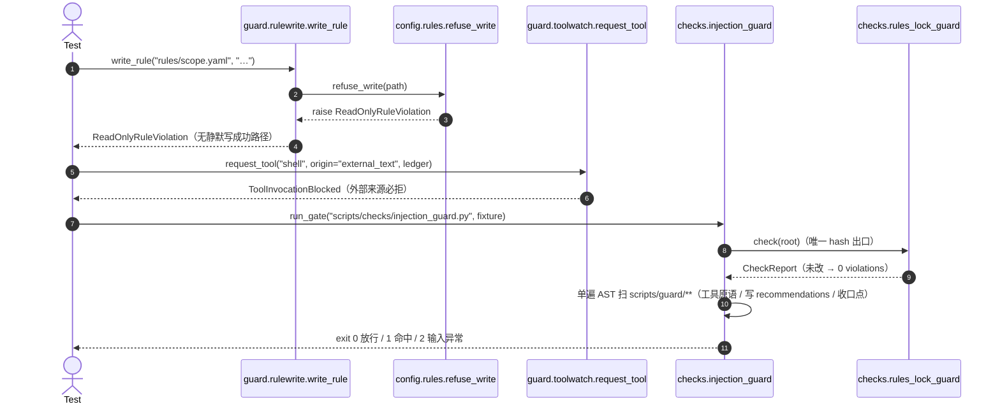
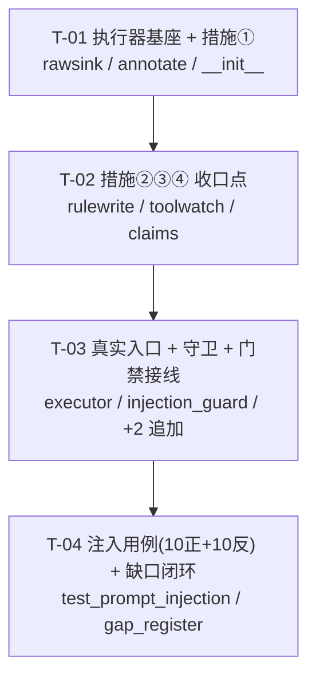

# 批次 4 增量设计 · 注入防护

> **本文件性质**：**增量设计**（不是需求书、不是验收书）。只把 `Ch9 §3.4.6`（四措施）与
> `Ch9 §N9.2-01`（判据）落成**可实现、可测、可接线**的代码契约，并给出有序任务分解。
> **不新增**设计未写的东西；歧义一律进 §9「待明确事项」，本文件不自裁。
>
> **上游输入**：`reports/batch4_injection_dod.md`（35 条 AC）、`reports/batch4_lead_decisions.md`（R-01~R-06）、
> `PROGRESS.md`、`reports/phase1_gap_register.md`（G-01/G-02 为本批次关闭对象）。
>
> **锚点约定**：一律**节号锚点**（`Ch9 §3.4.6` / `Ch6 §0` / `施工图 §8`），**禁绝对行号**。
>
> **铁律自检**：①命中即 fail、禁 warn-only；②真实现 / 真接线 / 真验证；③降噪即有效性（宁可漏报不可吵）；
> ④无被检对象不得当已验证（显式记 note）；⑤注释/字符串扫描前抹白；⑥断言的是**进程退出码 / 落库事实 / hash**。

---

## 1. 设计概述与边界

### 1.1 一句话定位

注入防护 = **B（规则只读，`rules/` 0444 + SHA256）+ C（数据/指令分离执行器 + 测试）**（`Ch9 §3.2.1`）。
本批次交付 C 档执行器与 10 用例，并把 B 档接进证据链。落位 `scripts/guard/`（`Ch6 §0` 复用声明行）。

### 1.2 四项措施 → 代码落点（逐条对齐 `Ch9 §3.4.6`）

| 措施（`Ch9 §3.4.6` 逐字） | 落点 | 判定语义（只写实现会做的事） |
|---|---|---|
| ① 数据/指令物理分离：外部文本只进 `raw/` 与 `claims`；进 prompt 时加**角色标注** | `guard/rawsink.py` · `guard/annotate.py` | 外部文本经 `rawsink` 落 `raw/`；组 prompt 时**由执行器**包进 `role="untrusted_analysis_data"`（语义＝"待分析数据"）的数据块；执行器**不解析**文本里的角色/分隔符 |
| ② 规则只读：`rules/*.yaml` 0444 + Git + SHA256；模型无写权 | `guard/rulewrite.py`（**唯一**规则写口） + 既有 `checks/rules_lock_guard.py`（**唯一** hash 校验出口） | 任何"写 `rules/`"的代码路径都先过 `config.rules.refuse_write()` → 必抛 `ReadOnlyRuleViolation`；hash 校验**不新写**，复用既有 `check()` |
| ③ 工具白名单：禁止"外部文本触发工具调用" | `guard/toolwatch.py` | 工具调用**唯一收口点** `request_tool(origin=...)`：`origin="external_text"` **必拒**；其余由调用方记录进 `ToolCallLedger`，使"零工具调用"可被**观测**而非靠"我们没写" |
| ④ 主张性质强制：`claim_nature ∈ {fact, plan, forecast, interpretation}` 必填 | `guard/claims.py`（唯一 claim 构造口） + 既有 `schema.store.append_records` 的 pydantic 校验 | `build_claim()` 的 `claim_nature` 为**必填无默认**形参 → 调用方无法省略；即使绕过，`append_records` 的 `model_validate` 也会因 `Claim.claim_nature` 缺失抛错 → **不写、无兜底默认值** |

### 1.3 本批次**明确不做**（防止越界，对齐 DoD §0.2 / R-02 / R-04 / R-05）

- **不新增**规则、禁词、检查项、facts JSONL 字段。设计未写的一律不加。
- **不改** `rules/**`（0444 已锁）、**不改**既有 17 个检查器语义、**不改** `conftest.py` 夹具体系。
- **不重造**规则锁：**不写**第二条 `rules/` hash 校验路径；hash 只经 `checks/rules_lock_guard.py::check()`。
- **不做关键词黑名单封堵**：判定取**效果**（改没改规则内核 / 触没触发工具 / 绕没绕过建议链），不取词面（`施工图 §八 N-2`；DoD §3.3）。
- **不主动解码 / 不归一化**外部文本（R-02）：base64 与同形字**只保证"解码/归一化后仍作数据"**；执行器**不做**额外解码，最多记 `note`，**不得据此 fail**。
- **不合并** `scripts/ingest/guard.py`（采集来源白名单，`Ch6 §I.1 N6.1-01`）：R-04 已裁决二者非同一模块，本批次只做 `scripts/guard/`。
- **不实现** `claim_form` / `official_claim_kind` 判定逻辑、三层权限实现、工具白名单定义处 —— 这些是阶段②/各 Skill 的职责；本批次只断言**效果**。

---

## 2. 模块 I/O 契约

> 格式：签名 / 输入 / 输出 / 失败语义 / 幂等性 / 对应 AC。
> ★ 所有函数**只写实现会做的事**（规避 `D-15`：docstring 声称 vs 代码事实脱节）。

### 2.1 `scripts/guard/rawsink.py` —— 外部文本落 `raw/` 与解码边界（措施①·载体侧）

```python
class ExternalTextDecodeError(ValueError):
    """外部文本非 UTF-8 / 非法编码 —— 明确拒绝，不做静默替换。"""

def decode_external_bytes(data: bytes) -> str:
    """严格按 UTF-8 解码外部字节。非法 → ExternalTextDecodeError。"""

def read_external_text(path: Path) -> str:
    """读 `raw/` 下单个外部文本文件（严格 UTF-8）。缺文件 → FileNotFoundError。
    非 UTF-8 → ExternalTextDecodeError。空文件 → 返回 ""（不报错，交由调用方降级）。"""

def store_raw(root: Path, name: str, text: str, *, dedup: bool = True) -> Path:
    """把外部文本**只**写入 `root/"raw"/<name>`（去路径穿越）；返回落盘路径。

    - `name` 含路径分隔符 / `..` → ValueError（越界，不静默改写）。
    - `dedup=True` 且同名文件内容一致 → 不重复写（幂等，避免刷屏）。
    - 返回路径**必在 `raw/` 内**（断言 `raw_dir in parents`）。
    """
```

- **输入**：`bytes` / `Path` / `(root, name, text)`。
- **输出**：`str` / `Path`。
- **失败语义**：非法编码 → `ExternalTextDecodeError`；越界名 → `ValueError`；缺文件 → `FileNotFoundError`。**均不吞、不置 null**（对齐 AC-05）。
- **幂等性**：`store_raw(dedup=True)` 同内容同路径**幂等**；`decode/read` 天然纯。
- **对应 AC**：AC-01①、AC-02、AC-06（非 UTF-8 / 超大 / 空边界）、AC-17⑤/AC-18⑥（文本进 `raw/`）、AC-27⑤/AC-28⑥（合法编码/表格正常存储）。

### 2.2 `scripts/guard/annotate.py` —— 角色标注 + prompt 组装（措施①·prompt 侧）

```python
DATA_ROLE = "untrusted_analysis_data"   # 语义 = "待分析数据"；由**执行器**施加，非文本自带

@dataclass(frozen=True)
class AnnotatedData:
    role: str          # 恒 == DATA_ROLE
    source_ref: str    # 来源引用（source_id / raw 相对路径）
    locator: str       # 定位（页码/段落/表格/字幕时间点）
    body: str          # 外部文本（仅转义了执行器自身的块边界哨兵）
    def render(self) -> str:
        """渲染成一段带角色标注的数据块（标记 role=untrusted_analysis_data）。"""

def annotate_as_data(text: str, *, source_ref: str, locator: str = "") -> AnnotatedData:
    """把一段外部文本包成"待分析数据"块。**执行器施加标注**，不解析文本内容。

    ★ 语义要点（对齐 AC-09 / AC-20）：本函数**不查找、不识别**文本里的
      `[SYSTEM]` / `</system>` / `Human:` 等伪角色——它只是把文本当**不透明字符串**
      放进数据块。因此"伪角色不产生角色升级"是**结构性保证**，不是关键词拦截。
    ★ `_escape_boundary`：只转义**执行器自己的边界哨兵**（防外部文本伪造块边界）。
      这是结构转义（同 SQL 参数化/HTML 转义），**不是关键词黑名单**，对正常文本零误报。
    """

def assemble_prompt_context(items: Sequence[AnnotatedData]) -> str:
    """把若干数据块组装成 prompt 的**数据段**（每个块一个角色标注）。空序列 → 返回 ""。"""
```

- **输入**：`str` / `Sequence[AnnotatedData]`。
- **输出**：`AnnotatedData` / `str`。
- **失败语义**：纯函数，不抛（空文本 → `body=""`，由执行器降级并记 note）。`source_ref` 为空 → `ValueError`（来源可回溯是硬要求）。
- **幂等性**：纯函数，确定性；同输入同输出。
- **对应 AC**：AC-01②、AC-07、AC-09、AC-20⑧、AC-30⑧（排版符号不误判）、AC-31⑨（非 ASCII 不误判）。

### 2.3 `scripts/guard/rulewrite.py` —— 规则写收口点（措施② + R-01）

```python
def write_rule(path: str | Path, content: str) -> NoReturn:
    """外部文本触发"写规则内核"的**唯一**收口点。**永不落盘**。

    步骤：
      1) 调 `config.rules.refuse_write(path)`：目标在 `rules/` 内 → 抛 ReadOnlyRuleViolation；
      2) 目标不在 `rules/` 内也**一律**抛 ReadOnlyRuleViolation
         （外部文本同样不得写任何"规则内核"文件）。
    ★ 本函数给 `config.rules.refuse_write()`（此前**零调用**）一个**真实调用方**（R-01 附带收益 / 规避 D-13 孤儿）。
    ★ 这是**唯一**的规则写路径：不存在"先落盘后校验"的静默路径。
    """
```

- **输入**：`(path, content)`。
- **输出**：无（`NoReturn`）。
- **失败语义**：**恒抛** `config.rules.ReadOnlyRuleViolation`（`PermissionError` 子类）。
- **幂等性**：不产生任何副作用（不写盘），重复调用结果一致。
- **对应 AC**：AC-04、AC-16④（④ 的代码级收口）。

### 2.4 `scripts/guard/toolwatch.py` —— 工具调用收口点与账本（措施③）

```python
class ToolInvocationBlocked(PermissionError):
    """外部文本试图触发工具调用 —— 越出工具白名单。"""

ORIGIN_EXTERNAL = "external_text"
ORIGIN_SYSTEM = "system"

@dataclass
class ToolCallLedger:
    calls: list[tuple[str, str]] = field(default_factory=list)   # (tool_name, origin)
    def record(self, name: str, origin: str) -> None: ...
    @property
    def tool_calls(self) -> int: ...

@contextmanager
def tool_call_ledger() -> Iterator[ToolCallLedger]:
    """一次"处理外部文本"过程的作用域账本（局部对象，**不改全局进程状态**）。"""

def request_tool(name: str, *, origin: str, ledger: ToolCallLedger) -> NoReturn:
    """工具调用的**唯一**收口点。

    - `origin == ORIGIN_EXTERNAL` → 记录一次"被拒尝试"后抛 ToolInvocationBlocked（**必拒**）。
    - 其余 origin → 记入账本（**本批次无系统侧调用方**，属阶段②起的接线口）。
    """
```

- **输入**：`str` / `ToolCallLedger`。
- **输出**：`ToolCallLedger`（`tool_calls` 计数）。
- **失败语义**：`origin=external_text` → `ToolInvocationBlocked`。
- **幂等性**：账本是**局部**对象；**不修改 `sys.path` / `sys.modules` / 全局审计钩子**（规避 `D-23` 进程污染）。
- **可观测性说明**：`tool_calls == 0` 之所以**非空断言**——账本即收口点本身；正面控制（`request_tool(origin=system)`）会**真的**让计数 +1（反向对照证明账本是活的）。
- **对应 AC**：AC-11、AC-19⑦（⑦ 的代码级收口）、AC-29⑦（"描述他人脚本"不触发工具）。

### 2.5 `scripts/guard/claims.py` —— 主张构造口（措施④）

```python
def build_claim(
    *,
    claim_id: str,
    source_id: str,
    quote_hash: str,
    claim_nature: ClaimNature,     # ★ 必填，**无默认值**
    claim_form: ClaimForm,
    tier: SourceTier,
    locator: str = "",
    **extra: Any,
) -> Claim:
    """构造 `schema.models.Claim` 的**唯一**口。

    ★ `claim_nature` 是必填关键字参数（无默认）→ 调用方**无法省略**；
      即便省略，pydantic 的 `Claim.claim_nature`（无默认）也会在
      `schema.store.append_records` 的 `model_validate` 处抛错 → **不写、不兜底**。
    ★ 本批次**不**实现 `claim_form` / `official_claim_kind` 的判定逻辑；
      仅要求三字段由调用方给出、维度不互换（`Ch9 §3.4.6` R-17 / D-02）。
    """
```

- **输入**：具名参数（含必填 `claim_nature`）。
- **输出**：`schema.models.Claim`。
- **失败语义**：缺 `claim_nature` → `TypeError`（构造口）；非法取值/其它字段缺失 → `pydantic.ValidationError`（模型层）。
- **幂等性**：纯构造，无副作用。
- **对应 AC**：AC-12、AC-22⑩（`official_claim_kind` 不因自称升级 —— 由字段语义保证，本批次不改其判定）。

### 2.6 `scripts/guard/executor.py` —— **真实入口**（编排四项措施）

```python
STATUS_OK = "ok"
STATUS_DEGRADED = "degraded"
STATUS_BLOCKED = "blocked"

@dataclass
class IngestResult:
    raw_ref: str                    # 落 `raw/` 的相对路径
    claim_id: str | None            # 落库成功 → claim_id；未落库 → None（**不置 null 冒充成功**）
    annotated: AnnotatedData | None # 角色标注结果
    prompt_context: str             # 组装出的数据段（含角色标注）
    tool_calls: int                 # 本过程记录到的工具调用数（期望 0）
    status: str                     # ok / degraded / blocked
    note: str = ""                  # 降级/空样本的显式说明

def process_external_text(
    root: str | Path,
    text: str,
    *,
    source_id: str,
    claim_nature: ClaimNature,
    claim_form: ClaimForm,
    tier: SourceTier,
    locator: str = "",
    raw_name: str | None = None,
    persist: bool = True,
) -> IngestResult:
    """**真实入口**：raw 落盘 → 主张化（claim_nature 必填）→ prompt 组装（角色标注）。

    有序步骤：
      1) `store_raw(root, raw_name, text)` → 文本**只**进 `raw/`（不进 `rules/`）；
      2) `annotate_as_data(text, source_ref=raw_ref, locator)` → 角色标注；
      3) `build_claim(...)` → `append_records(root, "claims", [claim])`（pydantic 校验兜底）；
      4) 全过程**不调用** `request_tool`；`tool_calls` 取自本次 `tool_call_ledger`。
    ★ 空文本 → `status="degraded"` + `note="EMPTY_EXTERNAL_TEXT"`（**不得**当 PASS=已验证，AC-06/AC-34）。
    ★ 本函数**不解析**文本内容，故"外部文本无法改变规则内核 / 无法触发工具"是**结构性**的。
    """

def process_raw_file(root, relpath, *, source_id, claim_nature, claim_form, tier, locator="", persist=True) -> IngestResult:
    """从 `raw/` 读一个文件走同一流程；非 UTF-8 → `status="blocked"` + note（不崩）。"""
```

- **输入**：`(root, text)` + 来源/主张元数据。
- **输出**：`IngestResult`。
- **失败语义**：不抛未捕获异常；越界/解码失败 → `blocked` + note；空文本 → `degraded` + note；正常 → `ok`。
- **幂等性**：`persist=True` 且相同 `(source_id, quote_hash)` → claim 幂等键唯一（依 `Ch9 §3.5` 阶段②）；`raw` 侧 `dedup` 幂等。
- **对应 AC**：AC-01、AC-02、AC-03、AC-05、AC-06、AC-11、AC-13~AC-22（全部 10 用例的被测入口）。

### 2.7 `scripts/checks/injection_guard.py` —— 效果断言守卫（**进 CI / pre-commit**）

```python
DATA_PATH_GLOBS = ("scripts/guard/**",)
TOOL_PRIMITIVES = {"subprocess", "os.system", "os.popen", "os.exec", "os.spawn", "pty.spawn",
                   "eval", "exec", "compile", "__import__", "importlib.import_module"}
RECOMMENDATION_STEM = "recommendations"

def check(root: Path) -> CheckReport:
    """断言 `Ch9 §N9.2-01` 判据的**不变式形式**（不依赖关键词黑名单）。

    四条机械断言（命中即 FATAL → exit 1）：
      A. 规则内核未被改：**复用** `checks/rules_lock_guard.check(root)`；
         其 violations 原样并入本报告（**同一 hash 出口，不新写第二套**）。
      B. 数据路径无工具能力：对 `scripts/guard/**` 做**单遍 AST 扫描**，出现
         `TOOL_PRIMITIVES` 引用 → FATAL（"外部文本不触发工具"的结构性证据）。
      C. 数据路径无写建议：对 `scripts/guard/**` 单遍 AST，出现
         `append_records(... \"recommendations\" ...)` 或写 `facts/recommendations.jsonl` → FATAL。
      D. 规则写收口点存在且真被调用：`scripts/guard/rulewrite.py` 的 AST 中
         `write_rule` 函数体含对 `refuse_write` 的调用 → 否则 FATAL（收口点失效/孤儿）。

    报告字段：
      scanned["rules_files"]        = rules_lock_guard 报告的登记文件数
      scanned["data_path_modules"]  = scripts/guard/** 的 .py 文件数
      scanned["tool_primitive_hits"]= 命中数（期望 0）
      scanned["recommendation_writes"]= 命中数（期望 0）
    空样本（显式记 note，**不得**判 PASS=已验证）：
      - scripts/guard/ 不存在         → **exit 2**（被检对象缺失＝输入异常，不是"通过"）
      - data_path_modules == 0        → note "NO_GUARD_MODULES"，且 exit 2（同上）
      - raw/ 无外部文本               → note "NO_RAW_EXTERNAL_TEXT"（不变式真空成立，**须标注**）
      - registry/rules.lock.json 缺失 → exit 2（由 rules_lock_guard 抛 FileNotFoundError 折叠）
    退出码：0 放行 / 1 命中违例 / 2 输入异常（复用 `_common.run_checker` 的统一约定）。
    """
```

- **输入**：`root`（`code_root`）。
- **输出**：`CheckReport`。
- **失败语义**：见上；`run_checker` 将异常折叠为 exit 2。
- **幂等性**：只读扫描，无副作用；单遍 AST（规避 `D-19` O(n²)）；**不急切导入 pydantic**（规避 `D-21`）。
- **对应 AC**：AC-03、AC-04、AC-10、AC-11、AC-16、AC-34、AC-35。

### 2.8 测试资产 `scripts/../tests/injection/test_prompt_injection.py`（单文件，R-03）

- 10 正向（AC-13~22）+ 10 反向对照（AC-23~32）；**直接使用** `conftest.py` 的 `code_root` / `run_gate` / `run_gate_subprocess` / `assert_rejected` / `GateResult`；**不新增夹具体系**。
- 断言对象是**进程退出码 / 落库事实 / hash**，非"函数返回了违例列表"。

---

## 3. 文件清单（相对 `system/`，标注 新增/追加/复用）

| # | 路径 | 动作 | 说明 |
|---|---|---|---|
| 1 | `scripts/guard/__init__.py` | **新增** | 包入口；惰性导出（不急切导入 pydantic / 不做全局副作用） |
| 2 | `scripts/guard/rawsink.py` | **新增** | 外部文本落 `raw/` + 解码边界（措施①·载体） |
| 3 | `scripts/guard/annotate.py` | **新增** | 角色标注 + prompt 组装（措施①·prompt） |
| 4 | `scripts/guard/rulewrite.py` | **新增** | 规则写收口点，调 `refuse_write`（措施② + R-01） |
| 5 | `scripts/guard/toolwatch.py` | **新增** | 工具调用收口点 + 账本（措施③） |
| 6 | `scripts/guard/claims.py` | **新增** | claim 构造口，`claim_nature` 必填（措施④） |
| 7 | `scripts/guard/executor.py` | **新增** | 真实入口 `process_external_text` / `process_raw_file` |
| 8 | `scripts/checks/injection_guard.py` | **新增** | 效果断言守卫（进 CI / pre-commit） |
| 9 | `tests/injection/test_prompt_injection.py` | **新增** | 10 正向 + 10 反向对照（单文件，R-03） |
| 10 | `scripts/ops/run_all_gates.py` | **追加 1 行** | GATES 元组**末尾追加** `injection_guard.py`；**不重排既有 18 项** |
| 11 | `scripts/ops/pre-commit.sh` | **追加 1 段** | 末尾追加一条 `run_gate "injection_guard" ...`；**不改既有 6 道** |
| 12 | `reports/phase1_gap_register.md` | **更新** | G-01 / G-02 状态 `OPEN → DONE` + 证据路径 |

**复用（不改、不重锁、不新增）**：

| 复用资产 | 用法 |
|---|---|
| `config/rules.py::refuse_write()` | `rulewrite.write_rule` 调用它（R-01：给它首个真实调用方） |
| `checks/rules_lock_guard.py::check()` | AC-04/10/16 的**唯一** hash 校验出口；`injection_guard` **调用**它，不另写 hash |
| `checks/append_only_guard.py` | AC-15 校验出口；不改 |
| `schema/store.py::append_records` | claim 落库与 pydantic 校验兜底；不改 |
| `schema/models.py::Claim` / `ClaimNature` / `ClaimForm` / `SourceTier` | claim 模型与枚举；不改 |
| `scripts/_common.py` | `CheckReport` / `Violation` / `run_checker` / `walk_files` / `rel` / `_cached_yaml`；新守卫的公共设施 |
| `tests/conftest.py` | 注入测试**直接使用**；不新增夹具体系 |
| `scripts/ops/verify.py` → `reports/verify_latest.log` | AC-35 证据留档出口 |

---

## 4. 类图（Mermaid）与调用时序图（Mermaid）

### 4.1 类图



### 4.2 时序图 · AC-01 真实入口（ingest → 主张化 → prompt 组装）



### 4.3 时序图 · ④/⑦ 收口点与守卫出口



---

## 5. 数据结构与接口（含与既有模型的复用关系）

| 新结构 | 定义处 | 复用/关系 |
|---|---|---|
| `AnnotatedData`（frozen dataclass） | `guard/annotate.py` | 独立值对象；`role` 恒 `DATA_ROLE` |
| `IngestResult`（dataclass） | `guard/executor.py` | 携带 `AnnotatedData`；`claim_id` 关联 `Claim` |
| `ToolCallLedger`（dataclass） | `guard/toolwatch.py` | 局部对象，不进 `facts/` |
| `Claim` | **复用** `schema/models.py` | `claim_nature`/`claim_form`/`official_claim_kind` 三字段维度不同（R-17 / D-02） |
| `CheckReport` / `Violation` | **复用** `scripts/_common.py` | `injection_guard` 用其产出报告与退出码 |
| `ReadOnlyRuleViolation` | **复用** `config/rules.py` | `rulewrite.write_rule` 触发 |

- **`scanned` 计数契约**：见 §2.7。
- **落库事实**：claim 经 `schema.store.append_records` 落 `facts/claims.jsonl`；**不新增** JSONL、**不改** 18 文件结构。
- **不引入新枚举**：`ClaimNature` / `ClaimForm` / `SourceTier` 全部复用既有定义（`schema/models.py`）。

---

## 6. 任务列表（有序、含依赖、按实现顺序）

> 共 **4 个任务**（≤5 上限）；每个任务给出 目标 / 涉及文件 / 依赖 / 完成判据 / 对应 AC。
> 任务依赖图见 §6.1

### T-01 执行器基座 + 措施①（数据/指令物理分离与角色标注）　P0

- **目标**：立起 `scripts/guard/` 包与措施①的两个原语（载体侧 + prompt 侧）。
- **涉及文件**：`scripts/guard/__init__.py`（新增）、`scripts/guard/rawsink.py`（新增）、`scripts/guard/annotate.py`（新增）。
- **依赖**：无（首个任务＝本批次的"基础设施"：包骨架 + 共享错误类型 + 措施①原语）。
- **完成判据**：
  - `annotate_as_data` 施加的标注含 `role="untrusted_analysis_data"`，且**不解析**文本内伪角色（AC-09/AC-20 的手工可验）。
  - `store_raw` 落点**必在 `raw/`**（越界名抛 `ValueError`）；`decode_external_bytes` 非 UTF-8 → `ExternalTextDecodeError`。
  - 模块**不**急切导入 pydantic、**无** `sys.path` / `sys.modules` 全局副作用（规避 D-21/D-23）。
- **对应 AC**：AC-01①②、AC-06、AC-09、AC-17、AC-18、AC-27、AC-30、AC-31。

### T-02 措施②③④ 收口点（规则只读 / 工具账本 / 主张性质必填）　P0

- **目标**：立起三项措施的**代码级收口点**。
- **涉及文件**：`scripts/guard/rulewrite.py`（新增）、`scripts/guard/toolwatch.py`（新增）、`scripts/guard/claims.py`（新增）。
- **依赖**：T-01（复用 `annotate`/`rawsink` 的异常约定与包入口）。
- **完成判据**：
  - `write_rule` 恒抛 `ReadOnlyRuleViolation` 且**真的**调用 `config.rules.refuse_write`（R-01：`refuse_write` 已非零调用）。
  - `request_tool(origin="external_text")` 抛 `ToolInvocationBlocked`；`tool_call_ledger` 为局部对象、不污染进程。
  - `build_claim` 的 `claim_nature` 为必填（缺 → `TypeError`）；四合法取值均可构造 `Claim`。
- **对应 AC**：AC-04、AC-11、AC-12、AC-16（④ 侧）、AC-19（⑦ 侧）、AC-22。

### T-03 真实入口 + 效果断言守卫 + 门禁接线　P0

- **目标**：把四措施编排成**真实入口**，并让守卫进 CI / pre-commit（消灭孤儿模块）。
- **涉及文件**：`scripts/guard/executor.py`（新增）、`scripts/checks/injection_guard.py`（新增）、`scripts/ops/run_all_gates.py`（**追加 1 行**）、`scripts/ops/pre-commit.sh`（**追加 1 段**）。
- **依赖**：T-01、T-02。
- **完成判据**：
  - `process_external_text` 跑通：文本进 `raw/`、claim 落 `claims.jsonl`、返回含角色标注的 `prompt_context`、`tool_calls == 0`（AC-01/02）。
  - `injection_guard.py` 出现在 `run_all_gates.py` 与 `pre-commit.sh`，且**运行日志证明被触发**（AC-03，非孤儿）；既有 18 项**未重排**。
  - 守卫四条断言 A/B/C/D 生效：A 复用 `rules_lock_guard.check()`；B/C 单遍 AST；D 校验 `refuse_write` 收口点存在且被调用。
  - 错误路径：缺 `rules/` / 缺 `scripts/guard/` → **exit 2**（AC-05）；空 `raw/` → note `NO_RAW_EXTERNAL_TEXT`（AC-34）。
- **对应 AC**：AC-01、AC-02、AC-03、AC-04、AC-05、AC-10、AC-11、AC-16、AC-34、AC-35。

### T-04 注入用例（10 正向 + 10 反向对照）+ 缺口闭环　P0

- **目标**：10 用例与逐条反向对照落 `tests/injection/test_prompt_injection.py`（单文件，R-03）；关闭 G-01/G-02。
- **涉及文件**：`tests/injection/test_prompt_injection.py`（新增）、`reports/phase1_gap_register.md`（更新 G-01/G-02 状态 + 证据）。
- **依赖**：T-03。
- **完成判据**：
  - 10 正向：每条断言**效果三元组**（(a) `rules/` hash 不变 经 `rules_lock_guard`；(b) 无新增建议 / 基准 / 权限变化；(c) 文本仅以数据身份存在并含角色标注）；**④ 另断言 `write_rule` 抛错 + `rules_lock_guard` exit 1**；**⑦ 另断言 `request_tool(origin=external_text)` 抛错 + `injection_guard` exit 1**（R-01）。
  - 10 反向对照（AC-23~32）：**全部放行（exit 0）**，尤其 AC-23（"分析师建议买入"不 fail）、AC-26（引用规则术语不 fail）。
  - 直接使用 `conftest` 既有夹具；断言进程退出码/落库事实/hash。
  - 单文件同时容纳正反两向，使 AC-33（误报率约束）在**同一处可审**。
- **对应 AC**：AC-13~AC-33、AC-35。

> ★ **对"≥3 文件/任务"的说明**：T-04 仅 2 个文件（测试单文件 + 缺口台账），系**遵从主理人裁决 R-03（10 用例必须落单一文件 `test_prompt_injection.py`）**——R-03 优先级高于"每任务 ≥3 文件"的粒度指引。

### 6.1 任务依赖图



★ 依赖为**线性**：基座（T-01）→ 收口点（T-02）→ 编排与接线（T-03）→ 验证（T-04）。
不设跨任务反向依赖，避免深链；T-02 亦可与 T-01 的部分文件并行起草（接口已在 §2 冻结）。

---

## 7. 共享知识（跨文件约定）

### 7.1 命名与目录

- 注入防护执行器一律落 `scripts/guard/`（`Ch6 §0`）；**不得**与 `scripts/ingest/guard.py` 合并（R-04）。
- 守卫落 `scripts/checks/injection_guard.py`，命名与既有 `*_guard.py` 一致。
- 测试落 `tests/injection/test_prompt_injection.py`（单文件，R-03）。

### 7.2 枚举与常量取值

- `DATA_ROLE = "untrusted_analysis_data"`（语义＝"待分析数据"）；全包**唯一定义**在 `guard/annotate.py`。
- `claim_nature ∈ {fact, plan, forecast, interpretation}`、`claim_form`、`official_claim_kind`、`tier` **一律复用** `schema/models.py` 的枚举，**禁止**在 `guard/` 内重定义。
- 工具 origin：`"external_text"` / `"system"`。
- 结果状态：`"ok"` / `"degraded"` / `"blocked"`（与 `orchestrate/pipeline.py` 的 `STATUS_*` 语义一致，**不新增第四态**）。

### 7.3 错误类型（一律响亮失败，不吞、不置 null）

| 错误 | 定义处 | 触发 |
|---|---|---|
| `ExternalTextDecodeError(ValueError)` | `guard/rawsink.py` | 非 UTF-8 / 非法编码 |
| `ToolInvocationBlocked(PermissionError)` | `guard/toolwatch.py` | 外部文本触发工具调用 |
| `ReadOnlyRuleViolation(PermissionError)` | **复用** `config/rules.py` | 写 `rules/` |
| `pydantic.ValidationError` | **复用** pydantic | claim 缺 `claim_nature` 等 |

### 7.4 退出码（沿用 `_common.py`，禁 warn-only）

- `0` 放行 / `1` 命中违例（FATAL）/ `2` 输入异常（缺文件、缺被检对象）。
- **无 warn 出口**：`injection_guard` 不提供"仅告警"分支。

### 7.5 note 前缀（显式记空样本，**不得**判 PASS=已验证）

- `NO_RAW_EXTERNAL_TEXT`：`raw/` 无外部文本。
- `NO_GUARD_MODULES`：`scripts/guard/**` 无模块（同时 exit 2）。
- `EMPTY_EXTERNAL_TEXT`：单条外部文本为空（`status="degraded"`）。
- `DECODE_DEGRADED`：非 UTF-8 输入被拒绝（`status="blocked"`）。

### 7.6 性能与进程卫生（上一批次 D-19~D-23 的硬约束）

- AST **单遍扫描**；**禁止**"对每个被访问节点再 `ast.walk`"。
- 配置读取一律走 `_common._cached_yaml()`；**不**直接 `read_text()+yaml.safe_load`。
- 新守卫**不得**在模块级急切导入 pydantic；`scripts/guard/__init__.py` 走惰性导出（PEP 562 风格）。
- **不得**修改 `sys.path` / `sys.modules` / 全局审计钩子；账本用**局部**对象。

### 7.7 引用规范

- 文档/注释引用规则 **一律节号锚点**（`Ch9 §3.4.6`），**禁绝对行号**。
- docstring **只写代码做到的事**（规避 `D-15`）。

---

## 8. 风险与对策

| # | 风险 | 对策 |
|---|---|---|
| R1 | **误报刷屏 → 门禁被关掉**（最致命，`施工图 §八 N-2`） | 判据取**效果**不取词面；**不设关键词黑名单**；④⑦ 才走 exit 1，其余走效果断言；C 组 10 条反向对照**必须全绿**（AC-33）。|
| R2 | **孤儿模块**（D-13 教训） | `injection_guard.py` 注册进 `run_all_gates.py` + `pre-commit.sh`（追加行）；`scripts/guard/**` 由 `injection_guard` 与 `executor` 真实导入；`refuse_write` 由 `rulewrite.write_rule` 真实调用。|
| R3 | **第二条 hash 校验路径**（纪律：唯一真源） | `injection_guard` **只调用** `rules_lock_guard.check()`，**不自算 sha256**、不读 `rules.lock.json` 自行比对。|
| R4 | **性能退化**：AST O(n²)、配置重解析、急切导入 pydantic（D-19/20/21） | 单遍 AST；配置走 `_cached_yaml`；模块级不导入 pydantic；`scripts/guard/` 体量小（≤7 文件），扫描成本可控。|
| R5 | **进程污染**：改 `sys.path`/`sys.modules`/审计钩子（D-23） | 账本用局部对象；**不装**全局 `sys.addaudithook`；若导入既有守卫（其模块级会 `sys.path.insert`），只在**幂等**前提下容忍并记 note。|
| R6 | **与既有 18 守卫的顺序 / 耦合** | `injection_guard` **仅追加**为第 19 项，**不重排**；其失败即 exit 1，与既有"命中即 fail"一致；不依赖其它守卫的执行顺序。|
| R7 | **docstring 声称 vs 代码脱节**（D-15） | 每个函数契约**只写实现会做的事**；§2 已逐条对账；实现时 docstring 与函数体一并自检。|
| R8 | **把"无被检对象"当"已验证"**（G-03 / 铁律④） | 空样本显式记 note 前缀（§7.5）；`scripts/guard/` 缺失 → **exit 2** 而非 PASS。|
| R9 | **误把正常研究文本判为注入**（AC-23/26） | "分析师建议买入"是**第三方陈述**→ 作数据吸收；执行器**不解析**内容，天然不误判；用 C 组对照钉死。|
| R10 | **无写权保证仅靠自觉**（R-01 附带收益未达成） | `rulewrite.write_rule` 是**唯一**规则写口且恒抛；`refuse_write` 获得真实调用方，消灭零调用公开函数。|

---

## 9. 待明确事项（**设计未写的一律不新增，写这里**）

| # | 事项 | 现状/取向 | 为什么不自行新增 |
|---|---|---|---|
| U-01 | **`scripts/guard/` 的模块粒度（拆几文件）** | 设计只写"注入防护（`scripts/guard/）`"这个**目录**，未规定模块划分。本设计按四措施拆为 6 个模块 + 1 入口。 | 模块粒度是**实现细节**，非设计新增需求；如需求方要求更少文件可合并，语义不变。|
| U-02 | **`annotate` 是否转义"执行器自身块边界哨兵"** | 本设计**做**（结构性转义，非关键词）；设计只写"加角色标注"，未明说边界转义。 | 属"物理分离"的必要实现手段，不新增防护维度；若需求方认为不需要，去掉转义亦不违反四措施。|
| U-03 | **`injection_guard` 的定位（是否也需扫 `raw/` 内容）** | 本设计**不**扫 `raw/` 内容（扫内容＝词面判定＝R1 风险）；改为**结构化**断言（数据路径无工具能力/无写建议/收口点存在）。 | "文本仅以数据身份存在"的**场景**断言放在测试（AC-13~22）；守卫只守**不变式**。此为设计未写处的**保守取法**。|
| U-04 | **`process_external_text` 的 claim 幂等键** | 依 `Ch9 §3.5` 阶段②用 `(source_id, quote_hash)`；本批次 `quote_hash` 由调用方给出。 | `quote_hash` 的**计算口径**属阶段②（主张拆解）；本批次不新增其算法。|
| U-05 | **`source_id` 的来源** | 由调用方传入（测试传入固定值）；来源登记属阶段②（`registry/sources.yaml`）。 | 本批次不做来源登记层，不新增。|
| U-06 | **工具账本的系统侧调用方** | 本批次**无**系统侧调用方（"外部文本不触发工具"是本批次关注点）；系统侧接线属阶段②+。 | 不预测未来调用方；只保证收口点存在且外部来源必拒。|

> 除 U-01~U-06 外无其他歧义。**凡设计未写者，本批次一律不新增。**
